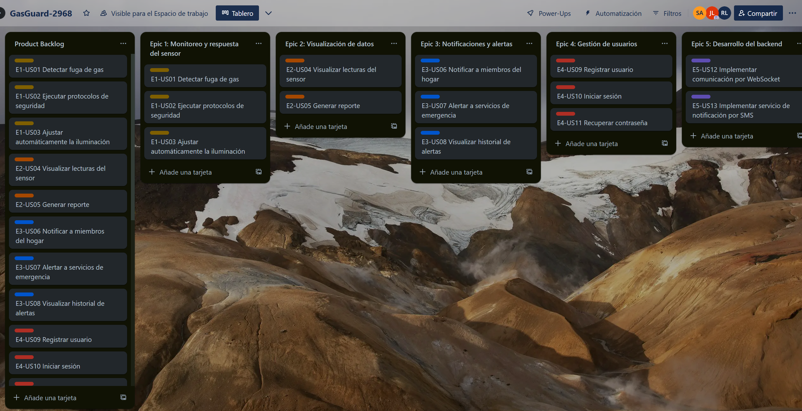
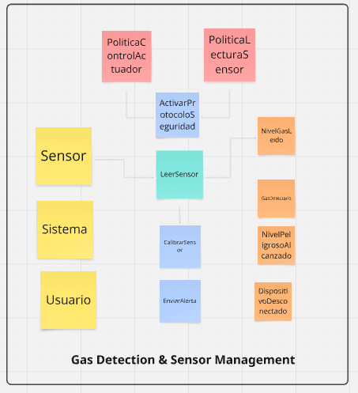
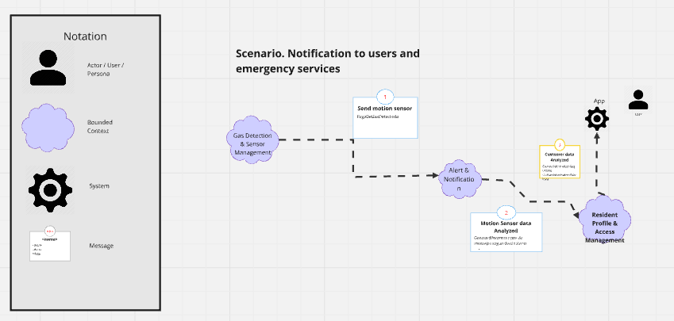
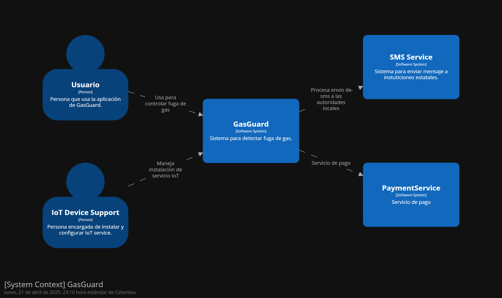
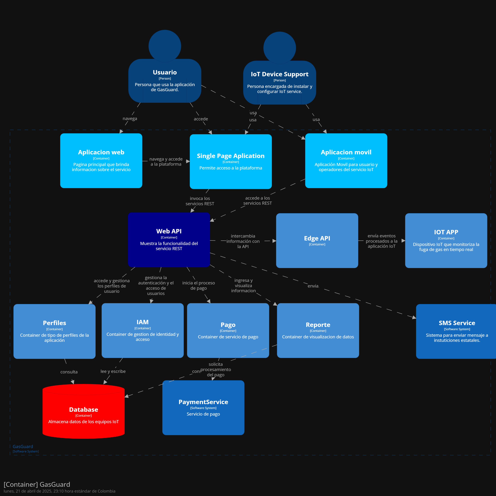
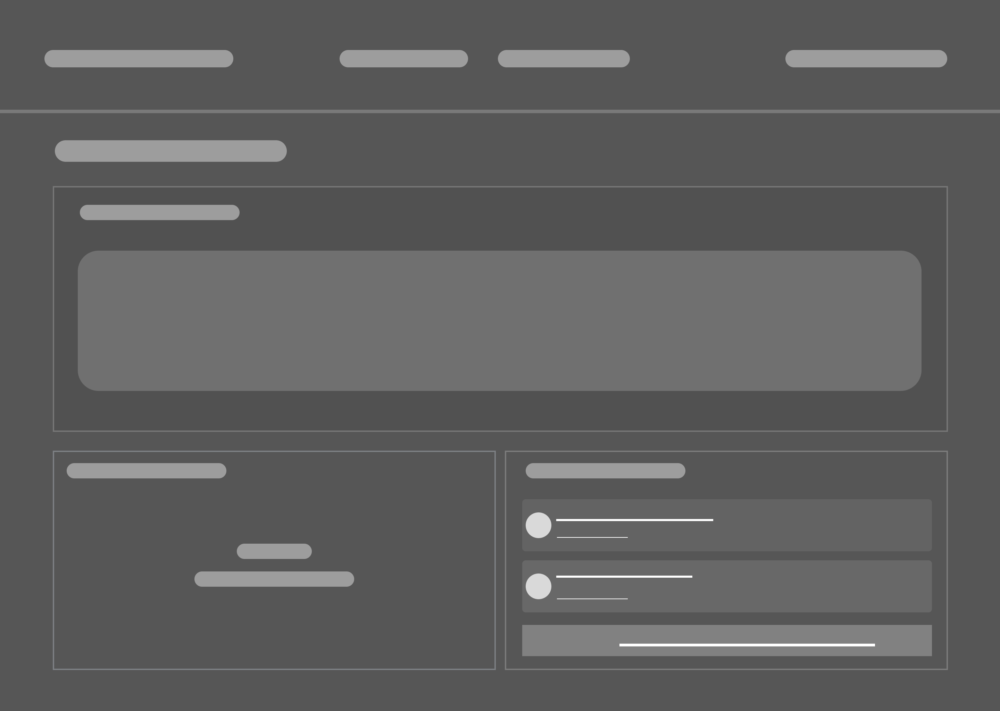
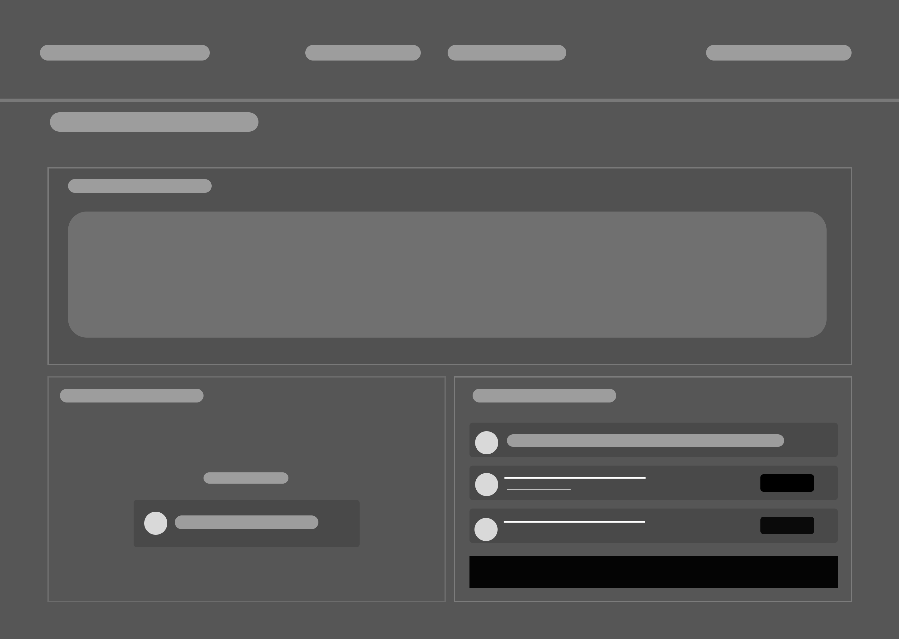
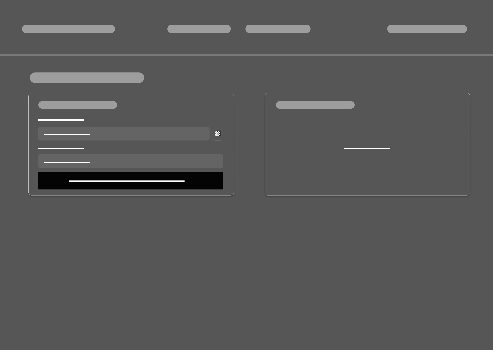

# Project-report

    <strong>Universidad Peruana de Ciencias Aplicadas</strong> 
    </img> 
    <strong>Ingeniería de Software</strong> 
    <strong>Desarrollo de Soluciones IOT - 2968</strong> 
    <strong>Profesor: Marco Antonio Leon Baca</strong> 
     INFORME

    <strong>Startup:  GasGuard</strong> 
    <strong>Producto:  GasGuard</strong>

    <h3 align="center">Team Members:</h3>
    

     <table align="center">
        <tr>
            <th style="text-align:center;">Member</th>
            <th style="text-align:center;">Code</th>
        </tr>
        <tr>
            <td>Alvarez Araguache, Samira Jetzabel</td>
            <td>U20211A046</td>
        </tr>
	<tr>
            <td>Llacchua Peralta, Joseph Ulysses</td>
            <td>U202317002</td>
        </tr>
        <tr>
            <td>Quilla Luyo, Jorge Gerardo</td>
            <td>U20211b197</td>
        </tr>
        <tr>
            <td>Ramirez Contreras, Zaid Valentino</td>
            <td>U202218472</td>
        </tr>
         <tr>
            <td>Ticona Luque, Rony Piero</td>
            <td>U201420422</td>
        </tr>
    </table>

    <strong>2025</strong>

 
 
 
 
 

# Registro de Versiones del Informe
<table>
        <tr>
            <th style="text-align:center;">Versión</th>
            <th style="text-align:center;">Fecha</th>
            <th style="text-align:center;">Autor</th>
            <th style="text-align:center;">Descripción de la modificación</th>
        </tr>
        <tr>
            <td align = "center">TB1</td>
            <td>18/04/2025</td>
            <td> Grupo 2
            <td>Se agregó el contenido del capítulo 1, apartados 1.1, 1.2 y 1.3; el contenido del capítulo 2, apartados 2.1, 2.2, 2.3, 2.4; el contenido del capítulo 3, apartados 3.1, 3.2, 3.3 y 3.4; el contenido del capítulo 4, apartados 4.1 y 4.2</td>
        </tr>
</table>
 

# Tabla de Contenidos

- [Project-report](#project-report)
- [Registro de Versiones del Informe](#registro-de-versiones-del-informe)
- [Tabla de Contenidos](#tabla-de-contenidos)
- [Student Outcome](#student-outcome)
- [Capítulo I: Introducción](#capítulo-i-introducción)
  - [1.1. Startup Profile](#11-startup-profile)
    - [1.1.1. Descripción de la Startup](#111-descripción-de-la-startup)
    - [Misión](#misión)
    - [Visión](#visión)
    - [1.1.2. Perfiles de integrantes del equipo](#112-perfiles-de-integrantes-del-equipo)
  - [1.2. Solution Profile](#12-solution-profile)
    - [1.2.1. Antecedentes y problemática](#121-antecedentes-y-problemática)
    - [Antecedentes:](#antecedentes)
    - [Problemática (5Ws y 2Hs)](#problemática-5ws-y-2hs)
    - [What/Qué](#whatqué)
      - [¿Cuál es el problema?](#cuál-es-el-problema)
    - [Where / Dónde](#where--dónde)
      - [¿Dónde está el usuario cuando usa el producto?](#dónde-está-el-usuario-cuando-usa-el-producto)
      - [¿Dónde surge el problema?](#dónde-surge-el-problema)
    - [Why / Por Qué](#why--por-qué)
      - [¿Cuál es la causa del problema?](#cuál-es-la-causa-del-problema)
    - [When / Cuándo](#when--cuándo)
      - [¿Cuándo sucede el problema?](#cuándo-sucede-el-problema)
    - [Who / Quién](#who--quién)
      - [¿Quiénes están involucrados?](#quiénes-están-involucrados)
      - [¿A quién le sucede el problema?](#a-quién-le-sucede-el-problema)
      - [¿Quién lo utilizará?](#quién-lo-utilizará)
    - [How / Cómo](#how--cómo)
      - [¿En qué condiciones los usuarios usan nuestro producto?](#en-qué-condiciones-los-usuarios-usan-nuestro-producto)
      - [¿Cómo nos conocieron los usuarios?](#cómo-nos-conocieron-los-usuarios)
      - [¿Cómo prefieren los usuarios acceder a nuestro servicio?](#cómo-prefieren-los-usuarios-acceder-a-nuestro-servicio)
    - [How much / Cuánto](#how-much--cuánto)
    - [1.2.2. Lean UX Process](#122-lean-ux-process)
      - [1.2.2.1. Lean UX Problem statements](#1221-lean-ux-problem-statements)
      - [1.2.2.2. Lean UX Assumptions](#1222-lean-ux-assumptions)
      - [Features](#features)
      - [Business Outcomes](#business-outcomes)
      - [Users](#users)
      - [User Outcomes \& Benefits](#user-outcomes--benefits)
      - [User assumptions](#user-assumptions)
      - [¿Quién es el usuario?](#quién-es-el-usuario)
      - [¿Dónde encaja nuestro producto en sus trabajos o vidas?](#dónde-encaja-nuestro-producto-en-sus-trabajos-o-vidas)
      - [¿Qué problema resuelve nuestro producto?](#qué-problema-resuelve-nuestro-producto)
      - [¿Cuándo y cómo es usado nuestro producto?](#cuándo-y-cómo-es-usado-nuestro-producto)
      - [¿Qué características son importantes?](#qué-características-son-importantes)
      - [¿Cómo debería verse y comportarse nuestro producto?](#cómo-debería-verse-y-comportarse-nuestro-producto)
      - [Business Assumptions](#business-assumptions)
      - [1.2.2.3. Lean UX Hypothesis Statements](#1223-lean-ux-hypothesis-statements)
    - [Hipótesis 1:](#hipótesis-1)
    - [Hipótesis 2:](#hipótesis-2)
    - [Hipótesis 3:](#hipótesis-3)
    - [Hipótesis 4:](#hipótesis-4)
      - [1.2.2.4. Lean UX Canvas](#1224-lean-ux-canvas)
  - [1.3. Segmentos Objetivo](#13-segmentos-objetivo)
- [Capítulo II: Requirements Elicitation \& Analysis](#capítulo-ii-requirements-elicitation--analysis)
  - [2.1. Competidores](#21-competidores)
    - [2.1.1. Análisis competitivo](#211-análisis-competitivo)
    - [2.1.2. Estrategias y tácticas frente a competidores](#212-estrategias-y-tácticas-frente-a-competidores)
  - [2.2. Entrevistas](#22-entrevistas)
    - [2.2.1. Diseño de entrevistas](#221-diseño-de-entrevistas)
    - [2.2.2. Registro de entrevistas](#222-registro-de-entrevistas)
    - [2.2.3. Análisis de entrevistas](#223-análisis-de-entrevistas)
  - [2.3. Needfinding](#23-needfinding)
    - [2.3.1. User Personas](#231-user-personas)
    - [2.3.2. User Task Matrix](#232-user-task-matrix)
    - [2.3.3. User Journey Mapping](#233-user-journey-mapping)
    - [2.3.4. Empathy Mapping](#234-empathy-mapping)
    - [2.3.5. As-is Scenario Mapping](#235-as-is-scenario-mapping)
  - [2.4. Ubiquitous Language](#24-ubiquitous-language)
- [Capítulo III: Requirements Specification](#capítulo-iii-requirements-specification)
  - [3.1. To-Be Scenario Mapping](#31-to-be-scenario-mapping)
  - [3.2. User Stories](#32-user-stories)
  - [3.3. Impact Mapping](#33-impact-mapping)
  - [3.4. Product Backlog](#34-product-backlog)
- [Capítulo IV: Solution Software Design](#capítulo-iv-solution-software-design)
  - [4.1. Strategic-Level Domain-Driven Design](#41-strategic-level-domain-driven-design)
    - [4.1.1. EventStorming](#411-eventstorming)
      - [4.1.1.1. Candidate Context Discovery](#4111-candidate-context-discovery)
      - [4.1.1.2. Domain Message Flows Modeling](#4112-domain-message-flows-modeling)
      - [4.1.1.3. Bounded Context Canvases](#4113-bounded-context-canvases)
    - [4.1.2. Context Mapping](#412-context-mapping)
    - [4.1.3. Software Architecture](#413-software-architecture)
      - [4.1.3.1. Software Architecture System Landscape Diagram](#4131-software-architecture-system-landscape-diagram)
      - [4.1.3.2. Software Architecture Context Level Diagrams](#4132-software-architecture-context-level-diagrams)
      - [4.1.3.3. Software Architecture Container Level Diagrams](#4133-software-architecture-container-level-diagrams)
      - [4.1.3.4. Software Architecture Deployment Diagrams](#4134-software-architecture-deployment-diagrams)
  - [4.2. Tactical-Level Domain-Driven Design](#42-tactical-level-domain-driven-design)
    - [4.2.1. Bounded Context: Perfiles](#421-bounded-context-perfiles)
      - [4.2.1.1. Domain Layer](#4211-domain-layer)
      - [4.2.1.2. Interface Layer](#4212-interface-layer)
      - [4.2.1.3. Application Layer](#4213-application-layer)
      - [4.2.1.4. Infrastructure Layer](#4214-infrastructure-layer)
      - [4.2.1.5. Component Level Diagrams](#4215-component-level-diagrams)
      - [4.2.1.6. Code Level Diagrams](#4216-code-level-diagrams)
        - [4.2.1.6.1. Domain Layer Class Diagrams](#42161-domain-layer-class-diagrams)
        - [4.2.1.6.2. Database Design Diagram](#42162-database-design-diagram)
    - [4.2.2. Bounded Context: Protocolo de Seguridad](#422-bounded-context-protocolo-de-seguridad)
      - [4.2.2.1. Domain Layer](#4221-domain-layer)
      - [4.2.2.2. Interface Layer](#4222-interface-layer)
      - [4.2.2.3. Application Layer](#4223-application-layer)
      - [4.2.2.4. Infrastructure Layer](#4224-infrastructure-layer)
      - [4.2.2.5. Component Level Diagrams](#4225-component-level-diagrams)
      - [4.2.2.6. Code Level Diagrams](#4226-code-level-diagrams)
        - [4.2.2.6.1. Domain Layer Class Diagrams](#42261-domain-layer-class-diagrams)
        - [4.2.2.6.2. Database Design Diagram](#42262-database-design-diagram)
    - [4.2.3. Bounded Context: Detector de Gas](#423-bounded-context-detector-de-gas)
      - [4.2.3.1. Domain Layer](#4231-domain-layer)
      - [4.2.3.2. Interface Layer](#4232-interface-layer)
      - [4.2.3.3. Application Layer](#4233-application-layer)
      - [4.2.3.4. Infrastructure Layer](#4234-infrastructure-layer)
      - [4.2.3.5. Component Level Diagrams](#4235-component-level-diagrams)
      - [4.2.3.6. Code Level Diagrams](#4236-code-level-diagrams)
        - [4.2.3.6.1. Domain Layer Class Diagrams](#42361-domain-layer-class-diagrams)
        - [4.2.3.6.2. Database Design Diagram](#42362-database-design-diagram)
    - [4.2.4. Bounded Context: Notificacion](#424-bounded-context-notificacion)
      - [4.2.4.1. Domain Layer](#4241-domain-layer)
      - [4.2.4.2. Interface Layer](#4242-interface-layer)
      - [4.2.4.3. Application Layer](#4243-application-layer)
      - [4.2.4.4. Infrastructure Layer](#4244-infrastructure-layer)
      - [4.2.4.5. Component Level Diagrams](#4245-component-level-diagrams)
      - [4.2.4.6. Code Level Diagrams](#4246-code-level-diagrams)
        - [4.2.4.6.1. Domain Layer Class Diagrams](#42461-domain-layer-class-diagrams)
        - [4.2.4.6.2. Database Design Diagram](#42462-database-design-diagram)
    - [4.2.5. Bounded Context: Reporte](#425-bounded-context-reporte)
      - [4.2.5.1. Domain Layer](#4251-domain-layer)
      - [4.2.5.2. Interface Layer](#4252-interface-layer)
      - [4.2.5.3. Application Layer](#4253-application-layer)
      - [4.2.5.4. Infrastructure Layer](#4254-infrastructure-layer)
      - [4.2.5.5. Component Level Diagrams](#4255-component-level-diagrams)
      - [4.2.5.6. Code Level Diagrams](#4256-code-level-diagrams)
        - [4.2.5.6.1. Domain Layer Class Diagrams](#42561-domain-layer-class-diagrams)
        - [4.2.5.6.2. Database Design Diagram](#42562-database-design-diagram)
- [Capítulo V: Solution UI/UX Design](#capítulo-v-solution-uiux-design)
  - [5.1. Style Guidelines](#51-style-guidelines)
    - [5.1.1. General Style Guidelines](#511-general-style-guidelines)
    - [5.1.2. Web Style Guidelines](#512-web-style-guidelines)
  - [5.2. Information Architecture](#52-information-architecture)
    - [5.2.1. Organization Systems](#521-organization-systems)
    - [5.2.2. Labelling Systems](#522-labelling-systems)
    - [5.2.3. SEO Tags and Meta Tags](#523-seo-tags-and-meta-tags)
    - [5.2.4. Searching Systems](#524-searching-systems)
    - [5.2.5. Navegation Systems](#525-navegation-systems)
  - [5.3. Landing Page UI Design](#53-landing-page-ui-design)
    - [5.3.1. Landing Page Wireframe](#531-landing-page-wireframe)
    - [5.3.2. Landing Page Mock-up](#532-landing-page-mock-up)
  - [5.4. Web Applications UX/UI Design.](#54-web-applications-uxui-design)
    - [5.4.1 Web Applications Wireframes.](#541-web-applications-wireframes)
    - [5.4.2.Web Applications Wireflow Diagrams.](#542web-applications-wireflow-diagrams)
    - [5.4.3 Web Applications Mock-ups.](#543-web-applications-mock-ups)
    - [5.4.4 Web Applications User Flow Diagrams.](#544-web-applications-user-flow-diagrams)
  - [5.5. Web Applications Prototyping.](#55-web-applications-prototyping)
  - [5.6. Mobile Applications UX/UI Design.](#56-mobile-applications-uxui-design)
    - [5.6.1 Mobile Applications Wireframes.](#561-mobile-applications-wireframes)
    - [5.6.2.Mobile Applications Wireflow Diagrams.](#562mobile-applications-wireflow-diagrams)
    - [5.6.3 Mobile Applications Mock-ups.](#563-mobile-applications-mock-ups)
    - [5.6.4 Mobile Applications User Flow Diagrams.](#564-mobile-applications-user-flow-diagrams)
  - [5.7. Mobile Applications Prototyping.](#57-mobile-applications-prototyping)
- [Capítulo VI: Product Implementation, Validation \& Deployment](#capítulo-vi-product-implementation-validation--deployment)
  - [6.1. Software Configuration Management.](#61-software-configuration-management)
    - [6.1.1. Software Development Environment Configuration.](#611-software-development-environment-configuration)
    - [6.1.2. Source Code Management.](#612-source-code-management)
    - [6.1.3. Source Code Style Guide \& Conventions.](#613-source-code-style-guide--conventions)
    - [6.1.4. Software Deployment Configuration.](#614-software-deployment-configuration)
  - [6.2. Landing Page, Services \& Applications Implementation.](#62-landing-page-services--applications-implementation)
    - [6.2.1. Sprint 1](#621-sprint-1)
    - [6.2.1.1. Sprint Planning 1](#6211-sprint-planning-1)
    - [6.2.1.2. Aspect Leaders and Collaborators](#6212-aspect-leaders-and-collaborators)
    - [6.2.1.3. Sprint backlog 1](#6213-sprint-backlog-1)
    - [6.2.1.4. Development Evidence for Sprint Review.](#6214-development-evidence-for-sprint-review)
    - [6.2.1.5. Testing Suite Evidence for Sprint Review.](#6215-testing-suite-evidence-for-sprint-review)
    - [6.2.1.6 Execution Evidence for Sprint Review.](#6216-execution-evidence-for-sprint-review)
    - [6.2.1.7 Services Documentation Evidence for Sprint Review.](#6217-services-documentation-evidence-for-sprint-review)
    - [6.2.1.8 Software Deployment Evidence for Sprint Review.](#6218-software-deployment-evidence-for-sprint-review)
    - [6.2.1.9 Team Collaboration Insights during Sprint.](#6219-team-collaboration-insights-during-sprint)
- [Conclusiones y Recomendaciones](#conclusiones-y-recomendaciones)
- [Bibliografía](#bibliografía)
- [Anexos](#anexos)

---

# Student Outcome
<table >
        <tr>
            <th style="text-align:center;">Criterio específico</th>
            <th style="text-align:center;">Acciones realizadas</th>
            <th style="text-align:center;">Conclusiones</th>
        </tr>
        <tr>
            <td align = "center">Trabaja en equipo para
proporcionar liderazgo en
forma conjunta</td>
            <td> 

Alvarez Araguache, Samira Jetzabel  
**TB1**  
Para esta entrega, el trabajo se llevó a cabo de manera cooperativa, involucrando a todos los integrantes en el desarrollo de las tareas del proyecto. Para la realización de las entrevistas fue parte fundamental la participación de cada miembro en la recolección de información clave para definir las funcionalidades de nuestra solución. Asímismo, el uso de Gitflow facilitó un flujo de trabajo eficiente, permitiendo a cada miembro contribuir al desarrollo de la documentación de manera coordinada y fluida. 

Ramirez Contreras, Zaid Valentino  
**TB1**  
En esta etapa, el trabajo se hizo en conjunto donde cada integrante aportó su conocimiento y habilidad para el diseño del proyecto. Se usaron, además, herramientas para la creación de las user personas que nos ayudaran a entender correctamente y en su totalidad las necesidades de nuestro segmento objetivo e idear un plan de acción para abarcarlas.

Quilla Luyo, Jorge Gerardo  
**TB1**  
En esta entrega, se usaron herramientas visuales para la elaboración de escenarios donde nuestra propuesta resuelve la problemática planteada. Además, se usó un formato estándar y entendible para redactar los requerimientos de nuestros segmentos objetivos. La información recolectada por cada integrante del equipo fue necesario para la correcta elaboración de cada punto en esta entrega y así estar todos coordinados.

**TP**  
Para esta entrega se utilizaron herramientas de maquetado de interfaces de usuario, además de documentar flujos acorde a los requerimientos core de la aplicación. También, se desarrollaron videos demostrativos para explicar el prototipo del landing page y de la aplicación web.

Ticona Luque, Rony Piero  
**TB1**  
En esta entrega, se utilizó una herramienta de modelado C4 en Structurizr para el desarrollo de los diagramas de contexto, contenedores y componentes que serán implementados en el proyecto. Además, se emplearon herramientas como Lucidchart y Vertabelo para crear los diagramas de las bases de datos. También se realizaron entrevistas para identificar y comprender mejor las necesidades del segmento de público objetivo, lo cual fue fundamental para definir las funcionalidades clave del proyecto.
 
Llacchua Peralta, Joseph Ulysses  
**TB1**  
En esta entrega, trabajamos en la definición de metas claras, distribuyendo responsabilidades según las habilidades individuales mientras manteníamos un propósito colectivo. Mediante una planificación colaborativa, establecimos hitos y mecanismos de seguimiento que permitieron ajustar estrategias de manera ágil. Este proceso no solo optimizó la eficiencia, sino que también reforzó la confianza y el compromiso mutuo.

**TP**  
Durante esta fase, prioricé la creación de un espacio de trabajo colaborativo e integrador, fortaleciendo la comunicación entre los miembros del equipo. Lideré la investigación sobre experiencia de usuario en sistemas de seguridad, enfocándome en optimizar interfaces para situaciones de emergencia. Desarrollé wireframes iniciales para las aplicaciones móvil y web aplicando principios de diseño centrado en el usuario, lo que enriqueció el proyecto con diversas perspectivas técnicas y creativas.

</td>
         <td> TB1: Conclusiones  
		 El trabajo en equipo durante esta entrega demostró un liderazgo colaborativo, donde cada integrante aportó sus habilidades para alcanzar los objetivos comunes. Mediante herramientas como Gitflow, Structurizr, Lucidchart y entrevistas, logramos una coordinación eficiente, una comprensión profunda de las necesidades del usuario y una documentación bien estructurada. Este enfoque no solo optimizó el flujo de trabajo, sino que también fortaleció la cohesión del grupo, asegurando un avance sólido y alineado hacia el éxito del proyecto.
</td>         

  <tr>
            <td align = "center">Crea un entorno colaborativo e
inclusivo, establece metas,
planifica tareas y cumple
objetivos</td>
            <td>

Alvarez Araguache, Samira Jetzabel   
**TB1**  
En esta etapa del proyecto, se logró determinar el estado actual del mercado relacionado con soluciones tecnológicas orientadas a la seguridad del hogar, en particular aquellas vinculadas a IoT y detección de fugas de gas. Este análisis permitió identificar fortalezas y debilidades de productos similares, así como plantear estrategias para diferenciar a GasGuard, posicionándolo como una solución accesible, confiable y centrada en el usuario. Además, se profundizó en el comportamiento, necesidades y motivaciones de los potenciales usuarios mediante entrevistas y ejercicios de empatía, lo que permitió establecer los objetivos principales del proyecto a largo plazo.

Ramirez Contreras, Zaid Valentino  
**TB1**  
Para esta entrega se identificaron los usuarios objetivos del proyecto, por lo que se analizaron sus habilidades, necesidades y frustraciones para diseñar el producto de manera que pueda cumplir de manera eficiente todas estas cosas. Además se identificaron los competidores para conocer las distintas tacticas y funciones que ofrecen para poder mejorar y apuntar a objetivos mas especifico y asi diferenciarnos de la competencia. Todo este estudio se llevo a cabo para ofrecer la mejor version de la solucion IoT y asi atacar eficientemente al problema al que se dirige nuestro proyecto.

Quilla Luyo, Jorge Gerardo  
**TB1**  
En esta entrega, se logró redactar las historias de usuario, tomando en cuenta los posibles módulos de nuestra solución propuesta. También se priorizaron estos requerimientos para agilizar el desarrollo de las principales necesidades identificadas. Además, se realizó escenarios donde nuestra solución lograr satisfacer necesidades, resolver problemas y marcar una diferencia frente a la competencia.

**TP**  
En esta entrega se logró diseñar una interfaz de usuario que cumple con buenas prácticas y principios de usabilidad y consistencia. Por medio de la herramienta Figma, se elaboraron los prototipos respectivos para la landing page y la aplicacion web, además de definir los User Flow para conocer el recorrido y objetivo de cada pantalla o vista elaborada.

Ticona Luque Rony Piero  
**TB1**  
En esta entrega del proyecto, se avanzó en la definición y diseño de la solución tecnológica. Se desarrollaron diagramas de contexto, contenedores y componentes utilizando herramientas de modelado C4 en Structurizr, estableciendo una base sólida para la arquitectura del sistema. Adicionalmente, se emplearon Lucidchart y Vertabelo para crear diagramas detallados de las bases de datos. Adicional de realizaron entrevistas del segmento objetivo para profundizar en la comprensión de sus necesidades, expectativas y problemas clave.

Llacchua Peralta, Joseph Ulysses  
**TB1**  
Durante esta fase, prioricé la creación de un espacio de trabajo en equipo, integrando diversas perspectivas y fortaleciendo la comunicación. Realizamos una revisión conjunta de la literatura existente, analizamos los segmentos objetivos de manera participativa y exploramos metodologías de resolución de problemas en conjunto. Este enfoque inclusivo permitió enriquecer el proyecto con aportes diversos y fomentar un sentido de pertenencia en el equipo.

**TP**  
En esta etapa, lideré el desarrollo de la arquitectura de información y directrices de estilo para GasGuard, definiendo sistemas de navegación intuitivos y patrones de diseño optimizados para situaciones críticas. Implementé la guía completa de estilo (tipografía, paleta de colores, y elementos de interfaz) y desarrollé un sistema de organización y etiquetado que facilita el uso de la aplicación en momentos de emergencia, considerando distintos niveles de alfabetización digital.

</td>
            <td> TB1: Conclusiones 
            En esta etapa del proyecto, el equipo logró consolidar los fundamentos estratégicos, técnicos y centrados en el usuario para el desarrollo de GasGuard. A través de un análisis exhaustivo del mercado y la competencia, se identificaron oportunidades clave para posicionar nuestra solución IoT como una alternativa accesible y diferenciada en seguridad del hogar.

La investigación con usuarios permitió definir requerimientos prioritarios y diseñar historias de usuario alineadas a sus necesidades reales, mientras que el modelado arquitectónico (diagramas C4, bases de datos) sentó las bases técnicas para el desarrollo. El trabajo colaborativo, apoyado en metodologías ágiles y herramientas como Structurizr y Lucidchart, facilitó la integración de perspectivas diversas y aseguró una planificación eficiente.

</td>
       <tr>
</table>

 

---
 
 
 
 
 

# Capítulo I: Introducción
## 1.1. Startup Profile
### 1.1.1. Descripción de la Startup
GasGuard nace como respuesta a la falta de soluciones autónomas frente a las fugas de gas licuado en hogares, donde es necesaria la intervención humana para mitigar estas emergencias. 

Esta propuesta busca implementar tecnología del internet de las cosas (IoT) que, al detectar una fuga de gas, sea capaz de aplicar de manera innmediatas medidas de seguridad que reduzcan el riesgo de explosiones e incendios.

### Misión
Proteger a las personas y sus hogares con una solución simple, eficaz y segura ante situaciones de riesgo.

### Visión
Ser una empresa referente en el ámbito de la seguridad con tecnología IoT, centrados en innovar y transformar los hogares inteligentes.

### 1.1.2. Perfiles de integrantes del equipo
<table border="1" width="70%" style="text-align:center;">
    <tr align="center">
        <td rowspan="3">
            
        </td>
        <td align="left">
            <b>Nombre y Apellido:</b>
             
            Jorge Gerardo Quilla Luyo
        </td>
    </tr>
    <tr>
        <td align="left">
        <b>Carrera:</b>
         
        Ingeniería de Software
        </td>
    </tr>
    <tr>
        <td align="left">
        <b>Acerca de:</b>
         
        Estudiante de la carrera de ingeniería de software, tengo experiencia en los lenguajes de programación de java, python y c#, me considero una persona puntual y comprometida con los trabajos en grupo. Me esfuerzo en comunicar los resultados e investigar temas nuevos por cuenta propia.
        </td>
    </tr>
    <tr align="center">
        <td rowspan="3">
            
        </td>
        <td align="left">
            <b>Nombre y Apellido:</b>
             
            Rony Piero Ticona Luque            
        </td>
    </tr>
    <tr>
        <td align="left">
        <b>Carrera:</b>
         
        Ingeniería de Software
        </td>
    </tr>
    <tr>
        <td align="left">
        <b>Acerca de:</b>
         
        Estudiante de la carrera de Ingeniería de Software con experiencia en lenguajes de programación como Java, Python y Flutter. Además, poseo conocimientos en el uso de Power BI para el análisis y visualización de datos. Me considero una persona responsable, dedicada y conprometida con los proyectos de la universidad.
        </td>
    </tr>
    <tr align="center">
        <td rowspan="3">
            
        </td>
        <td align="left">
            <b>Nombre y Apellido:</b>
             
            Joseph Ulysses Llacchua Peralta 
        </td>
    </tr>
    <tr>
        <td align="left">
        <b>Carrera:</b>
         
        Ingeniería de Software
        </td>
    </tr>
    <tr>
        <td align="left">
        <b>Acerca de:</b>
         
        Soy un estudiante de la carrera de Ingeniería de Software, con experiencia en lenguajes de programación como Java, TypeScript y C#. Soy una persona comprometida con lo que me propongo, puntual, responsable y con habilidades para trabajar en equipo.
        </td>
    </tr>
    <tr align="center">
        <td rowspan="3">
            
        </td>
        <td align="left">
            <b>Nombre y Apellido:</b>
             
            Zaid Valentino Ramirez Contreras 
        </td>
    </tr>
    <tr>
        <td align="left">
        <b>Carrera:</b>
         
        Ingeniería de Software
        </td>
    </tr>
    <tr>
        <td align="left">
        <b>Acerca de:</b>
         
        Soy estudiante de la carrera de Ingeniería de Software, con conocimientos en Java, C++, python, javascript, entre otros. Soy alguien que le gusta aprender constantemente, además soy comunicativo y responsable. Espero seguir aprendiendo acerca de herramientas y habilidades que me puedan ser de utilidad en el futuro.
        </td>
    </tr>
    <tr align="center">
        <td rowspan="3">
        
        </td>
        <td align="left">
            <b>Nombre y Apellido:</b>
                         
            Samira Jetzabel Alvarez Araguache
        </td>
    </tr>
    <tr>
        <td align="left">
        <b>Carrera:</b>
         
        Ingeniería de Software
        </td>
    </tr>
    <tr>
        <td align="left">
        <b>Acerca de:</b>
         
        Soy una estudiante de ingeniería de software con experiencia en los lenguajes de programación C++, C# y JavaScript. Soy una persona comunicativa, capaz de trabajar eficazmente con mi equipo y con habilidades para liderar y gestionar proyectos.
        </td>
    </tr>
</table>

## 1.2. Solution Profile
Esta parte del contendo se encuentra dividida en dos partes:
- Antecedentes y Problemática: En este apartado se identifica la problemática que el proyecto busca a resolver. Se incluye el plantamento del problema, los aspectos más relevantes que la solución debe considerar y los objetivos y limitaciones que se esperan del proyecto. 
- Lean UX Process: En esta sección se implementa el enfoque Lean UX. Se describe de manera detallada la manera en la que se abordará la problemática según el modelo de negocio del proyecto. 
 
### 1.2.1. Antecedentes y problemática
### Antecedentes:

En la actualidad, el avance en la tecnología ha transformado nuestra interacción con nuestro entorno. Dichos avances han ganado fuerza en el ámbito doméstico, donde la integración con distintas tecnologías ha llevado a la creación del concepto de "hogares inteligentes". El internet de las cosas (IoT) ha formado una parte crucial de este proceso, aportando bienestar y comodidad facilitando tareas y optimizando el consumo de recursos. Sin embargo, la mayoría de estas soluciones se enfocan más en la comodidad, y no en la seguridad de los habitantes antes situaciones de riesgo.

En el caso de Perú, las fugas de gas licuado son la cuarta emergencia más recurrente. Solo en el año 2024 se registró un total de 5787 casos, mientras que en el primer trimestre del año 2025, ya se han contabilizado 1096, sin tomar en cuenta aquellos que escalaron a incendios (Cuerpo general de bomberos voluntario del Perú, 2025). Muchos de estos casos involucran el uso de gas domestico (Pereyra, 2020). 

Pese a existir sistemas de detección ante estas situaciones, la mayoría se limitan a emitir señales visuales o auditivas, por lo que todavía se requiere intervención humana para mitigar y comunicar este tipo de emergencias. Esta limitación deja expuestos tanto a los vecinos como a los residentes de la vivienda ante a estas amenazas.

Frente a este contexto, surge GasGuard como un sistema inteligente ante fugas de gas. Con el uso de tecnología IoT, se ejecutan medidas automáticas antes este tipo de emergencia, con protocolos de seguridad como la apertura de puertas, ventanas y corte de sistemas eléctricos, activación de señales visuales, así como notificaciones a los miembros del hogar y los servicios de emergencia. Mientras tanto, en condiciones normales, GasGuard se integra como un gestor inteligente de iluminación, controlando la intensidad de las luces del innmueble según la luz ambiental. 

### Problemática (5Ws y 2Hs)
### What/Qué
#### ¿Cuál es el problema?
Los hogares inteligentes muchas veces optan por la comodidad y conveniencia, descuidando situaciones de riesgo. La gran parte de sensores de detección requieren intervención humana inmediata para tomar acciones contra una fuga de gas. Estos se limitan a emitir señales visuales o sonoras, por lo que se tiene una respuesta más pasiva sobre estos incidentes.

### Where / Dónde
#### ¿Dónde está el usuario cuando usa el producto?
El usuario puede encontrarse en cualquier lugar, siempre y cuando tenga conexión a internet. Gracias a la naturaleza de los dispositivos IoT, es posible interactuar con GasGuard de manera remota, ya sea desde un teléfono inteligente o una computadora, siendo más accesible que los sistemas tradicionales de alarma.

#### ¿Dónde surge el problema?
El problema surge dentro del hogar, específicamente en zonas con instalaciones de gas o donde el uso de GLP es recurrente como en cocinas y lavanderías.

### Why / Por Qué
#### ¿Cuál es la causa del problema?
La causa del problema incluye factores como la necesidad de los sistemas tradicionales de alarma de requerir intervención humana, así como la falta de integración con otros sistemas del hogar para una reacción inmediata. Estas circunstancias aumentan la vunerabilidad de las familias en el hogar ante una fuga de gas.

### When / Cuándo
#### ¿Cuándo sucede el problema?
El problema puede suceder en cualquier momento, especialmente cuando no se han tomado medidas preventivas para reducir las posibilidades de una fuga de gas. Esto empeora cuando no hay personas en casa que puedan actuar rápida.   

### Who / Quién
#### ¿Quiénes están involucrados?
Los involucrados son principalmente las personas residentes de hogares que utilizan gas licuado. 

#### ¿A quién le sucede el problema?
El problema perjudica a cualquier persona que cuente con una instalación de gas licuado. Esto incluye a personas que viven solas, familias y condominios donde una fuga de gas puede tener consecuencias de mayor alcance.

#### ¿Quién lo utilizará?
Lo utilizaría cualquier persona que quiera mejorar la seguridad de su casa usando tecnología IoT. Esto incluye a familias que buscan hacer su hogar un espacio más seguro, así como adultos mayores o personas con problemas de movilidad que puedan tener dificultades a la hora de actuar en caso de una emergencia.

### How / Cómo
#### ¿En qué condiciones los usuarios usan nuestro producto?
Los usuarios utilizarían el sistema como parte de su hogar inteligente, siendo un complemento junto con otros dispositivos IoT en este tipo de viviendas. De manera predeterminada, GasGuard cumple con la función de regular la iluminación según el ambiente cuando la persona se encuentre en casa. Por otra parte, sus protocolos de seguridad se activan en caso de emergencia, ya sea que el usuario esté en su vivienda o fuera de ella.

#### ¿Cómo nos conocieron los usuarios?
Los usuarios pueden conocer el sistema a través de:
- Publicaciones o anuncios en plataformas de redes sociales como Instagram, Twitter, Facebook, TikTok, etc.
- Campañas de publicidad en línea mediante SEO en nuestra página web y artículos en periódicos o blogs.
- Eventos y exposiciones de tecnología IoT centrados en la domótica.
- Recomendaciones de usuarios actuales a amigos o familiares interesados en iniciar o complementar su hogar inteligente implementando un sistema de seguridad.

#### ¿Cómo prefieren los usuarios acceder a nuestro servicio?
Los usuarios prefieren acceder desde cualquier lugar de manera sencilla y conveniente. Por ello, pueden gestionar el sistema por medio de una aplicación web accesible desde computadoras de escritorio. Sin embargo, la mayoría de usuarios valoran la disponibilidad de una aplicación móvil, donde pueden recibir notificaciones a tiempo real sobre el estado de su hogar, así como controlar de manera remota los dispositivos del sistema.

### How much / Cuánto
El impacto del problema es considerable, especialmente teniendo en cuenta la cantidad de incidentes reportados anualmente relacionados a fugas de gas licuado. Las consecuencias de este tipo de emergencias implican un grave riesgo la integridad de las personas, así como perdidas materiales significativas. Por ello, es invaluable un sistema que pueda anticiparse ante este tipo de situaciones, que permita un accionar rápido que proteja no solo a una familia y sus bienes, sino también a los vecinos y a edificaciones de su entorno.

### 1.2.2. Lean UX Process

#### 1.2.2.1. Lean UX Problem statements

En Perú,el gas licuado es uno de los principales combustibles de energía domestica en cocinas, termas, calefacción, etc. Esto implica un mayor riesgo de sufrir alguna fuga de gas. Pese a esta amenaza, muchos hogares no cuentan con un sistema de seguridad que sea capaz de detectar y actuar frente a este tipo de emergencias. 

Hemos observado que, pese a que en el mercado existen detectores de gas, estos se limitan a mostrar alarmas visuales o sonoras, sin tomar medidas para mitigar la fuga. Así mismo, muchas personas no saben como reaccionar ante estas situaciones, ya sea por desconocimiento o temor. 

¿Cómo podríamos crear una solución accesible, confiable y automatizada que detecte de una fuga de gas, tome medidas de seguridad de manera innmediata para proteger a los habitantes de una vivienda y pueda integrarse en un hogar inteligente?

#### 1.2.2.2. Lean UX Assumptions
#### Features

- Detección a tiempo real de fuga de gas licuado: Sensores de gas para detectar altas concentraciones de GLP.
- Activación automática de protocolos de seguridad: Alerta visual, corte del suministro eléctrico y apertura de ventanas y puertas ante una fuga de gas.
- Notificaciones inteligentes: Envío de mensajes de texto a contactos seleccionados en la app y alertas a servicios de emergencia.
- Modo en reposo: Control inteligente de la iluminación en condiciones normales.
- Estado e historial: Aplicación para la consulta del estado actual del sistema y el historial de alertas.

#### Business Outcomes
- Aumento de usuarios: Mayor demanda de integración de sistemas automatizados de seguridad.
- Reducción de accidentes por fuga de gas: Reducir incidentes generadas como consecuencias de una fuga de gas doméstica.
- Reconocimiento de marca: Establecer GasGuard como lider en soluciones de seguridad para hogares inteligentes.
- Ingresos sostenibles: Ejecutar un modelo de ingreso en base a la venta e instalación de dispositivos, así como suscripciones en la aplicación para producir beneficios.

#### Users
Los usuarios serán principalmente aquellas personas que viven en hogares que emplean uso de GLP y busquen un sistema de seguridad ante fugas de gas que sea autónomo.

#### User Outcomes & Benefits
- Mayor seguridad en casos de fugas de gas: Disminuición del estrés por quedar en riesgo de sufrir accidentes debido a una fuga de GLP.
- Respuesta inmediata: Ejecución de sistemas de seguridad automáticas antes la detección de una fuga de gas.
- Integración como gestor de iluminación: Controlador inteligente de luces en el inmueble según la luz ambiental o intervención del usuario.
- Prevención de fugas: Informes, estadísticas y estadísticas acerca de los niveles de gas licuado en el inmueble.

#### User assumptions
#### ¿Quién es el usuario?
El usuario es cualquier persona que desee mejorar la seguridad en su hogar ante la amenzada de una fuga de gas.
#### ¿Dónde encaja nuestro producto en sus trabajos o vidas?
Nuestro producto se integra en la vida diaria de nuestros usuarios como un sistema de seguridad instalado en su hogar para actuar en situaciones de emergencia, donde podrá monitorearlo desde una aplicación web y móvil.
#### ¿Qué problema resuelve nuestro producto?
Nuestro producto reduce los incidentes producidos por fugas de gas licuado, ya sea por ausencia de personas en la vivienda, la presencia de personas que no puedan reaccionar de manera rápida o el desconocimiento de los protocolos a seguir en caso de este tipo de emergencias.
El sistema ofrece una respuesta automática ante la detección de una fuga de gas, alertando a las personas dentro o fuera de la vivienda, así como ejecutando protocolos de seguridad físicos sin necesitar intervención humana.
#### ¿Cuándo y cómo es usado nuestro producto?
- Funciona 24/7 desde que el sistema en instalado en el hogar del usuario.
- Cuando los niveles de gas son normales, controla de manera automática los niveles de luz en el inmueble. El usuario también puede gestionar la iluminación mediante la aplicación móvil.
- Cuando se detecta niveles altos de gas, se ejecutan medidas de seguridad para disminuir el riesgo ante fugas de gas. El usuario puede revisar el nivel de gas desde sus dispositivos.
#### ¿Qué características son importantes?
- Sistema de alerta: El sistema debe detectar y notificar de manera rápida los niveles anormales de gas licuado en el aire.
- Respuesta automática: Se ejecutan protocolos de seguridad de manera autónoma sin necesitar intervención humana.
- Control remoto: El usuario puede controlar el nivel de luminosidad en el hogar, así como abrir/cerrar ventanas o puertas de su vivienda desde cualquier dispositivo.
- Reportes: Reportes e historial acerca de los niveles de gas en el inmueble y el estado de los dispositivos asociados al sistema.

#### ¿Cómo debería verse y comportarse nuestro producto?
- Interacción simple: Un rápido flujo de interacción para cada acción que pueda realizar el usuario.
- Comportamiento predecible: Funcionamiento fluido, sin comportamientos inesperados o errores de conexión con los dispositivos asociados al sistema.
- Comunicación clara: Informar de manera simple el estado actual del sistema y las acciones disponibles.

#### Business Assumptions
1. **Creemos que nuestros clientes necesitan** una solución tecnológica confiable que actúe y detecte de manera innmediata una fuga de gas en sus hogares, así como ayude en la gestión inteligente en el hogar. 
2. **Estas necesidades se pueden resolver con un** un sistema IoT con sensores de gas que automatice la respuesta ante una fuga de gas (apertura de ventanas o puertas, corte de electricidad, notificaciones, etc) y pueda ser controlado de manera remota.
3. **El valor #1 que mi cliente quiere de mi servicio** es un sistema íntegro, que le permita sentirse seguro ante este tipo de emergencias, incluso estando fuera de casa.
4. **El cliente también puede obtener beneficios adicionales como** 
- Control de iluminación según la luz ambiental.
- Reportes acerca de los niveles de gas en el hogar e historial de alertas.
- Gestión remota del sistema mediante plataformas web y móvil.
5. **Voy a adquirir la mayoría de mis clientes** mediante marketing digital en redes sociales, asociaciones con inmobiliarias o empresas de gas y ferias o eventos de tecnología y seguridad.
6. **Haré dinero a través de** la venta directa e instalación del sistema, así como un modelo freemium de suscripción para brindar funcionalidades avanzadas.
7. **Mi competencia principal en el mercado** serán detectores de gas, otras soluciones IoT con acción limitada y alarmas tradicionales sin respuesta autónoma.
8. **Los venceremos debido a** nuestro elemento diferenciador: acción inmediata ante un accidente. De igual manera, ofreceremos un modo reposo, que se integrará junto a otros dispositivos smart-home para la gestión inteligente de iluminación.
9. **El mayor riesgo es que** no cumplamos con las expectativas de seguridad de nuestros usuarios y la desconfianza hacia los sistemas automatizados en el hogar.
10. **Resolveremos esto a través de** pruebas pilotos, demostraciones en vivo y testimonios de clientes, así como la mejora continua de nuestro sistema ante el feedback de nuestros usuarios.

#### 1.2.2.3. Lean UX Hypothesis Statements
### Hipótesis 1:
**Creemos que** cuando los protocolos de seguridad sean ejecutados de manera autónoma en caso de una fuga de gas, los usuarios se sentirán más protegidos por el sistema.
**Sabremos que** hemos tenido éxito **cuando** al menos el 70% de usuarios consultados en los primeros 6 meses de uso manifiesten sentirse más seguros gracias a la respuesta automática de la solución.

### Hipótesis 2:
**Creemos que** al integrar un sistema de control de iluminación inteligente aumentará el valor percibido por el cliente de la solución.
**Sabremos que** hemos tenido éxito **cuando** al menos el 60% de usuarios utilicen de manera diaria esta función después del primer mes de instalación.

### Hipótesis 3:
**Creemos que** al ejecutar cortes automáticos del suministro de seguridad, así como la apertura de ventanas/puertas al detectar niveles anormales de gas cuando se detecte una fuga de gas, se disminuirá el riesgo de incendios, explosiones e intoxicaciones en las viviendas.
**Sabremos que** hemos tenido éxito **cuando** no se reporten accidentes graves como consecuencias de una fuga de gas en los hogares con el sistema activado durante los primeros 12 meses.

### Hipótesis 4:
**Creemos que** implementar un modelo de suscripción freemium ofreciendo funciones adicionales avanzadas, incrementaremos la monetización del sistema.
**Sabremos que** hemos tenido éxito **cuando** observemos que al menos el 20% de nuestros clientes adquieran una suscripción premium durante el primer año.

 
 
 
 
 

#### 1.2.2.4. Lean UX Canvas

<TABLE BORDER>
	<TR>
		<TD ROWSPAN=2>

**Lean UX Canvas**
</TD>
	    	<TD ROWSPAN=2></TD> <TD>

**Fecha:** 10/04/2025

</TD> 
	</TR>
	<TR>
		<TD>

**Iteración 1**
</TD> 
	</TR>
    <TR>
		<TD ROWSPAN>
        
**1. Problema de negocios:**
        
En Perú,el gas licuado es uno de los principales combustibles de energía domestica en cocinas, termas, calefacción, etc. Esto implica un mayor riesgo de sufrir alguna fuga de gas. Pese a esta amenaza, muchos hogares no cuentan con un sistema de seguridad que sea capaz de detectar y actuar frente a este tipo de emergencias. 

Hemos observado que, pese a que en el mercado existen detectores de gas, estos se limitan a mostrar alarmas visuales o sonoras, sin tomar medidas para mitigar la fuga. Así mismo, muchas personas no saben como reaccionar ante estas situaciones, ya sea por desconocimiento o temor. 

¿Cómo podríamos crear una solución accesible, confiable y automatizada que detecte de una fuga de gas, tome medidas de seguridad de manera innmediata para proteger a los habitantes de una vivienda y pueda integrarse en un hogar inteligente?

</TD>
	    	<TD ROWSPAN=2>

**5. Ideas de solución:**
- Detección de fugas de gas inmediata mediante sensores IoT.
- Acciones automáticas de seguridad ante fugas de gas como: corte del servicio eléctrico, apertura de ventanas/puertas, alertas visuales y sonoras, etc.
- Notificaciones de alerta a contactos seleccionados y a servicios de emergencia mediante la app móvil o sms.
- Historial de eventos y monitereo remoto desde una aplicación web/móvil.
- Gestor de iluminación inteligente en condiciones normales.
</TD> <TD ROWSPAN=2>

**2. Resultados comerciales:**
- Tasa de conversión del 15% de usuarios gratuitos a suscriptores premium para acceder a funciones avanzadas.
- Retención del 80% de clientes durante el primer año del sistema.
- Integración en al menos el 5% de casas con servicios de gas licuado o con hogares inteligentes.
- Reducción en un 85% de accidentes graves generados por fugas de gas en viviendas.
</TD> 
	</TR>
	<TR>
		<TD >
        
**3. Usuarios y Clientes:**
Principalmente familias, adultos mayores, personas con movilidad reducida y cualquier usuario que utilice gas licuado en su hogar.
</TD> 
	</TR>
    <TR>
		<TD ROWSPAN=2>

**6. Hipótesis**
        
**Creemos que** cuando los protocolos de seguridad sean ejecutados de manera autónoma en caso de una fuga de gas, los usuarios se sentirán más protegidos por el sistema.
**Sabremos que** hemos tenido éxito **cuando** al menos el 70% de usuarios consultados en los primeros 6 meses de uso manifiesten sentirse más seguros gracias a la respuesta automática de la solución.

**Creemos que** al integrar un sistema de control de iluminación inteligente aumentará el valor percibido por el cliente de la solución.
**Sabremos que** hemos tenido éxito **cuando** al menos el 60% de usuarios utilicen de manera diaria esta función después del primer mes de instalación.

**Creemos que** al ejecutar cortes automáticos del suministro de seguridad, así como la apertura de ventanas/puertas al detectar niveles anormales de gas cuando se detecte una fuga de gas, se disminuirá el riesgo de incendios, explosiones e intoxicaciones en las viviendas.
**Sabremos que** hemos tenido éxito **cuando** no se reporten accidentes graves como consecuencias de una fuga de gas en los hogares con el sistema activado durante los primeros 12 meses.

**Creemos que** implementar un modelo de suscripción freemium ofreciendo funciones adicionales avanzadas, incrementaremos la monetización del sistema.
**Sabremos que** hemos tenido éxito **cuando** observemos que al menos el 20% de nuestros clientes adquieran una suscripción premium durante el primer año.</TD>

<TD ROWSPAN=2>

**7. ¿Qué es lo más importante que debemos aprender primero?**
- El tiempo mínimo de reacción del sistema ante una fuga de gas para que esta sea efectiva para el usuario y pueda tomar medidas.
- El nivel de confianza de los usuarios en las respuestas de sistemas automatizados de seguridad.
- Que tan efectivas pueden ser las medidas que toma el sistema para evitar accidentes mayores.
- Que tan dispuestos están los usuarios para adquirir una suscripcion premium.
</TD> 

<TD>

**4. Beneficios del usuario:**
- Mayor seguridad y protección ante una fuga de gas.
- Posibilidad de actuar de manera remota sin encontrarse en el inmueble en caso de una emergencia.
- Gestión automática de iluminación según la luz ambiental.
- Reducción de accidentes graves como consecuencia de una fuga de gas.

</TD> 
	</TR>
	<TR>
		<TD>
        
**8. ¿Cuál es la menor cantidad de trabajo que necesitamos para resolver las dudas y para hacer lo siguiente más importante?**
- Crear un prototipo funcional integrado a una aplicación web/móvil.
- Realizar simulacros y pruebas con usuarios reales.
- Validar la percepción el usuario con el sistema antes y después de su uso.
- Desarrollar un análisis de mercado para detectar puntos de mejora o nuevas necesidades del segmento objetivo. 
- Plantear estrategias de marketing para promocionar el sistema y su aplicación.
</TD> 
	</TR>
</TABLE>

## 1.3. Segmentos Objetivo

**Tipo de usuario:**
- Personas con vivienda propia o alquilada
**Geográfico:**
- Viven en zonas urbanas, especialmente en distritos residenciales.
- También se encuentran en ciudades en crecimiento con acceso a servicios tecnológicos.

**Psicográfico:**
- Se preocupan activamente por la seguridad de su hogar y sus seres queridos.
- Están interesados en implementar soluciones tecnológicas que mejoren la vida cotidiana.
- Priorizan la automatización y buscan comodidad y control desde sus dispositivos móviles.

**Demográfico:**
- Edad: Jóvenes adultos hasta personas mayores.
- Nivel educativo: Desde educación básica hasta educación superior.

<TABLE BORDER>
	<TR>
		<TD>

**Tipo de usuario**</TD> <TD>

**Geográfico** </TD> <TD>

**Psicográfico**</TD> <TD>

**Demográfico**</TD>
</TR>
	<TR>
		<TD>Personas con vivienda propia o alquilada</TD> <TD> Zonas urbanas en distritos residenciales y ciudades en crecimiento.</TD> 
        <TD>

Preocupado por la seguridad de su vivienda o las personas que viven en ella. Interesado en la integración de soluciones tecnológicas en el hogar. Priorizan la automatización de procesos.

</TD> 
<TD>

- Edad: Desde jóvenes adultos hasta personas mayores.
- Educación: Educación básica hasta educación superior.

</TABLE>

---

# Capítulo II: Requirements Elicitation & Analysis

## 2.1. Competidores

### 2.1.1. Análisis competitivo
| **Categoría**               | **Honeywell**                                                                   | **Siemens**                                                                  | **Johnson Controls**                                                            |
|----------------------------|-------------------------------------------------------------------------------|---------------------------------------------------------------------------|------------------------------------------------------------------------------|
| **Perfil**                 |                                                                               |                                                                           |                                                                              |
| Overview                | Empresa líder en soluciones de detección y control de gases, con amplio respaldo internacional. | Multinacional especializada en automatización e integración IoT para seguridad. | Líder global en la gestión integral de edificios y sistemas de seguridad.   |
| Ventaja competitiva     | Alta fiabilidad, robusta red técnica y variedad de soluciones.                | Alta integración con sistemas BMS existentes, escalabilidad.              | Fuerte presencia global y experiencia en múltiples sectores.                |
| **Perfil de marketing**    |                                                                               |                                                                           |                                                                              |
| Mercado objetivo        | Hogares, empresas e industrias.                                               | Edificios inteligentes y corporativos.                                    | Infraestructura, sector salud, retail.                                      |
| Estrategias de marketing| Campañas digitales, distribuidores y ferias tecnológicas.                    | Marketing B2B, eventos y alianzas corporativas.                           | Consultoría técnica, contenido técnico y enfoque en seguridad.             |
| **Perfil de producto**     |                                                                               |                                                                           |                                                                              |
| Productos y Servicios   | Detectores de gas, alarmas y plataformas conectadas.                          | Sensores de gas, monitoreo IoT y automatización.                          | Sistemas de gestión de edificios, IoT y detección ambiental.                |
| Precios y Costos        | Segmento medio-alto con énfasis en fiabilidad.                               | Soluciones premium a medida.                                              | Altamente variable según proyecto.                                          |
| Canales de distribución | Web, App móvil y red de distribuidores.                                       | Red de partners, app móvil y web.                                         | Venta directa y vía distribuidores.                                         |
| Fortalezas              | Innovación constante, soporte técnico robusto.                                | Soluciones modulares y amplia escalabilidad.                              | Integración completa, experiencia técnica.                                  |
| Debilidades             | Costos elevados para pequeños proyectos.                                      | Complejidad en integración.                                               | Alto costo inicial.                                                         |
| Oportunidades           | Expansión en LATAM y nuevos hogares smart.                                    | Integración con IA y cloud.                                               | Creciente demanda en automatización.                                        |
| Amenazas                | Nuevos competidores low-cost.                                                 | Competencia asiática y precios bajos.                                     | Nuevas startups con soluciones ágiles.                                      |

### 2.1.2. Estrategias y tácticas frente a competidores
| Competidores | ¿Que se puede hacer para ganarle a la competencia?|
|--------------|---------------------------------------------------|
| Honeywell    |Ofrecer una solución más accesible y especializada para hogares, con menor costo y mayor automatización inmediata (sin depender de instalaciones complejas).|
|Siemens|Presentar un producto más simple y enfocado en seguridad doméstica, evitando la complejidad y el enfoque corporativo de Siemens.|
|Johnson Controls|Aprovechar la agilidad de una startup para innovar más rápido y con una solución más adaptable y fácil de instalar en viviendas comunes, no solo en grandes infraestructuras.|

## 2.2. Entrevistas

### 2.2.1. Diseño de entrevistas

**Uso actual y percepcion de seguridad**
1. ¿Actualmente usas algún sistema para detectar fugas de gas en tu hogar?

2. ¿Cómo actuarías ante una fuga de gas? ¿Tienes un plan o herramienta que te ayude?

3. ¿Qué tan seguro/a te sientes en tu hogar respecto al uso de gas?

**Expectativas sobre una app de seguridad doméstica**

4. Si existiera una app que te avisara automáticamente sobre una fuga de gas y tomara acciones de seguridad por ti, ¿qué funcionalidades te parecerían imprescindibles?

5. ¿Te gustaría que la app se conecte con otros dispositivos del hogar (ventanas, luces, puertas, etc.)? ¿Con cuáles específicamente?

6. ¿Qué tipo de notificaciones preferirías recibir (sonido, vibración, mensaje, llamada, etc.)?

**Preferencias de diseño y experiencia de usuario**

7. ¿Cómo debería ser la interfaz de una app así para que te resulte fácil de usar?

8. ¿Qué tan cómodo/a te sientes usando apps relacionadas con seguridad del hogar?

9. ¿Te gustaría tener un panel con el estado en tiempo real de los sensores o solo alertas cuando haya problemas?

**Oportunidades de mejora / feedback**

10. Si ya usaste alguna app de seguridad o domótica, ¿qué aspectos te gustaron y cuáles no?

11. ¿Qué crees que podría mejorar una app de seguridad como esta para que realmente confíes en ella?

12. ¿Estarías dispuesto/a a pagar por una app que proteja tu hogar de forma automática? ¿Qué precio te parecería justo?

### 2.2.2. Registro de entrevistas

<strong>Entrevista 1</strong>

Entrevistador: Jorge Gerardo Quilla Luyo

Entrevistado: Jorge Carlos Quilla Luyo

Edad: 18 años

Residencia: Lima - La Victoria

<a href="https://upcedupe-my.sharepoint.com/:v:/g/personal/u20211b197_upc_edu_pe/ERD-BT5hLC5EpKAYPNymmsUB043RTDuk0x3Hc6QE13G2pA?nav=eyJyZWZlcnJhbEluZm8iOnsicmVmZXJyYWxBcHAiOiJPbmVEcml2ZUZvckJ1c2luZXNzIiwicmVmZXJyYWxBcHBQbGF0Zm9ybSI6IldlYiIsInJlZmVycmFsTW9kZSI6InZpZXciLCJyZWZlcnJhbFZpZXciOiJNeUZpbGVzTGlua0NvcHkifX0&e=1CcGsV">Link a la entrevista</a>

**Resumen:**

Se entrevistó a Jorge Carlos, joven de 18 años estudiante de la carrera de Derecho. Actualmente no cuenta con un dispositivo inteligente que sea capaz de detectar fugas de gas en ambientes de su hogar. Ante una fuga de gas, él y su familia conocen que medidas tomar, tales como abrir puertas y ventanas, y no encender las luces, además, en caso sea posible, usan una medida de contención, la cual consiste en poner un trapo mojado en la boca del balón de gas, así para  reducir la salida de gas momentáneamente y tener tiempo para llamar a servicios de emergencia.

Jorge Carlos piensa que contar con una aplicación que te permita visualizar en tiempo real los niveles de gas en el ambiente serían de mucha ayuda, siempre y cuando tengan baja incertidumbre y tenga la mejor precisión en cuanto a los datos. También cree que las notificaciones a servicios de emergencia son muy importantes en caso la situación de fuga de gas se agrave. Menciona que recibir un mensaje y la inclusión de un sonido como tipo de notificación son necesarios para que una persona pueda darse cuenta de la fuga de gas detectada y así pueda tomar acciones.

<strong>Entrevista 2</strong>

Entrevistador: Diego Nicolas Ramirez Rodriguez

Entrevistado: Diego Nicolas Ramirez Rodriguez

Edad: 20 años

Residencia: Lima - San Felipe

<a href="https://upcedupe-my.sharepoint.com/:v:/g/personal/u202218472_upc_edu_pe/EY2xMPNuv5ZFhTiGBvLWvTcBq1WC5vwQnOJlPXIKIMxn_Q?e=rskZbD&nav=eyJyZWZlcnJhbEluZm8iOnsicmVmZXJyYWxBcHAiOiJTdHJlYW1XZWJBcHAiLCJyZWZlcnJhbFZpZXciOiJTaGFyZURpYWxvZy1MaW5rIiwicmVmZXJyYWxBcHBQbGF0Zm9ybSI6IldlYiIsInJlZmVycmFsTW9kZSI6InZpZXcifX0%3D" >Link a la entrevista</a>

**Resumen:**
Se entrevisto a Diego Nicolas, joven de 20 años estudiante de la carrera de Ingeniería de Sistemas. Actualmente no tiene algun dispositivo capaz de detectar algun tipo de fuga o reaccionar al respecto.

Él menciona que el considera que sería una buena opcion con contar con un dispositivo inteligente que le pueda notificar en caso haya una fuga de gas, a pesar de estar lejos del punto de fuga. Además de contar con una funcion para reaccionar ante la fuga de gas, como por ejemplo abrir ventanas o puertas. Tambien le gustaria tener un panel de control donde pueda ver el estado de los sensores y el historial de eventos. En cuanto a las notificaciones, menciona que le gustaria recibir una alarma que se pueda configurar, ya que no siempre tiene el celular a la mano. Finalemnte menciona que en otra aplicacion que ha usado, le gustaria que la interfaz sea sencilla y amigable, ya que pueden tener mucho texto y funciones que interrumpen la experiencia de usuario.

<strong>Entrevista 3</strong>

Entrevistador: Rony Piero Ticona Luque

Entrevistado: Alexandra Mariella Cabezas

Edad: 29 años

Residencia: Lima - Breña

<a href="https://upcedupe-my.sharepoint.com/:v:/g/personal/u201420422_upc_edu_pe/ER6IMmm720xKssiJipPkNDgBu0oYowaPz2dTQ_KsdV0Vlw?nav=eyJyZWZlcnJhbEluZm8iOnsicmVmZXJyYWxBcHAiOiJPbmVEcml2ZUZvckJ1c2luZXNzIiwicmVmZXJyYWxBcHBQbGF0Zm9ybSI6IldlYiIsInJlZmVycmFsTW9kZSI6InZpZXciLCJyZWZlcnJhbFZpZXciOiJNeUZpbGVzTGlua0NvcHkifX0&e=KqPf7q">Link a la entrevista</a>

Resumen:

Se entrevistó a Alexandra Cabezas, licenciada en Derecho y Ciencias Políticas de 29 años. Actualmente no cuenta con un sistema para detectar fugas de gas en su hogar. Ante una fuga, indica que sus acciones serían cerrar las llaves de paso y abrir ventanas para ventilar el ambiente. Expresa preocupación por el uso de gas, especialmente porque en su hogar hay personas mayores de más de 80 años que en ocasiones han dejado la llave de gas abierta accidentalmente.

Considera que una aplicación que detecte fugas y tome acciones automáticas sería muy útil, sobre todo si puede alertar mediante notificaciones sonoras y vibración, similares a las alertas de sismos. También ve valioso que la app ventile el ambiente, informe a familiares y pueda cortar el circuito eléctrico en caso necesario. Mencionó la posibilidad de vincular la app con puertas y luces de emergencia.

Para ella, es importante que la interfaz sea dinámica y clara, con acceso al estado del ambiente en tiempo real. Aunque no ha usado apps similares, le interesa una que permita conexión desde cualquier dispositivo mediante cuenta y contraseña. Confía en aplicaciones que tengan actualizaciones constantes y buen rendimiento. Finalmente, estaría dispuesta a pagar hasta S/ 70 mensuales por este servicio.

### 2.2.3. Análisis de entrevistas

Las entrevistas realizadas muestran una clara preocupación por la seguridad frente a fugas de gas en el hogar, especialmente por la ausencia actual de sistemas inteligentes que permitan detectar y actuar ante estos eventos. Todos los entrevistados valoran la posibilidad de implementar una solución basada en IoT que permita monitorear en tiempo real los niveles de gas en el ambiente, con datos precisos y de baja incertidumbre. Además, consideran fundamental que esta solución no solo alerte mediante notificaciones eficaces (mensajes, sonidos, alarmas configurables o vibración), sino que también sea capaz de ejecutar acciones automáticas como abrir ventanas, cortar la energía eléctrica o cerrar válvulas de gas. Un punto recurrente es la importancia de contar con una interfaz intuitiva, dinámica y amigable, que brinde acceso inmediato al estado del sistema, al historial de eventos y que funcione desde cualquier dispositivo mediante autenticación segura. También se resalta la utilidad de permitir la conexión con servicios de emergencia o familiares, sobre todo en hogares donde hay personas mayores, como en el caso de Alexandra. Por otro lado, se observa una disposición positiva hacia el uso de tecnología si esta es confiable, tiene buen rendimiento y se mantiene actualizada, llegando incluso a considerar un pago mensual por el servicio. En resumen, los entrevistados expresan una necesidad latente por soluciones IoT domésticas centradas en seguridad, automatización, conectividad remota y facilidad de uso, lo que valida la viabilidad y el valor de una propuesta tecnológica en este ámbito.

## 2.3. Needfinding

### 2.3.1. User Personas

    
 
   

### 2.3.2. User Task Matrix
| Tarea                            | Carolina (Madre de familia) | Jorge (Adulto mayor) | Claudia (Usuario tecnologico) |
|----------------------------------|-----------------------------|-------------------------|------------------------------|
| Instalar el dispositivo          | Medio                       | Bajo                    | Alto                         |
| Configurar desde la app         | Medio                       | Bajo                    | Alto                         |
| Recibir alertas de fuga         | Alto                        | Medio                   | Alto                         |
| Ver historial de eventos        | Medio                       | Bajo                    | Alto                         |
| Controlar iluminación           | Medio                       | Bajo                    | Alto                         |
| Usar botón físico de emergencia | Bajo                        | Alto                    | Alto                         |
| Contactar soporte técnico       | Medio                       | Medio                   | Alto                         |
| Recomendar a otros              | Alto                        | Bajo                    | Alto                         |

### 2.3.3. User Journey Mapping

### 2.3.4. Empathy Mapping

 
 
 

### 2.3.5. As-is Scenario Mapping

Link al Miro: <a href="https://miro.com/app/board/uXjVIDkps3Q=/?moveToWidget=3458764624540110425&cot=14">As-Is Scenario Mapping - GasGuard</a>

## 2.4. Ubiquitous Language

<strong>Dispositivo IoT:</strong> Integra el sensor de gas, el microcontrolador y los actuadores. Se encarga de detectar niveles de gas, procesar la información y ejecutar acciones automáticas en caso de emergencia.
  
<strong>Sensor de gas:</strong> Sensor de gas MQ-135, es un componente que mide la concentración de gases en el ambiente. Su lectura constante permite detectar posibles fugas de gas en zonas como la cocina, lavandería, etc.
  
<strong>Actuadores:</strong> Son dispositivos controlados electrónicamente que ejecutan respuestas físicas, como cortar la energía eléctrica, abrir ventanas o activar luces de emergencia cuando se detecta un nivel peligroso de gas.
  
<strong>Aplicación móvil:</strong> Interfaz desde la cual los usuarios monitorean el estado de su hogar, visualizan niveles de gas en tiempo real, reciben notificaciones y controlan funciones del sistema GasGuard, incluso de manera remota.
  
<strong>Gráfica en tiempo real:</strong> Representación visual dinámica que muestra la evolución del nivel de gas detectado por el sensor. Facilita al usuario la comprensión de la situación y la detección de patrones o irregularidades.
  
<strong>Notificación SMS:</strong> Alerta enviada automáticamente por mensaje de texto a los usuarios registrados o a los servicios de emergencia cuando se detecta una fuga crítica.
  
<strong>Protocolos de emergencia:</strong> Conjunto de acciones automáticas que se activan cuando se detecta una fuga peligrosa de gas. Incluyen la activación de alarmas, notificaciones, cortes eléctricos y apertura de ventilación.
  
<strong>Servicios de emergencia:</strong> Entidades externas como bomberos o compañías de gas que pueden ser notificadas automáticamente por el sistema ante una emergencia. Su inclusión busca acelerar la respuesta y mitigar el riesgo.
  
<strong>Iluminación inteligente:</strong> Función del sistema que regula la intensidad de las luces del hogar en base a la luz ambiental. También puede adaptarse a situaciones de emergencia, activando señales visuales para alertar a los ocupantes.

---

# Capítulo III: Requirements Specification

## 3.1. To-Be Scenario Mapping

Link al Miro: <a href="https://miro.com/app/board/uXjVIDkps3Q=/?moveToWidget=3458764624540224366&cot=14">To-Be Scenario Mapping - GasGuard</a>

## 3.2. User Stories

<table>
  <thead>
    <tr>
      <th>Epic ID</th>
      <th>Título</th>
      <th>Descripción</th>
    </tr>
  </thead>
  <tbody>
    <tr>
      <td>E1</td>
      <td>Monitoreo y respuesta del sensor</td>
      <td>
        Como usuario
         
        Quiero que el sensor detecte gases peligrosos
         
        Para tomar medidas necesarias
      </td>
    </tr>
    <tr>
      <td>E2</td>
      <td>Visualización de datos</td>
      <td>
        Como usuario
         
        Quiero visualizar las lecturas del sensor en tiempo real
         
        Para conocer el estado de la calidad del aire
      </td>
    </tr>
    <tr>
      <td>E3</td>
      <td>Notificaciones y alertas</td>
      <td>
        Como usuario
         
        Quiero enviar notificaciones y alertas a miembros de mi familia o conocidos, y a servicios de emergencia
         
        Para que tomen las acciones necesarias
      </td>
    </tr>
    <tr>
      <td>E4</td>
      <td>Gestión de usuarios</td>
      <td>
        Como usuario
         
        Quiero acceder a la aplicación móvil
         
        Para gestionar mi cuenta      
      </td>
    </tr>
    <tr>
      <td>E5</td>
      <td>Desarrollo del backend</td>
      <td>
        Como desarrollador
         
        Quiero construir una api rest, integrar servicios y distribuir los datos del sensor
         
        Para que la información sea recibida por la aplicación móvil, otros actuadores, y se ejecuten las acciones necesarias      
      </td>
    </tr>
    <tr>
      <td>E6</td>
      <td>Diseño de Landing Page</td>
      <td>
        Como visitante del sitio
         
        Quiero visualizar una página antarctica y clara
         
        Para conocer características y propósito de la aplicación      
      </td>
    </tr>
    <tr>
      <td>E7</td>
      <td>Gestión de dispositivos</td>
      <td>
        Como usuario
         
        Quiero vincular, nombrar y administrar mis dispositivos GasGuard desde la plataforma
         
        Para controlar qué sensores están activos y supervisando mi hogar    
      </td>
    </tr>
  </tbody>
</table>

 

<table>
  <thead>
    <tr>
      <th>Epic/ Story ID</th>
      <th>Título</th>
      <th>Descripción</th>
      <th>Criterio de aceptación</th>
      <th>Epic ID</th>
    </tr>
  </thead>
  <tbody>
    <tr>
      <td>US01</td>
      <td>Detectar fuga de gas</td>
      <td>
        <strong>Como </strong>usuario
         
        <strong>Quiero </strong>que el sensor detecte niveles de gas en el ambiente
         
        <strong>Para </strong>que pueda identificar si son peligrosos
      </td>
      <td>
        <strong>Escenario 1: Detección de gas por encima del límite</strong>
         
        <strong>Dado que </strong>el sensor está monitoreando el nivel de gas en el ambiente
         
        <strong>Cuando </strong>detecte una concentración de gas mayor al límite permitido
         
        <strong>Entonces </strong>el sistema activará una alerta de fuga de gas
          
        <strong>Escenario 2: Detección de gas dentro del límite establecido</strong>
         
        <strong>Dado que </strong>el sensor está monitoreando el nivel de gas en el ambiente
         
        <strong>Cuando </strong>detecte una concentración de gas dentro del límite permitido
         
        <strong>Entonces </strong>el sensor continuará monitoreando el nivel de gas en el ambiente
      </td>
      <td>E1</td>
    </tr>
    <tr>
      <td>US02</td>
      <td>Ejecutar protocolos de seguridad</td>
      <td>
        <strong>Como </strong>usuario
         
        <strong>Quiero </strong>que el sensor ejecute protocolos de seguridad cuando detecte niveles de gas peligrosos
         
        <strong>Para </strong>reducir riesgos durante una fuga
      </td>
      <td>
        <strong>Escenario 1: Ejecución de protocolos</strong>
         
        <strong>Dado que </strong>el sensor se encuentra monitoreando el nivel de gas en el ambiente
         
        <strong>Cuando </strong>detecte que el nivel de gas sobrepasa el límite
         
        <strong>Entonces </strong>el sistema abrirá puertas y ventanas
         
        <strong>Y </strong>cortará los sistemas eléctricos
         
        <strong>Y </strong>activará señales visuales
          
        <strong>Escenario 2: Protocolos en espera</strong>
         
        <strong>Dado que </strong>el sensor se encuentra monitoreando el nivel de gas en el ambiente
         
        <strong>Cuando </strong>detecte que el nivel de gas se encuentra dentro del límite
         
        <strong>Entonces </strong>los protocolos de seguridad permanecerán inactivos
      </td>
      <td>E1</td>
    </tr>
    <tr>
      <td>US03</td>
      <td>Ajustar automáticamente la iluminación</td>
      <td>
        <strong>Como </strong>usuario
         
        <strong>Quiero </strong>que las luces del ambiente se ajusten automáticamente a un nivel adecuado
         
        <strong>Para </strong>tener iluminación automática durante el día
      </td>
      <td>
        <strong>Escenario 1: Aumentar la intensidad de la luz</strong>
         
        <strong>Dado que </strong>el sistema se encuentre activo
         
        <strong>Cuando </strong>los sensores detecten un bajo nivel de luz en el ambiente
         
        <strong>Entonces </strong>el sistema aumentará automáticamente la intensidad de las luces
          
        <strong>Escenario 2: Disminuir la intensidad de la luz</strong>
         
        <strong>Dado que </strong>el sistema se encuentre activo
         
        <strong>Cuando </strong>los sensores detecten un alto nivel de luz en el ambiente
         
        <strong>Entonces </strong>el sistema disminuirá automáticamente la intensidad de las luces
      </td>
      <td>E1</td>
    </tr>
    <tr>
      <td>US04</td>
      <td>Visualizar lecturas del sensor</td>
      <td>
        <strong>Como </strong>usuario
         
        <strong>Quiero </strong>ver en tiempo real las lecturas del sensor
         
        <strong>Para </strong>estar informado de los niveles de gas en el ambiente
      </td>
      <td>
        <strong>Escenario 1: Visualización de datos en una gráfica</strong>
         
        <strong>Dado que </strong>el sensor se encuentra monitoreando el nivel de gas en el ambiente
         
        <strong>Cuando </strong>envíe datos en tiempo real a la aplicación
         
        <strong>Entonces </strong>la aplicación mostrará los datos en una gráfica intuitiva
          
        <strong>Escenario 2: Fallo en recepción de datos</strong>
         
        <strong>Dado que </strong>el sensor se encuentra monitoreando el nivel de gas en el ambiente
         
        <strong>Cuando </strong>la aplicación no reciba lecturas
         
        <strong>Entonces </strong>la aplicación mostrará un mensaje indicando error al capturar datos
      </td>
      <td>E2</td>
    </tr>
    <tr>
      <td>US05</td>
      <td>Generar reporte</td>
      <td>
        <strong>Como </strong>usuario
         
        <strong>Quiero </strong>que se genere un reporte sobre los niveles de gas que se detectaron
         
        <strong>Para </strong>tomar precauciones necesarias
      </td>
      <td>
        <strong>Escenario 1: Generar reporte de última fuga de gas</strong>
         
        <strong>Dado que </strong>el sensor detectó una fuga de gas
         
        <strong>Y </strong>ya se tomaron las acciones necesarias
         
        <strong>Cuando </strong>el usuario acceda a la aplicación
         
        <strong>Entonces </strong>el sistema mostrará la opción de generar un reporte sobre el último incidente
         
        <strong>Escenario 2: Reporte con niveles bajos de gas</strong>
         
        <strong>Dado que </strong>el sensor se encuentra monitoreando el nivel de gas en el ambiente
         
        <strong>Cuando </strong>el usuario acceda a la aplicación 
         
        <strong>Y </strong>solicite generar un reporte
         
        <strong>Entonces </strong>el sistema mostrará datos de niveles de gas normales sin lecturas peligrosas
      </td>
      <td>E2</td>
    </tr>
    <tr>
    <td>US06</td>
    <td>Notificar a miembros del hogar</td>
    <td>
      <strong>Como </strong>usuario
       
      <strong>Quiero </strong>que la aplicación notifique a los miembros asociados al sistema
       
      <strong>Para </strong>que tomen medidas necesarias
    </td>
    <td>
      <strong>Escenario 1: Notificar alerta por niveles peligrosos</strong>
       
      <strong>Dado que </strong>existen usuarios asociados al sistema
       
      <strong>Cuando </strong>se detecten niveles de gas superiores al límite seguro
       
      <strong>Entonces </strong>el sistema enviará notificaciones de alerta a todos los usuarios
        
      <strong>Escenario 2: Confirmación de niveles seguros</strong>
       
      <strong>Dado que </strong>se activó previamente una alerta por niveles peligrosos
       
      <strong>Cuando </strong>los niveles de gas vuelvan al rango seguro
       
      <strong>Entonces </strong>el sistema enviará una notificación confirmando que la situación está controlada
    </td>
    <td>E3</td>
  </tr>
  <tr>
    <td>US07</td>
    <td>Alertar a servicios de emergencia</td>
    <td>
      <strong>Como </strong>usuario
       
      <strong>Quiero </strong>que la aplicación notifique a servicios de emergencia
       
      <strong>Para </strong>que actúen rápidamente
    </td>
    <td>
      <strong>Escenario 1: Alertar a servicios de emergencia</strong>
       
      <strong>Dado que </strong>el sensor está monitoreando los niveles de gas
       
      <strong>Y </strong>envía datos en tiempo real a la aplicación
       
      <strong>Cuando </strong>la gráfica muestre niveles peligrosos
       
      <strong>Entonces </strong>el sistema enviará una alerta a los servicios de emergencia
        
      <strong>Escenario 2: Sin alteraciones en la gráfica</strong>
       
      <strong>Dado que</strong> se detectaron niveles peligrosos de gas
       
      <strong>Cuando</strong> el sistema no pueda contactar a los servicios de emergencia
       
      <strong>Entonces</strong> el sistema reintentará el envío cada 30 segundos
      <strong>Y </strong> activará todas las medidas de seguridad
    </td>
    <td>E3</td>
  </tr>
  <tr>
    <td>US08</td>
    <td>Visualizar historial de alertas</td>
    <td>
      <strong>Como </strong>usuario
       
      <strong>Quiero </strong>visualizar el historial de alertas
       
      <strong>Para </strong>estar informado de las notificaciones enviadas
    </td>
    <td>
      <strong>Escenario 1: Visualizar historial de notificaciones</strong>
       
      <strong>Dado que </strong>el sistema ha enviado alertas
       
      <strong>Y </strong>existen registros de notificaciones
       
      <strong>Cuando </strong>el usuario acceda al historial
       
      <strong>Entonces </strong>la aplicación mostrará el registro completo
       
      <strong>Y </strong>permitirá ver detalles de cada alerta
        
      <strong>Escenario 2: Historial vacío</strong>
       
      <strong>Dado que </strong>no se han detectado incidentes
       
      <strong>Cuando </strong>el usuario acceda al historial
       
      <strong>Entonces </strong>la aplicación mostrará un historial vacío
    </td>
    <td>E3</td>
  </tr>    
  <tr>
    <td>US09</td>
    <td>Registrar usuario</td>
    <td>
      <strong>Como </strong>usuario
       
      <strong>Quiero </strong>crear una cuenta
       
      <strong>Para </strong>acceder a la aplicación
    </td>
    <td>
      <strong>Escenario 1: Registro exitoso</strong>
       
      <strong>Dado que</strong> un nuevo usuario accede a la aplicación
       
      <strong>Cuando</strong> complete el formulario de registro
       
      <strong>Y</strong> envíe la solicitud
       
      <strong>Entonces</strong> el sistema guardará la información del usuario
      <strong>Y</strong> mostrará un mensaje confirmando la creación de la cuenta
        
      <strong>Escenario 2: Registro fallido</strong>
       
      <strong>Dado que</strong> un nuevo usuario accede a la aplicación
       
      <strong>Cuando</strong> complete solo algunos campos o escriba datos inválidos
       
      <strong>Y</strong> presione el botón de "Register" 
       
      <strong>Entonces</strong> el sistema no guardará la información del usuario
      <strong>Y</strong> mostrará un mensaje indicando que no se ha podido registrar la cuenta
    </td>
    <td>E4</td>
  </tr>
  <tr>
    <td>US10</td>
    <td>Iniciar sesión</td>
    <td>
      <strong>Como </strong>usuario 
       
      <strong>Quiero </strong>iniciar sesión
       
      <strong>Para </strong>acceder a la aplicación
    </td>
    <td>
      <strong>Escenario 1: Inicio de sesión exitoso</strong>
       
      <strong>Dado que</strong> el usuario tiene una cuenta creada
       
      <strong>Cuando</strong> ingrese credenciales correctas
       
      <strong>Entonces</strong> el sistema permitirá el acceso
        
      <strong>Escenario 2: Inicio fallido</strong>
       
      <strong>Dado que</strong> el usuario tiene una cuenta creada
       
      <strong>Cuando</strong> ingrese credenciales incorrectas
       
      <strong>Entonces</strong> el sistema mostrará un error
    </td>
    <td>E4</td>
  </tr>
  <tr>
    <td>US11</td>
    <td>Recuperar contraseña</td>
    <td>
      <strong>Como </strong>usuario 
       
      <strong>Quiero </strong>recibir un correo
       
      <strong>Para </strong>reestablecer mi contraseña
    </td>
    <td>
      <strong>Escenario 1: Recuperación exitosa</strong>
       
      <strong>Dado que</strong> el usuario solicitó recuperación
       
      <strong>Cuando</strong> ingrese un correo registrado
       
      <strong>Entonces</strong> el sistema enviará un enlace de recuperación
        
      <strong>Escenario 2: Recuperación fallida</strong>
       
      <strong>Dado que</strong> el usuario solicitó recuperación
       
      <strong>Cuando</strong> ingrese un correo no registrado
       
      <strong>Entonces</strong> el sistema mostrará un error
    </td>
    <td>E4</td>
  </tr>
  <tr>
    <td>US12</td>
    <td>Implementar comunicación por WebSocket</td>
    <td>
      <strong>Como </strong>desarrollador
       
      <strong>Quiero </strong>implementar WebSocket
       
      <strong>Para </strong>recibir datos en tiempo real
    </td>
    <td>
      <strong>Escenario 1: Conexión exitosa</strong>
       
      <strong>Dado que</strong> el sistema tiene WebSocket implementado
       
      <strong>Cuando</strong> el sensor envíe datos
       
      <strong>Entonces</strong> el sistema establecerá la conexión
       
      <strong>Y</strong> procesará los datos recibidos
        
      <strong>Escenario 2: Fallo de conexión</strong>
       
      <strong>Dado que</strong> el sistema tiene WebSocket implementado
       
      <strong>Cuando</strong> falle la conexión
       
      <strong>Entonces</strong> el sistema registrará el error
    </td>
    <td>E5</td>
  </tr>
  <tr>
    <td>US13</td>
    <td>Implementar servicio de notificación por SMS</td>
    <td>
      <strong>Como </strong>desarrollador
       
      <strong>Quiero </strong>integrar notificaciones SMS
       
      <strong>Para </strong>alertar sobre fugas de gas
    </td>
    <td>
      <strong>Escenario 1: Notificación exitosa</strong>
       
      <strong>Dado que</strong> el servicio SMS está configurado
       
      <strong>Cuando</strong> se active una alerta
       
      <strong>Entonces</strong> el sistema enviará los SMS
        
      <strong>Escenario 2: Fallo en envío</strong>
       
      <strong>Dado que</strong> el servicio SMS está configurado
       
      <strong>Cuando</strong> ocurra un error
       
      <strong>Entonces</strong> el sistema registrará el fallo
    </td>
    <td>E5</td>
  </tr>
    <tr>
  <td>US13</td>
  <td>Implementar servicio de notificación por SMS</td>
  <td>
    <strong>Como </strong>desarrollador
     
    <strong>Quiero </strong>integrar un servicio de notificaciones por SMS
     
    <strong>Para </strong>notificar a los usuarios sobre fugas de gas
  </td>
  <td>
    <strong>Escenario 1: Notificación exitosa</strong>
     
    <strong>Dado que </strong>el sistema tiene configurado el servicio SMS
     
    <strong>Y </strong>el endpoint está implementado
     
    <strong>Cuando </strong>se realice una petición POST al endpoint
     
    <strong>Entonces </strong>el sistema enviará SMS a los números registrados
      
    <strong>Escenario 2: Fallo en notificación</strong>
     
    <strong>Dado que </strong>el sistema tiene configurado el servicio SMS
     
    <strong>Y </strong>el endpoint está implementado
     
    <strong>Cuando </strong>ocurra un error al enviar
     
    <strong>Entonces </strong>el sistema registrará la excepción
     
  </td>
  <td>E5</td>
</tr>
<tr>
  <td>US14</td>
  <td>Visualizar características del sistema</td>
  <td>
    <strong>Como </strong>visitante
     
    <strong>Quiero </strong>ver las características en el landing page
     
    <strong>Para </strong>entender su funcionamiento
  </td>
  <td>
    <strong>Escenario 1: Visualización detallada</strong>
     
    <strong>Dado que </strong>un visitante accede al sitio
     
    <strong>Y </strong>navega a la sección de características
     
    <strong>Cuando </strong>consulte la información
     
    <strong>Entonces </strong>el sistema mostrará detalles clave del producto
      
    <strong>Escenario 2: Información incompleta</strong>
     
    <strong>Dado que </strong>un visitante accede al sitio
     
    <strong>Y </strong>navega a la sección de características
     
    <strong>Cuando </strong>consulte la información
     
    <strong>Entonces </strong>el sistema mostrará contenido insuficiente
  </td>
  <td>E6</td>
</tr>
<tr>
  <td>US15</td>
  <td>Visualizar planes</td>
  <td>
    <strong>Como </strong>visitante
     
    <strong>Quiero </strong>comparar los planes disponibles
     
    <strong>Para </strong>elegir el adecuado
  </td>
  <td>
    <strong>Escenario 1: Comparación de planes</strong>
     
    <strong>Dado que </strong>un visitante accede al sitio
     
    <strong>Cuando </strong>consulte la sección de planes
     
    <strong>Entonces </strong>el sistema mostrará beneficios de cada opción
      
    <strong>Escenario 2: Información limitada</strong>
     
    <strong>Dado que </strong>un visitante accede al sitio
     
    <strong>Cuando </strong>consulte la sección de planes
     
    <strong>Y </strong>no encuentre detalles suficientes
     
    <strong>Entonces </strong>el sistema no facilitará la decisión
  </td>
  <td>E6</td>
</tr>
<tr>
  <td>US16</td>
  <td>Accesibilidad multiplataforma</td>
  <td>
    <strong>Como </strong>visitante
     
    <strong>Quiero </strong>acceder desde cualquier dispositivo
     
    <strong>Para </strong>tener buena experiencia
  </td>
  <td>
    <strong>Escenario 1: Visualización adaptable</strong>
     
    <strong>Dado que </strong>un visitante accede al sitio
     
    <strong>Cuando </strong>use cualquier dispositivo
     
    <strong>Entonces </strong>el sistema adaptará la interfaz
      
    <strong>Escenario 2: Problemas de visualización</strong>
     
    <strong>Dado que </strong>un visitante accede al sitio
     
    <strong>Cuando </strong>encuentre contenido desordenado
     
    <strong>Entonces </strong>el sistema no será responsive
  </td>
  <td>E6</td>
</tr>
<tr>
  <td>US17</td>
  <td>Agregar dispositivo</td>
  <td>
    <strong>Como </strong>usuario
     
    <strong>Quiero </strong>agregar un nuevo dispositivo (sensor o actuador)
     
    <strong>Para </strong>extender el monitoreo
  </td>
  <td>
    <strong>Escenario 1: Registro exitoso</strong>
     
    <strong>Dado que </strong>el usuario accede a la sección Devices en la aplicación
     
    <strong>Y </strong>completa el formulario con un ID y un nombre válido
     
    <strong>Cuando </strong>presione el botón Pair Device
     
    <strong>Entonces </strong>el sistema registra el dispositivo
     
    <strong>Y </strong>este aparece en la lista con estado "Online" y el tiempo de su última lectura
      
    <strong>Escenario 2: Datos inválidos</strong>
     
    <strong>Dado que </strong>el usuario accede a la sección Devices en la aplicación
     
    <strong>Cuando </strong>ingrese información incorrecta en el formulario
     
     <strong>Entonces </strong>el sistema no registrará el nuevo dispositivo
     
    <strong>Y </strong>mostrará un mensaje de error
  </td>
  <td>E7</td>
</tr>
<tr>
  <td>US18</td>
  <td>Editar dispositivo</td>
  <td>
    <strong>Como </strong>usuario
     
    <strong>Quiero </strong>editar la información de un dispositivo ya registrado
     
    <strong>Para </strong>corregir datos o actualizar su configuración
  </td>
  <td>
    <strong>Escenario 1: Actualización exitosa</strong>
     
    <strong>Dado que </strong>el usuario seleccione la opción de editar un dispositivo
     
    <strong>Y </strong>modifica los campos de nombre o ID con valores válidos
     
    <strong>Cuando </strong>presione el botón Save
     
    <strong>Entonces </strong>el sistema guarda los cambios 
     
    <strong>Y </strong>mostrará un mensaje de que los cambios se han guardado correctamente
      
    <strong>Escenario 2: Datos inválidos</strong>
     
    <strong>Dado que </strong>el usuario seleccione la opción de editar un dispositivo
     
    <strong>Y </strong>ingrese información incorrecta en el campo de nombre o ID
     
    <strong>Cuando </strong>presione el botón Save
     
    <strong>Entonces </strong> el sistema mostrará un mensaje indicando que los valores ingresados son inválidos
  </td>
  <td>E7</td>
</tr>
<tr>
  <td>US19</td>
  <td>Eliminar dispositivo</td>
  <td>
    <strong>Como </strong>usuario
     
    <strong>Quiero </strong>eliminar un dispositivo previamente vinculado
     
    <strong>Para </strong>gestionar los dispositivos activos en mi hogar
  </td>
  <td>
    <strong>Escenario 1: Eliminación exitosa de un dispositivo inactivo</strong>
     
    <strong>Dado que </strong>el usuario ha iniciado sesión en la aplicación
     
    <strong>Cuando </strong>se encuentra en la sección de "Devices"
     
    <strong>Y </strong>presiona el icono de papelera al lado del dispositivo que quiero eliminar
     
    <strong>Entonces </strong>el dispositivo se desvincula del sistema
     
    <strong>Y </strong>el sistema mostrará un mensaje confirmando la desvinculación
      
    <strong>Escenario 2: Eliminar un dispositivo con alerta activa</strong>
     
    <strong>Dado que </strong>un dispositivo está ejecutando una acción
     
    <strong>Cuando </strong>el usuario intente eliminarlo
     
    <strong>Entonces </strong> el sistema impide la acción
    <strong>Y </strong> mostrará  un mensaje indicando que no es posible eliminar el dispositivo en ese estado.
  <td>E7</td>
</tr>
<tr>
  <td>US20</td>
  <td>Monitorear dispositivos</td>
  <td>
    <strong>Como </strong>usuario
     
    <strong>Quiero </strong>ver el estado de los dispositivos
     
    <strong>Para </strong> saber si están funcionando correctamente o requieren mantenimiento
  </td>
  <td>
    <strong>Escenario 1: Listado completo</strong>
     
     <strong>Dado que </strong>el usuario ha iniciado sesión en la aplicación
     
    <strong>Cuando </strong>accede a la sección Devices
     
    <strong>Entonces </strong>el sistema mostrará todos los dispositivos(sensores o actuadores) asociados al sistema y un apartado para agregar un nuevo dispositivo.
      
    <strong>Escenario 2: Dispositivo conectado</strong>
     
    <strong>Dado que </strong>un sensor/actuador está encendido y en funcionamiento
     
    <strong>Cuando </strong>el usuario accede a la sección Devices
     
    <strong>Entonces </strong>el sistema lo mostrará en la lista de dispositivos con estado Online
      
    <strong>Escenario 3: Dispositivo desconectado</strong>
     
    <strong>Dado que </strong>un sensor/actuador no responde o no está enviando datos
     
    <strong>Cuando </strong>el usuario se encuentre en la sección Devices
     
    <strong>Entonces </strong> podrá ver en la lista de dispositivos al dispositivo con estado Disconnected
  </td>
  <td>E7</td>
</tr>

  </tbody>
</table>

## 3.3. Impact Mapping

 
 
 
 
 

## 3.4. Product Backlog

Link al tablero de Trello: https://trello.com/b/RRNb2Jdg/gasguard-2968 

<table>
  <thead>
    <tr>
      <th># Orden</th>
      <th>User Story Id</th>
      <th>Título</th>
      <th>Descripción</th>
      <th>Story Points (1/2/3/5/8)</th>
    </tr>
  </thead>
  <tbody>
    <tr>
      <td>1</td>
      <td>E6-US14</td>
      <td>Visualizar características del sistema GasGuard</td>
      <td>
        Como visitante del sitio web
         
        Quiero ver las características principales de GasGuard en el landing page
         
        Para entender como funciona y cómo puede garantiza seguridad
      </td>
      <td>1</td>
    </tr>
    <tr>
      <td>2</td>
      <td>E6-US15</td>
      <td>Visualizar planes</td>
      <td>
        Como visitante del sitio web
         
        Quiero ver comparar los planes que ofrece GasGuard
         
        Para elegir el que se adapte a mis necesidades      
      </td>
      <td>1</td>
    </tr>
    <tr>
      <td>3</td>
      <td>E6-US16</td>
      <td>Visualizar sitio web desde dispositivo de preferencia</td>
      <td>
        Como visitante del sitio web
         
        Quiero que la landing page sea accesible desde mi computadora, tablet o móvil
         
        Para tener una buena experiencia desde cualquier dispositivo
      </td>
      <td>2</td>
    </tr>
    <tr>
      <td>4</td>
      <td>E1-US01</td>
      <td>Detectar fuga de gas</td>
      <td>
        Como usuario
         
        Quiero que el sensor detecte niveles de gas en el ambiente
         
        Para que pueda identificar si son peligrosos      
      </td>
      <td>3</td>
    </tr>
    <tr>
      <td>5</td>
      <td>E1-US02</td>
      <td>Ejecutar protocolos de seguridad</td>
      <td>
        Como usuario
         
        Quiero que el sensor ejecute protocolos de seguridad cuando detecte niveles de gas peligrosos
         
        Para reducir riesgos durante una fuga      
      </td>
      <td>5</td>
    </tr>
    <tr>
      <td>6</td>
      <td>E1-US03</td>
      <td>Ajustar automáticamente la iluminación</td>
      <td>
        Como usuario
         
        Quiero que las luces del ambiente se ajusten automáticamente a un nivel adecuado
         
        Para tener suficiente iluminación durante la fuga de gas      
      </td>
      <td>5</td>
    </tr>
    <tr>
      <td>7</td>
      <td>E2-US04</td>
      <td>Visualizar lecturas del sensor</td>
      <td>
        Como usuario
         
        Quiero ver en tiempo real las lecturas del sensor
         
        Para estar informado de los niveles de gas en el ambiente      
      </td>
      <td>5</td>
    </tr>
    <tr>
      <td>8</td>
      <td>E3-US06</td>
      <td>Notificar a miembros del hogar</td>
      <td>
        Como usuario
         
        Quiero que la aplicación notifique a los miembros registrados
         
        Para que tomen sus medidas necesarias      
      </td>
      <td>3</td>
    </tr>
    <tr>
      <td>9</td>
      <td>E3-US07</td>
      <td>Alertar a servicios de emergencia</td>
      <td>
        Como usuario
         
        Quiero que la aplicación notifique a servicios de emergencia cuando se detecte una fuga de gas
         
        Para que actúen rapidamente      
      </td>
      <td>3</td>
    </tr>
    <tr>
      <td>10</td>
      <td>E2-US05</td>
      <td>Generar reporte</td>
      <td>
        Como usuario
         
        Quiero que se genere un reporte sobre los niveles de gas que se detectaron
         
        Para tomar precauciones necesarias
      </td>
      <td>3</td>
    </tr>
    <tr>
      <td>11</td>
      <td>E3-US08</td>
      <td>Visualizar historial de alertas</td>
      <td>
        Como usuario
         
        Quiero visualizar el historial de alertas
         
        Para estar informado de las notificaciones y alertas que se enviaron
      </td>
      <td>3</td>
    </tr>
    <tr>
      <td>12</td>
      <td>E5-US12</td>
      <td>Implementar comunicación por WebSocket</td>
      <td>
        Como desarrollador
         
        Quiero implementar un canal WebSocket en el backend
         
        Para recibir los datos en tiempo real desde el Edge Gateway
      </td>
      <td>5</td>
    </tr>
    <tr>
      <td>13</td>
      <td>E5-US13</td>
      <td>Implementar servicio de notificación por SMS</td>
      <td>
        Como desarrollador
         
        Quiero integrar un servicio de notificaciones por SMS
         
        Para notificar a los respectivos usuarios sobre una fuga de gas      
      </td>
      <td>3</td>
    </tr>
    <tr>
      <td>14</td>
      <td>E4-US09</td>
      <td>Registrar usuario</td>
      <td>
        Como usuario
         
        Quiero crear una cuenta
         
        Para acceder a la aplicación y sus funciones      
      </td>
      <td>3</td>
    </tr>
    <tr>
      <td>15</td>
      <td>E4-US10</td>
      <td>Iniciar sesión</td>
      <td>
        Como usuario
         
        Quiero iniciar sesión
         
        Para acceder a la aplicación y sus funciones      
      </td>
      <td>3</td>
    </tr>
    <tr>
      <td>16</td>
      <td>E4-US11</td>
      <td>Recuperar contraseña</td>
      <td>
        Como usuario
         
        Quiero recibir un correo
         
        Para reestablecer mi contraseña      
      </td>
      <td>3</td>
    </tr>
    <tr>
    <td>17</td>
    <td>E7-US17</td>
    <td>Agregar nuevo dispositivo</td>
    <td>
      Como usuario
       
      Quiero agregar nuevos sensores/actuadores al sistema
       
      Para expandir la cobertura de monitoreo
    </td>
    <td>3</td>
  </tr>
  <tr>
    <td>18</td>
    <td>E7-US18</td>
    <td>Editar dispositivo registrado</td>
    <td>
      Como usuario
       
      Quiero modificar la configuración de dispositivos existentes
       
      Para corregir información o ajustar parámetros
    </td>
    <td>2</td>
  </tr>
  <tr>
    <td>19</td>
    <td>E7-US19</td>
    <td>Eliminar dispositivo vinculado</td>
    <td>
      Como usuario
       
      Quiero remover dispositivos desinstalados
       
      Para mantener mi lista actualizada
    </td>
    <td>2</td>
  </tr>
  <tr>
    <td>20</td>
    <td>E7-US20</td>
    <td>Monitorear dispositivos</td>
    <td>
      Como usuario
       
      Quiero ver el estado de conexión de todos mis dispositivos
       
      Para identificar posibles fallos técnicos
    </td>
    <td>3</td>
  </tr>
  </tbody>
</table>

---

# Capítulo IV: Solution Software Design
## 4.1. Strategic-Level Domain-Driven Design

En esta sección se detalla el enfoque de Diseño Dirigido por el Dominio a nivel estratégico para el proyecto GasGuard. Este enfoque es fundamental para establecer una base sólida que permita definir y modelar los dominios complejos de nuestro sistema de detección y mitigación de fugas de gas. A través de técnicas como Event Storming, Context Mapping y la definición de la Arquitectura de Software, se ha logrado obtener una comprensión profunda de los elementos esenciales necesarios para crear un sistema efectivo y bien estructurado.

### 4.1.1. EventStorming

El EventStorming es un enfoque colaborativo y visual que permitió modelar el contexto del dominio de GasGuard. Esta técnica nos ayudó a identificar los eventos clave, comandos, políticas y otros elementos que conforman el flujo del sistema.

#### 4.1.1.1. Candidate Context Discovery

Empleando la metodología de EventStorming con enfoque en la técnica "start-with-simple", realizamos una sesión colaborativa donde identificamos los siguientes contextos candidatos para nuestro sistema GasGuard:

**Proceso de identificación:**

 **Identificación de Valores del Negocio:**  
   Analizamos los valores clave que nuestro sistema debe proporcionar:
   - Seguridad preventiva ante situaciones de riesgo
   - Automatización efectiva de respuestas ante emergencias
   - Tranquilidad para los usuarios al saber que su hogar está protegido
   - Reducción significativa de daños materiales y riesgos para la vida

**Identificación de Funcionalidades Clave:**  
   Determinamos las capacidades esenciales que el sistema debe ofrecer:
   - Detección precisa de concentraciones de gas
   - Ejecución automática de protocolos de emergencia
   - Sistema de notificaciones a usuarios y servicios de emergencia
   - Control adaptativo de iluminación y sistemas conectados

1. **Gas Detection & Sensor Management**  
     
   Este contexto es responsable de la adquisición y procesamiento de datos desde los sensores de gas, incluyendo la calibración de dispositivos, monitoreo continuo de niveles de concentración y generación de alertas cuando se detectan niveles anormales.

2. **Safety Protocol Automation**  
     
   
   Gestiona los protocolos automáticos que se activan cuando se detecta una fuga, controlando actuadores para ventilación, apertura de puertas/ventanas, corte de suministro eléctrico, y activación de señales visuales de emergencia.

3. **Resident Profile & Access Management**  
     

   Maneja la información de los residentes, sus preferencias de notificación, roles dentro del sistema, y permisos para controlar diferentes aspectos del sistema GasGuard, así como la configuración específica de cada hogar.

4. **Emergency Alert & Notification**  
     

   Coordina todas las comunicaciones de emergencia, distribuyendo alertas a diferentes canales (app móvil, SMS, llamadas) según la gravedad de la situación, y manteniendo un registro auditable de todas las notificaciones enviadas.

5. **Environment Analytics**  
     

   Procesa los datos históricos recolectados por los sensores para proporcionar insights sobre patrones de calidad del aire, eficacia de los protocolos implementados, y generación de reportes preventivos para los usuarios.

Estos contextos delimitados forman la base para nuestro diseño modular del sistema, permitiendo que cada área evolucione de manera independiente mientras mantiene interfaces claras para la comunicación entre ellas, asegurando así la escalabilidad y mantenibilidad de GasGuard.
Empleando la metodología de EventStorming con enfoque en la técnica "start-with-simple", identificamos los siguientes contextos candidatos para nuestro sistema GasGuard:

#### 4.1.1.2. Domain Message Flows Modeling

En esta sección presentamos los flujos de mensajes entre los diferentes contextos delimitados de GasGuard, modelando las interacciones clave que ocurren durante escenarios críticos del sistema.

**Escenario 1: Registro en la Aplicación**

Este flujo modela el proceso de registro de un nuevo usuario en el sistema GasGuard. Comienza con la solicitud de creación de cuenta desde la app móvil, donde los datos son validados por el contexto **Resident Profile & Access Management**. Una vez verificada la información, se crea el perfil con preferencias de notificación y se establecen los permisos correspondientes. El proceso finaliza con la confirmación del registro que permite al usuario comenzar a configurar los dispositivos de su hogar.

**Escenario 2: Detección de Fuga de Gas**

Este flujo representa el proceso desde que el sensor detecta concentraciones elevadas de gas hasta la generación de alertas. El contexto de **Gas Detection & Sensor Management** captura las lecturas y, al identificar niveles superiores al umbral establecido, genera el evento "GasLevelExceededThreshold" que es consumido por otros contextos para iniciar sus respectivas acciones.

**Escenario 3: Ejecución de Protocolo de Seguridad**

Una vez detectada la fuga, este flujo muestra cómo el contexto **Safety Protocol Automation** orquesta la secuencia de respuestas automáticas. Se activan los actuadores que abren ventanas, cortan suministro eléctrico y activan señales visuales, generando eventos de confirmación que permiten el seguimiento del proceso de mitigación.

**Escenario 4: Notificación a Usuarios y Servicios de Emergencia**

Este diagrama ilustra cómo el contexto **Emergency Alert & Notification** distribuye alertas a diferentes canales según la severidad de la fuga. Se consultan preferencias del usuario desde **Resident Profile & Access Management** y se priorizan notificaciones a residentes y servicios de emergencia, manteniendo un registro de todas las comunicaciones enviadas.

#### 4.1.1.3. Bounded Context Canvases

Para completar nuestro análisis de EventStorming, desarrollamos los Bounded Context Canvases para cada uno de los contextos delimitados de GasGuard, definiendo sus responsabilidades específicas y relaciones con otros componentes del sistema.

1. Resident Profile & Access Management

2. Gas Detection & Sensor Management

3. Safety Protocol Automation

4. Emergency Alert & Notification

5. Environment Analytics

### 4.1.2. Context Mapping

El Context Mapping representa cómo los diferentes módulos interactúan dentro del sistema GasGuard. En el centro se encuentra el Sistema de Gestión de Protocolos de Seguridad, que actúa como núcleo coordinando la interacción con otros componentes. La Gestión de Dispositivos IoT proporciona los datos de sensores y controla los actuadores, conformándose a los requisitos del sistema central. La Gestión de Perfiles de Usuario maneja las configuraciones personalizadas y se apoya en Gestión de Identidad y Accesos para controlar la autenticación y autorización.

El sistema también interactúa con el módulo de Gestión de Notificaciones que maneja las alertas generadas por el sistema, mientras que el módulo de Análisis de Datos procesa la información para proporcionar insights sobre la calidad del aire, patrones de fugas y eficacia de los protocolos de seguridad.

### 4.1.3. Software Architecture

Este diagrama muestra el panorama general del sistema GasGuard, destacando las principales entidades involucradas: Usuarios Residenciales, Servicios de Emergencia y Administradores del Sistema. También representa las interacciones con componentes externos como la API de Notificaciones SMS y el Sistema de Autenticación. Cada actor interactúa con el sistema GasGuard de forma diferente según su rol, accediendo a funcionalidades específicas como monitoreo, configuración o respuesta a emergencias.

#### 4.1.3.1. Software Architecture System Landscape Diagram

El diagrama a continuación muestra el panorama general del sistema GasGuard, destacando las principales entidades involucradas: Usuarios Residenciales, Servicios de Emergencia y Administradores del Sistema. También representa las interacciones con componentes externos como la API de Notificaciones SMS y el Sistema de Autenticación. Cada actor interactúa con el sistema GasGuard de forma diferente según su rol, accediendo a funcionalidades específicas como monitoreo, configuración o respuesta a emergencias.

#### 4.1.3.2. Software Architecture Context Level Diagrams

El System Context Diagram ofrece una vista general del sistema GasGuard, destacando cómo interactúa con actores externos como usuarios finales y operadores de dispositivos IoT, así como con sistemas externos como servicios de pago y envío de SMS. Este diagrama identifica los límites del sistema y resalta las interacciones clave, proporcionando un marco claro para entender cómo el sistema se integra en su entorno. Es una herramienta esencial para visualizar las relaciones principales entre el sistema y los actores o servicios externos.

#### 4.1.3.3. Software Architecture Container Level Diagrams

El Container Diagram desglosa el sistema GasGuard en contenedores principales como la aplicación móvil, la aplicación web, las APIs REST y los servicios de backend (por ejemplo, IAM, Perfiles, Pago, y Reporte). Este diagrama ilustra cómo estos contenedores interactúan entre sí y con actores externos, detallando las tecnologías empleadas y las interfaces que conectan estos elementos. Proporciona un entendimiento claro de la arquitectura lógica del sistema y cómo los módulos principales colaboran para cumplir sus funciones.

#### 4.1.3.4. Software Architecture Deployment Diagrams

El Deployment Diagram describe cómo los diferentes contenedores de GasGuard se implementan en infraestructura física o en la nube. Detalla dónde se ejecutan las aplicaciones móviles y web, y cómo se despliegan servicios clave como Web API, Edge API e IoT App en diferentes nodos. Este diagrama también incluye las conexiones de red necesarias para la comunicación entre dispositivos IoT y la infraestructura central, garantizando la disponibilidad, la escalabilidad y la seguridad del sistema en entornos de despliegue en tiempo real.

## 4.2. Tactical-Level Domain-Driven Design

### 4.2.1. Bounded Context: Perfiles

#### 4.2.1.1. Domain Layer

Clases a tomar en cuenta para este bounded context:

* Entities:

  * Usuario: Representa a un usuario registrado en el sistema. Atributos:

    * id: UUID
    * email: string
    * password: string

  * Perfil: Representa el perfil asociado a un usuario. Atributos:

    * userId: UUID
    * id: String
    * name: string

* ValueObjects:

  * Ninguno explícito en el modelo actual.

* Servicios de Dominio:

  * IAMService: Gestiona operaciones relacionadas con credenciales de usuarios:

    * validarCredenciales()
    * hashPassword()

#### 4.2.1.2. Interface Layer

Controllers a incluir en este contexto:

* UserController:

  * Gestiona las solicitudes de autenticación y registro de usuarios.

  * Métodos:

    * iniciarSesion()
    * registrarUsuario()

* ProfileController:

  * Gestiona las solicitudes relacionadas con perfiles de usuario.

  * Métodos:

    * actualizarPerfil()
    * consultarPerfil()

#### 4.2.1.3. Application Layer

Manejadores de eventos y comandos para este contexto:

* CommandHandler:

  * UserCommandHandler:

    * RegisterUserCommand
    * AuthenticateUserCommand

  * ProfileCommandHandler:

    * UpdateProfileCommand

* EventHandler:

  * UserEventHandler:

    * UserRegisteredEvent
    * UserAuthenticatedEvent

  * ProfileEventHandler:

    * ProfileUpdatedEvent

#### 4.2.1.4. Infrastructure Layer

Repositorios necesarios para gestionar la persistencia de datos:

* UsuarioRepository: Gestiona la persistencia de los datos de usuarios.
* PerfilRepository: Gestiona la persistencia de los perfiles asociados a los usuarios.

#### 4.2.1.5. Component Level Diagrams

El módulo IAM y Perfiles gestiona la autenticación, autorización y configuración de usuarios. IAMController y ProfileController manejan registro, inicio de sesión y gestión de perfiles, delegando la lógica a IAMService y ProfileService. Los repositorios asociados garantizan el acceso seguro y estructurado a la base de datos. Este módulo asegura una experiencia personalizada y segura para cada usuario.

#### 4.2.1.6. Code Level Diagrams

##### 4.2.1.6.1. Domain Layer Class Diagrams

##### 4.2.1.6.2. Database Design Diagram

### 4.2.2. Bounded Context: Protocolo de Seguridad

#### 4.2.2.1. Domain Layer

Clases a tomar en cuenta para este bounded context:

* Entities:

  * IoTDevice: Representa el dispositivo IoT responsable de ejecutar los protocolos de seguridad.

  * SensorGas: Clase encargada de medir los niveles de gas y determinar si existe un peligro.

* ValueObjects:

  * GasLevelStatus: Enum que define los estados del nivel de gas: BIEN, MODERADO, PELIGROSO.

* Interfaces:

  * ProtocolosDeSeguridad: Define los métodos necesarios para activar medidas de seguridad:

    * abrirPuertas()
    * abrirVentanas()
    * ajustarIluminacion()
    * deteccionGasPeligroso()

#### 4.2.2.2. Interface Layer

Controllers a incluir en este contexto:

* ProtocolosDeSeguridadController:

  * Gestiona las peticiones HTTPS para activar y supervisar los protocolos de seguridad.

  * Métodos:

    * activarProtocoloDeSeguridad()
    * supervisarEstadoProtocolo()

#### 4.2.2.3. Application Layer

Manejadores de eventos y comandos para este contexto:

* CommandHandler:

  * SecurityProtocolCommandHandler:

    * ActivateSecurityProtocolCommand
    * AdjustIlluminationCommand
    * OpenDoorsCommand
    * OpenWindowsCommand

* EventHandler:

  * SecurityProtocolEventHandler:

    * SecurityProtocolActivatedEvent
    * GasDangerDetectedEvent

#### 4.2.2.4. Infrastructure Layer

Repositorios necesarios para gestionar la persistencia de datos:

* IoTDeviceRepository: Gestiona la persistencia de los dispositivos IoT y su estado actual.
* SensorGasRepository: Permite almacenar y recuperar datos sobre lecturas del sensor de gas y niveles de peligro detectados.

#### 4.2.2.5. Component Level Diagrams

El ActuatorController toma decisiones basadas en los datos de los sensores y ejecuta comandos para controlar los actuadores, como cerrar válvulas en caso de fuga de gas. Paralelamente, el SensorMonitor realiza una supervisión constante de los sensores, reportando anomalías y asegurando la integridad de los datos capturados. Juntos, estos componentes conforman el núcleo de la funcionalidad IoT del sistema.

#### 4.2.2.6. Code Level Diagrams

##### 4.2.2.6.1. Domain Layer Class Diagrams

##### 4.2.2.6.2. Database Design Diagram

### 4.2.3. Bounded Context: Detector de Gas

#### 4.2.3.1. Domain Layer

Clases a tomar en cuenta para este bounded context:

* Entities:

  * IoTDevice: Clase que representa el dispositivo IoT encargado de procesar las lecturas de gas.

  * SensorGas: Clase que representa el sensor que mide los niveles de gas.

  * EdgeGateway: Clase que actúa como punto de conexión entre los dispositivos IoT y la red central.

* ValueObjects:

  * GasLevelStatus: Enum que define los estados del nivel de gas: BIEN, MODERADO, PELIGROSO.

* Interfaces:

  * ProtocolosDeSeguridad: Define los protocolos de seguridad que incluyen:

    * abrirPuertas()
    * abrirVentanas()
    * ajustarIluminacion()
    * deteccionGasPeligroso()

#### 4.2.3.2. Interface Layer

Controllers a incluir en este contexto:

* GasLevelReadingsController: Controlador para gestionar las peticiones relacionadas con las lecturas del nivel de gas.

* ReportsService: Servicio para generar y mostrar reportes sobre los niveles de gas.

Componentes de comunicación:

* WebSocket: Maneja la recepción de datos desde el dispositivo IoT.

#### 4.2.3.3. Application Layer

Manejadores de eventos y comandos para este contexto:

* CommandHandler:

  * GasDetectionCommandHandler:

    * RegisterIoTDeviceCommand
    * UpdateGasLevelStatusCommand
    * ActivateSafetyProtocolsCommand

* EventHandler:

  * GasDetectionEventHandler:

    * GasLevelUpdatedEvent
    * SafetyProtocolsActivatedEvent

#### 4.2.3.4. Infrastructure Layer

Repositorios necesarios para gestionar la persistencia de datos:

* IoTDeviceRepository: Maneja la persistencia de los dispositivos IoT.

* SensorGasRepository: Almacena y recupera datos relacionados con los sensores de gas.

* EdgeGatewayRepository: Gestiona los datos de los gateways de red.

#### 4.2.3.5. Component Level Diagrams

El Edge API sirve para la detección de gas. El IoTController recibe lecturas de los sensores de gas de los dispositivos IoT. El EventHandler analiza estos datos para detectar fugas o niveles peligrosos. Cuando se detecta una anomalía, el WebSocket envía alertas en tiempo real a las aplicaciones cliente.

#### 4.2.3.6. Code Level Diagrams

##### 4.2.3.6.1. Domain Layer Class Diagrams

##### 4.2.3.6.2. Database Design Diagram

### 4.2.4. Bounded Context: Notificacion

#### 4.2.4.1. Domain Layer

Clases a tomar en cuenta para este bounded context:

* Entities:

  * Notification: Representa una notificación enviada a un perfil.

    * id: String
    * date: DateTime
    * message: String

* ValueObjects:

  * Ninguno explícito en el modelo actual.

* Servicios de Dominio:

  * NotificationService: Gestiona el envío de notificaciones y alertas a los usuarios.

    * Métodos:

      * enviarNotificacionSMS(): void
      * alertarServiciosDeEmergencia(): void

#### 4.2.4.2. Interface Layer

Controllers a incluir en este contexto:

* NotificationController:

  * Gestiona las solicitudes relacionadas con el envío y visualización de notificaciones.

  * Métodos:

    * enviarNotificacion()
    * consultarNotificaciones()

* EventController (Opcional):

  * Gestiona eventos provenientes del sistema IoT o sensores.

#### 4.2.4.3. Application Layer

Manejadores de eventos y comandos para este contexto:

* CommandHandler:

  * NotificationCommandHandler:

    * EnviarNotificacionCommand
    * AlertarServiciosCommand

* EventHandler:

  * GasLevelEventHandler: Responde a eventos de niveles peligrosos de gas:
    * GasLevelDetectedEvent

#### 4.2.4.4. Infrastructure Layer

Repositorios necesarios para gestionar la persistencia de datos:

* NotificationRepository: Gestiona la persistencia de las notificaciones enviadas y recibidas.

* Integration Components:

  * Edge Gateway: Interactúa con dispositivos IoT para recibir datos sobre el nivel de gas.

  * WebSocket: Facilita la comunicación en tiempo real con los usuarios para notificaciones inmediatas.

#### 4.2.4.5. Component Level Diagrams

El Edge API gestiona las notificaciones en tiempo real. El IoTController recibe datos de los dispositivos, y el WebSocket envía estas notificaciones a los clientes suscritos. El EventHandler procesa los eventos de los sensores para determinar cuándo y qué notificaciones enviar a través del WebSocket.

#### 4.2.4.6. Code Level Diagrams

##### 4.2.4.6.1. Domain Layer Class Diagrams

##### 4.2.4.6.2. Database Design Diagram

### 4.2.5. Bounded Context: Reporte

#### 4.2.5.1. Domain Layer

Clases a tomar en cuenta para este bounded context:

* Entities:

  * GasLevelReport: Representa un informe detallado del nivel de gas detectado.

    * Atributos:

      * status: ENUM (BIEN, MODERADO, PELIGROSO)
      * valor: Float
      * unidad: String
      * incidentDate: datetime

    * Métodos:

      * esPeligroso(): Boolean

* ValueObjects:

  * GasLevelStatus (ENUM): Define los posibles estados de los niveles de gas (BIEN, MODERADO, PELIGROSO).

* Servicios de Dominio:

  * CalcularRiesgoServicio:

    * Lógica para determinar el nivel de riesgo en función del reporte.

    * Métodos:

      * determinarRiesgo(valor: Float, unidad: String): GasLevelStatus
      * Valores numéricos de gas a un estado ENUM (BIEN, MODERADO, PELIGROSO)

#### 4.2.5.2. Interface Layer

Controllers y Endpoints a incluir:

* GasLevelReadingsController:

  * Responsable de exponer los datos sobre los niveles de gas detectados.

  * Métodos:

    * showGasLevelReadings(): void

* WebSocket:

  * Proporciona una interfaz de comunicación en tiempo real para la transmisión de los reportes.

#### 4.2.5.3. Application Layer

* ReportsService:

  * Gestiona la generación y visualización de reportes relacionados con los niveles de gas.

  * Atributos:

    * content: GasLevelReport

  * Métodos:

    * showReport(): void

* Command/Event Handlers:

  * Comandos para manejar solicitudes de reportes en tiempo real o programados:

    * GenerateGasReportCommand

  * Eventos para notificar cambios en los niveles de gas detectados.

#### 4.2.5.4. Infrastructure Layer

Componentes técnicos necesarios:

* Data Adapters:

  * Edge Gateway: Recibe y transmite datos desde los dispositivos IoT hacia el sistema de reportes.

  * IoTDevice: Recopila información en tiempo real del estado del gas y su nivel.

* Base de datos para reportes:

  * Sistema de almacenamiento para mantener un historial de reportes generados.

* Integración en tiempo real:

  * WebSocket: Canal para notificaciones inmediatas relacionadas con los reportes.

#### 4.2.5.5. Component Level Diagrams

El ReportController permite a los usuarios visualizar y consultar reportes generados a partir de los datos del sistema IoT, como métricas de rendimiento y eventos de emergencia. Este controlador se apoya en el ReportService, que procesa y formatea los datos para generar reportes comprensibles y útiles. Finalmente, el ReportRepository interactúa con la base de datos para obtener la información necesaria y almacenarla para futuras consultas.

#### 4.2.5.6. Code Level Diagrams

##### 4.2.5.6.1. Domain Layer Class Diagrams

##### 4.2.5.6.2. Database Design Diagram

---

# Capítulo V: Solution UI/UX Design
## 5.1. Style Guidelines

Mediante la solución IoT GasGuard se busca que los usuarios gocen de una interfaz que transmite seguridad, confiabilidad y tranquilidad. Por ello, el equipo tomó la decisión de emplear recursos visuales que capten la atención de los segmentos objetivos y que sean fáciles de identificar.

### 5.1.1. General Style Guidelines

La solución IoT GasGuard surge a partir de la necesidad de mejorar la seguridad en hogares ante fugas de gas y automatizar la respuesta para prevenir accidentes graves. A partir de esto, se propuso desarrollar una solución completa incluyendo IoT que facilitará la detección temprana de fugas de gas, tomará medidas automáticas de protección, y brindará control remoto sobre el sistema, con el fin de atender las necesidades previamente mencionadas.

**Branding**

El nombre de la solución IoT es GasGuard. Este nombre nació de la combinación de "Gas" por el elemento que monitorea, y "Guard" (guardián) para representar la vigilancia y protección constante que ofrece el sistema. Por otro lado, el logo de GasGuard representa seguridad y protección a través de un escudo estilizado combinado con un símbolo de gas, transmitiendo la idea de vigilancia constante y defensa ante peligros.

  
  

/n

**Colores**

**Colores primarios:** El color primario empleado para el diseño del producto y para el logotipo es un verde-azulado (#3cbcbc ) que aparece en el logo y elementos destacados de la página. Este color transmite frescura, confianza y seguridad, representando la protección que ofrece el sistema. Se combina con un azul (#547c9c) utilizado en el fondo de la cabecera, que refuerza la sensación de profesionalismo y tranquilidad.

**Colores secundarios:** Como color secundario se utiliza un blanco (#FFFFFF) que contrasta perfectamente con los fondos azulados, mejorando la legibilidad del texto y creando espacios limpios en la interfaz. También se emplean tonos grises claros para áreas de contenido alternativas, manteniendo la coherencia visual.

**Colores de acento:** Se utiliza un azul más oscuro (#345F75) para botones y elementos interactivos principales como "INICIA AHORA", creando puntos focales que guían al usuario a través de las acciones importantes. En situaciones de alerta o emergencia, se incorpora un rojo (#E53935) que señaliza claramente situaciones de peligro.

**Tipografía**

El equipo seleccionó la fuente de letra Montserrat para títulos y Open Sans para cuerpo de texto, estilos modernos y de alta legibilidad. La separación del interletraje es de 0,15 px, el interlineado es de 0,5 px y el tamaño de la fuente varía dependiendo de la finalidad de uso, por ejemplo:

**Tono de comunicación y lenguaje aplicado**

El tipo de lenguaje a emplear será claro, directo y tranquilizador junto con profesionalismo y certeza. Dado que se trata de un sistema de seguridad, es crucial que la comunicación sea inequívoca y genere confianza en situaciones potencialmente críticas. Los mensajes seguirán estas características:

- **Precisión**: Información exacta sin ambigüedades
- **Brevedad**: Comunicación concisa que vaya directo al punto
- **Claridad**: Uso de términos comprensibles sin tecnicismos innecesarios
- **Confianza**: Tono seguro que refuerza la fiabilidad del sistema

### 5.1.2. Web, Mobile and IoT Style Guidelines

Con respecto a la página web, está diseñada para mostrarse en el dispositivo que se esté usando, ya sea desde una computadora o dispositivo móvil (responsive), el sitio web estará disponible en ambas plataformas para proporcionar una mejor experiencia de usuario. Además, el patrón de diseño web usado es Flat Design con elementos de Material Design, para que el usuario tenga una alta comprensión y una fácil interacción al momento de estar en la interfaz.

**Responsive web interfaces**

Se tienen contemplados los siguientes puntos relacionados a interfaces web responsivas:

- **Grid System**: Sistema de 12 columnas para permitir que la interfaz se adapte a diferentes tamaños de pantalla.
- **Breakpoints**: Puntos de quiebre definidos para adaptarse a pantallas pequeñas (320px), medianas (768px) y grandes (1200px).
- **Escalado en tipografía**: Tamaño mínimo de 16px para móviles, asegurando legibilidad en todas las pantallas.
- **Consistencia en la paleta de colores**: Paleta uniforme con variaciones para estados interactivos (hover, focus, active).
- **Botones y Links**: Dimensionados para interacción táctil (mínimo 44px de altura).
- **Iconografía**: Iconos universales y reconocibles, especialmente para funciones críticas como alertas.

**Interfaces de aplicación móvil**

Para las interfaces de la aplicación móvil, se contemplan los siguientes patrones:

- **Single Column**: Ideal para mostrar datos de sensores, alertas y control del sistema.
- **Bottom Navigation**: Barra de navegación en la parte inferior para fácil acceso con el pulgar.
- **Overlays**: Capas superpuestas para información adicional sin cambiar de pantalla.
- **Floating Action Button**: Botón flotante para acceso rápido a acciones de emergencia.

**Interfaces de dispositivos IoT**

Para las interfaces físicas de los dispositivos IoT:

- **LEDs indicadores**: Sistema de códigos de colores para mostrar el estado del sistema.
- **Botones físicos**: Reconocibles y accesibles para operaciones críticas.
- **Señales sonoras**: Patrones de sonido distintos según la gravedad de las alertas.
- **Etiquetas claras**: Componentes marcados con iconos universales y texto simple.

## 5.2. Information Architecture
### 5.2.1. Organization Systems

La organización de la información en GasGuard se diseña para facilitar la navegación y el acceso rápido a los datos críticos que requieren los usuarios. Se aplican diferentes sistemas de estructuración que permiten categorizar y presentar la información de forma intuitiva.

**Sistemas de organización utilizados:**

- **Jerárquico:**
  - **Dashboard de seguridad:** Visualización prioritaria del estado actual de los sensores y alertas.
  - **Historial de eventos:** Lista cronológica con filtros para identificar incidencias por fecha, tipo y nivel de urgencia.

- **Secuencial:**
  - **Configuración inicial:** Proceso guiado paso a paso para la instalación y puesta en marcha del sistema.
  - **Protocolo de emergencia:** Secuencia ordenada de acciones recomendadas en caso de detección de fugas de gas.

- **Matricial:**
  - **Gestión de dispositivos:** Visualización cruzada que organiza los dispositivos (sensores y actuadores) por tipo y ubicación.
  - **Registro de alertas:** Matriz temporal que permite revisar cuándo y dónde se han producido las incidencias.

**Segmentos de usuario atendidos:**

- **Personas con vivienda propia o alquilada:** Priorizando notificaciones de emergencia y contactos de alerta.

### 5.2.2. Labeling Systems

El sistema de etiquetado en GasGuard garantiza que cada sección y funcionalidad se identifique de manera clara, facilitando la comprensión y navegación tanto en la Landing Page como en las aplicaciones web y móviles.

**Etiquetas en la Landing Page:**

- **Inicio / Home:** Página principal que presenta el logo, mensaje central y una visión general del producto.
- **Sobre Nosotros / About Us:** Sección dedicada a la información del equipo, misión, visión y valores.
- **Características / Features:** Descripción de las funciones y beneficios principales del sistema GasGuard.
- **Planes / Plans:** Información sobre las opciones de suscripción y modelos de servicio disponibles.
- **Contáctanos / Contact Us:** Datos y formularios para que los usuarios puedan comunicarse con el equipo.

**Etiquetas en la aplicación web y móvil:**

- **Dashboard:** Pantalla principal que muestra los niveles de gas, alertas y estado en tiempo real.
- **Dispositivos / Devices:** Sección para gestionar los sensores y actuadores conectados al sistema.
- **Historial / History:** Registro de eventos pasados, permitiendo filtrar y consultar incidencias.
- **Configuración / Settings:** Opciones para personalizar umbrales, notificaciones y preferencias del usuario.
- **Perfil / Profile:** Área dedicada a la información personal del usuario y detalles de la cuenta.

### 5.2.3. SEO Tags and Meta Tags

Para mejorar el posicionamiento en buscadores y garantizar que GasGuard sea fácilmente encontrado, se implementarán las siguientes etiquetas SEO y meta tags en cada versión de la plataforma:

**Sitio web estático:**
- `<title>GasGuard - Sistema Inteligente de Prevención de Fugas de Gas</title>`
- `<meta name="description" content="GasGuard proporciona detección temprana y respuesta automática ante fugas de gas en el hogar, brindando seguridad y tranquilidad.">`
- `<meta name="keywords" content="detector de gas, seguridad hogar, IoT, prevención de accidentes, sensor de gas">`
- `<meta name="authors" content="Equipo GasGuard">`

**Aplicación web:**
- `<title>GasGuard - Panel de Control</title>`
- `<meta name="description" content="Monitorea y controla tu sistema GasGuard en tiempo real desde cualquier dispositivo.">`
- `<meta name="keywords" content="monitoreo, control remoto, IoT, alertas de gas, seguridad">`
- `<meta name="authors" content="Equipo GasGuard">`

**Aplicación móvil:**
- `<title>GasGuard Mobile</title>`
- `<meta name="description" content="Controla tu sistema GasGuard desde la palma de tu mano y recibe notificaciones en tiempo real.">`
- `<meta name="keywords" content="app de seguridad, móvil, notificaciones, IoT, detector de gas">`
- `<meta name="authors" content="Equipo GasGuard">`

---

### 5.2.4. Searching Systems

Para que los usuarios encuentren fácilmente la información relevante, se desarrollarán sistemas de búsqueda optimizados en las distintas plataformas, incluyendo:

- **Búsqueda en el Historial de Eventos:**  
  Permite filtrar y buscar eventos por fecha, tipo, nivel de gravedad y ubicación dentro del hogar.

- **Panel de Control de Dispositivos:**  
  Facilita la búsqueda de sensores, actuadores y otros dispositivos por nombre, tipo o ubicación.

- **Sección de Ayuda y Soporte:**  
  Incorpora una barra de búsqueda para explorar preguntas frecuentes, tutoriales y artículos de soporte.

Estos sistemas garantizarán una respuesta rápida y precisa, mejorando la experiencia del usuario en todas las plataformas.

---

### 5.2.5. Navigation Systems

La navegación intuitiva es clave para que los usuarios accedan fácilmente a cualquier sección de GasGuard. Los sistemas de navegación a implementar son:

- **Landing Page:**  
  Un menú horizontal fijo en la parte superior con anclajes a secciones específicas, permitiendo saltar rápidamente a la información deseada.

- **Aplicación Web:**  
  Un menú lateral (sidebar) siempre visible en pantallas grandes, que se colapsa en dispositivos pequeños, junto con un sistema de breadcrumbs para mostrar la ruta de navegación actual y facilitar el regreso a secciones anteriores.

- **Aplicación Móvil:**  
  Una barra inferior (bottom navigation) con íconos representativos para funciones principales (Dashboard, Dispositivos, Alertas, Configuración), complementada con un menú hamburguesa para opciones secundarias y un botón flotante para acciones de emergencia.

Estos mecanismos asegurarán una experiencia de navegación consistente y accesible en todos los dispositivos.

## 5.3. Landing Page UI Design

## 5.3. Landing Page UI Design
### 5.3.1. Landing Page Wireframe

<strong>Desktop Web Browser</strong>

 

<strong>Mobile Web Browser</strong>

### 5.3.2. Landing Page Mock-up

<strong>Desktop Web Browser</strong>

 

<strong>Mobile Web Browser</strong>

 
 

<strong>Enlace a Figma:</strong><a href="https://www.figma.com/design/yfrJ7FpIkPQnHKeVujGgUm/GasGuard-IoT?node-id=0-1">Wireframes</a>

## 5.4. Web Applications UX/UI Design.
### 5.4.1 Web Applications Wireframes.

<strong>Login Page</strong>

 

<strong>Register Page</strong>

 

<strong>Dashboard - Good Air Quality</strong>

 

<strong>Dashboard - Bad Air Quality</strong>

 

<strong>Devices Page</strong>

 

<strong>No Devices</strong>

 

<strong>Add Device</strong>

 
 

<strong>Enlace a Figma:</strong><a href="https://www.figma.com/design/yfrJ7FpIkPQnHKeVujGgUm/GasGuard-IoT?node-id=20-107">Wireframes</a>

### 5.4.2.Web Applications Wireflow Diagrams.

### 5.4.3 Web Applications Mock-ups.

<strong>Login Page</strong>

 

<strong>Register Page</strong>

 

<strong>Dashboard - Good Air Quality</strong>

 

<strong>Dashboard - Bad Air Quality</strong>

 

<strong>Devices Page</strong>

 

<strong>No Devices</strong>

 

<strong>Add Device</strong>

 
 

<strong>Enlace a Figma:</strong><a href="https://www.figma.com/design/yfrJ7FpIkPQnHKeVujGgUm/GasGuard-IoT?node-id=1-2">Mock-ups</a>

### 5.4.4 Web Applications User Flow Diagrams.

## 5.5. Web Applications Prototyping.

En esta sección mostramos los prototipos de la Landing Page y la Aplicación Web tanto para navegadores de escritorio como móviles, desarrollados en Figma. Las decisiones de diseño e interacción se guiaron por principios de usabilidad, accesibilidad y consistencia visual, alineándose con la arquitectura de información planteada. Hemos priorizado una navegación clara y flujos de interacción eficientes, los cuales se ilustran mediante videos demostrativos que recorren los caminos principales definidos en los diagramas de User Flow.

 

<strong>Prototipado Landing Page (Desktop and Mobile Web Browser) Video:</strong> <a href="https://upcedupe-my.sharepoint.com/:v:/g/personal/u20211b197_upc_edu_pe/EemBRjtb5MlOk8nAIgqTWNUBSFwhtIrIbxoA-q3umruodw?e=WArdYf&nav=eyJyZWZlcnJhbEluZm8iOnsicmVmZXJyYWxBcHAiOiJTdHJlYW1XZWJBcHAiLCJyZWZlcnJhbFZpZXciOiJTaGFyZURpYWxvZy1MaW5rIiwicmVmZXJyYWxBcHBQbGF0Zm9ybSI6IldlYiIsInJlZmVycmFsTW9kZSI6InZpZXcifX0%3D">Link to Video</a>

 

Prototipado Landing Page (Desktop Web Browser) en Figma: <a href="https://www.figma.com/proto/yfrJ7FpIkPQnHKeVujGgUm/GasGuard-IoT?node-id=64-971&p=f&t=5UMgq7izEyio9Kpm-1&scaling=scale-down&content-scaling=fixed&page-id=64%3A970">Link to Figma</a>

 

Prototipado Landing Page (Mobile Web Browser) en Figma: <a href="https://www.figma.com/proto/yfrJ7FpIkPQnHKeVujGgUm/GasGuard-IoT?node-id=64-1343&p=f&t=NMtaplEXQ6FRpPfA-1&scaling=scale-down&content-scaling=fixed&page-id=64%3A1342">Link to Figma</a>

 

----

 

 

<strong>Prototipado AppWeb Video:</strong> <a href="https://upcedupe-my.sharepoint.com/:v:/g/personal/u20211b197_upc_edu_pe/EX2bbTvoSABAr20AwZYVCkABthf5jxT1PBj6Avz93PrfYg?e=lqupyh&nav=eyJyZWZlcnJhbEluZm8iOnsicmVmZXJyYWxBcHAiOiJTdHJlYW1XZWJBcHAiLCJyZWZlcnJhbFZpZXciOiJTaGFyZURpYWxvZy1MaW5rIiwicmVmZXJyYWxBcHBQbGF0Zm9ybSI6IldlYiIsInJlZmVycmFsTW9kZSI6InZpZXcifX0%3D">Link to Video</a>

 

Prototipado AppWeb en Figma: <a href="https://www.figma.com/proto/yfrJ7FpIkPQnHKeVujGgUm/GasGuard-IoT?node-id=29-1186&p=f&t=bXCzF7PdyCL4wnVJ-1&scaling=scale-down&content-scaling=fixed&page-id=29%3A1185&starting-point-node-id=29%3A1186">Link to Figma</a>

## 5.6. Mobile Applications UX/UI Design.
### 5.6.1 Mobile Applications Wireframes.

### 5.6.2.Mobile Applications Wireflow Diagrams.

**Wireflow del inicio de sesión y creacion de cuenta:**

**Wireflow del dashboard:**

**Wireflow de los sensores:**

[Link de Wireflow](https://miro.com/app/board/uXjVKVjVgwc=/?share_link_id=84254043463)

### 5.6.3 Mobile Applications Mock-ups.

### 5.6.4 Mobile Applications User Flow Diagrams.

**Userflow del inicio de sesión y creacion de cuenta:**

**userflow del dashboard:**

**Userflow de los sensores:**

[Link de User Flow](https://miro.com/app/board/uXjVKVjVgwc=/?share_link_id=84254043463)

## 5.7. Mobile Applications Prototyping.

Prototipo
[Link del prototipo](https://www.figma.com/proto/vUKkvFktm6YLhDpJcmccEe/Untitled?node-id=4-118&p=f&t=9t8WrTOrU3z0aaPk-1&scaling=scale-down&content-scaling=fixed&page-id=0%3A1&starting-point-node-id=1%3A3)

# Capítulo VI: Product Implementation, Validation & Deployment
## 6.1. Software Configuration Management.
### 6.1.1. Software Development Environment Configuration.
### 6.1.2. Source Code Management.
### 6.1.3. Source Code Style Guide & Conventions.
### 6.1.4. Software Deployment Configuration.
## 6.2. Landing Page, Services & Applications Implementation.

### 6.2.1. Sprint 1
### 6.2.1.1. Sprint Planning 1 

<table>
     <tr> 
        <th>  Sprint #  </th>
        <th> Sprint 1 </th>
     </tr>
     <tr> 
        <td style="font-weight: bold;" colspan="7"> Sprint Planing Background</td>
     </tr>
     <tr>
       <td style="font-weight: bold;"> Date </td>
       <td> 9/05/2025 </td>
     </tr>
     <tr>
       <td style="font-weight: bold;"> Time </td>
       <td> 14:00 horas (GMT-5) </td>
     </tr>
     <tr>
       <td style="font-weight: bold;"> Location </td>
       <td> Modalidad remota a través de la aplicación Discord <td>
     </tr>
      <tr>
        <td style="font-weight: bold;"> Prepared By </td>
        <td> Alvarez Araguache, Samira Jetzabel <td>
     </tr>
        <tr>
        <td style="font-weight: bold;"> Attendees (to planning meeting) </td>
        <td> Alvarez Araguache, Samira Jetzabel
         
          Llacchua Peralta, Joseph Ulysses
            
         Quilla Luyo, Jorge Gerardo 
           
           Luna Capuñay, Italo D'Alessandro
           
         Ramirez Contreras, Zaid Valentino
               
         Ticona Luque, Rony Piero
         <td>
     </tr>
     <tr>
        <td style="font-weight: bold;"> Sprint 0 Review Summary </td>
        <td> El sprint 1 será el primero que involucra desarrollo, por lo que no se ha considerado un review summary del sprint anterior.<td>
     </tr>
     <tr>
        <td style="font-weight: bold;"> Sprint 0 Retrospective Summary </td>
        <td> Como estamos en el primer sprint del proyecto, aún no se identifican planes de mejora.<td>
     </tr>
     <tr> 
        <td style="font-weight: bold;" colspan="7"> Sprint Goal & User Stories</td>
     </tr>
       <tr>
          <td style="font-weight: bold;"> Sprint 1 Goal</td>
          <td>  En este sprint, se ha propuesto la implementación de una landing page, donde se muestre el propósito del proyecto, las características principales del sistema y los tipos de planes que ofrece el producto. De igual manera, se desarrollará parte de la aplicación web, donde se implementará las interfaces de las funciones clave de GasGuard, como la visualización de los niveles de gas en el ambiente, el estado de los actuadores y los sensores asociados al sistema. Finalizado este sprint, tanto la landing page como parte de la aplicación web debe estar desplegada, permitiendo a cualquier usario accedear a cualquiera de estas.
        <td>
      </tr>
       <tr>
          <td style="font-weight: bold;"> Sprint 1 Velocity </td>
          <td>  22  <td>
      </tr>
      <tr>
          <td style="font-weight: bold;"> Sum of Story Points </td>
          <td> 22 <td>
      </tr>

  </table>

### 6.2.1.2. Aspect Leaders and Collaborators
El alcance de este sprint se basa en el desarrollo de la primera versión de la landing page, donde se espera que esta funcione de base para futuras iteraciones. De igual manera, se considera la implementación parcial del prototipado de la aplicación web, donde se toma en cuenta las principales funcionalidades del sistema. Este avance es puramente de la interfaz, que será luego integrado con sus respectivas funcionalidades luego de la validación de el resultado de este sprint.

<table>
  <thead>
    <tr>
      <th>Team Member</th>
      <th>GitHub Username</th>
      <th>Landing Page Leader (L) / Collaborator (C)</th>
      <th> Feature Visualizar lecturas del sensor Leader (L) / Collaborator (C)</th>
      <th> Feature Ejecutar protocolos de seguridad  Leader (L) / Collaborator (C)</th>
      <th> Feature Agregar nuevo dispositivo Leader (L) / Collaborator (C)</th>
      <th> Feature Eliminar dispositivo vinculado (L) / Collaborator (C)</th>
      <th> Feature Monitoriear dispositivos Leader (L) / Collaborator (C)</th>
    </tr>
  </thead>
  <tbody>
    <tr>
      <td>Alvarez Araguache, Samira Jetzabel</td>
      <td>Samira-AA</td>
      <td>L</td>
      <td>C</td>
      <td>C</td>
      <td>C</td>
      <td>C</td>
      <td>C</td>
    </tr>
    <tr>
      <td>Llacchua Peralta, Joseph Ulysses</td>
      <td>JosephLlachua</td>
      <td>C</td>
      <td>C</td>
      <td>L</td>
      <td>C</td>
      <td>C</td>
      <td>C</td>
    </tr>
    <tr>
      <td>Quilla Luyo, Jorge Gerardo</td>
      <td>GerardoQuilla</td>
      <td>C</td>
      <td>L</td>
      <td>C</td>
      <td>C</td>
      <td>C</td>
      <td>C</td>
    </tr>
    <tr>
      <td>Ramirez Contreras, Zaid Valentino</td>
      <td>ZadoR205</td>
      <td>C</td>
      <td>C</td>
      <td>C</td>
      <td>L</td>
      <td>C</td>
      <td>C</td>
    </tr>
    <tr>
      <td>Ticona Luque, Rony Piero</td>
      <td>pticona</td>
      <td>C</td>
      <td>L</td>
      <td>C</td>
      <td>C</td>
      <td>L</td>
      <td>C</td>
    </tr>
  </tbody>
</table>

### 6.2.1.3. Sprint backlog 1

<table style="width:400px; height:100px;"> 
   <tr>
      <th colspan="4"> Sprint # </th>
      <th colspan="7"> Sprint 1 </th>
   </tr>
   <tr >
     <th colspan="4"> User Story </th>
     <th colspan="7"> Work-Item /Task</th>
   </tr>
   <tr>
     <th > Id </th>
     <th colspan="3"> Title </th>
     <th> Id </th>
     <th > Title </th>
     <th> Description </th>
     <th> Estimation (Hours) </th>
     <th> Assigned To </th> 
     <th> Status (To-do / In-Process / To- Review / Done) </th>
   </tr>
     <tr>
      <th> E6-US14 </th>
     <th colspan="3"> Visualizar características del sistema GasGuard </th>
      <th> W01  </th>
     <th> Features Section  </th>
     <th> Mostrar las funcionalidades del sistema en la landing page de GasGuard</th>
     <th> 0.2  </th>
     <th> Gerardo Quilla </th> 
     <th> Done </th>
   </tr>
    <tr>
      <th> E6-US15 </th>
     <th colspan="3">  Visualizar planes  </th>
      <th> W02  </th>
     <th> Payment Plans Section </th>
     <th> Mostrar los planes de pago del sistema en la landing page de GasGuard  </th>
     <th> 0.3  </th>
     <th> Samira Alvarez </th> 
     <th> Done </th>
   </tr>
    <tr>
      <th> E6-US16 </th>
     <th colspan="3"> Visualizar sitio web desde dispositivo de preferencia </th>
      <th> W03  </th>
     <th> Responsive Design </th>
     <th> Adaptar el diseño de la landing page de GasGuard para distintos dispositivos  </th>
     <th> 0.5  </th>
     <th> Joseph Llacchua </th> 
     <th> Done </th>
   </tr>
     <tr>
      <th> E2-US02 </th>
     <th colspan="3"> Ejecutar protocolos de seguridad 
     </th>
      <th> W04  </th>
     <th> Security protocol </th>
     <th> Implementar el diseño inicial del estado de los protocolos de seguridad en la aplicación web </th>
     <th> 5  </th>
     <th> Zaid Ramirez/Joseph Llachua </th> 
     <th> Done </th>
   </tr>
    <tr>
      <th> E2-US04 </th>
     <th colspan="3"> Visualizar lecturas del sensor
     </th>
      <th> W04  </th>
     <th> Sensor Readings </th>
     <th> Implementar el diseño inicial de las lecturas del sensor en la aplicación web</th>
     <th> 4  </th>
     <th> Piero Ticona/Gerardo Quilla </th> 
     <th> Done </th>
   </tr>
    <tr>
      <th> E7-US17 </th>
     <th colspan="3"> Agregar nuevo dispositivo
     </th>
      <th> W04  </th>
     <th> Add device feature </th>
     <th> Implementar el prototipo inicial para agregar un nuevo dispositivo </th>
     <th> 2.5  </th>
     <th> Zaid Ramirez</th> 
     <th> Done </th>
   </tr>
   <tr>
      <th> E7-US19 </th>
     <th colspan="3"> Eliminar dispositivo vinculado
     </th>
      <th> W04  </th>
     <th> Delete device feature </th>
     <th> Implementar el prototipo inicial para eliminar un dispositivo </th>
     <th> 0.3  </th>
     <th> Piero Ticona</th> 
     <th> Done </th>
   </tr>
   </tr>
     </tr>
     <tr>
      <th> E7-US20 </th>
     <th colspan="3"> Monitorear dispositivos
     </th>
      <th> W04  </th>
     <th> Device Management </th>
     <th> Implementar el diseño inicial de la gestión de dispositivos para ver la actividad de los sensores y actuadores </th>
     <th> 2  </th>
     <th> Samira Alvarez</th> 
     <th> Done </th>
   </tr>
   </tr>

</table>

### 6.2.1.4. Development Evidence for Sprint Review.

<table>

 <tr>
    <th> <strong> Repository </strong> </th>
    <th> <strong> Branch </strong> </th>
    <th> <strong> Commit ID</strong> </th>
    <th> <strong> Commit Message </strong> </th>
     <th> <strong> Commit Message (Body) </strong> </th>
     <th> <strong> Commited on (Date) </strong> </th>
 </tr>

  <tr>
   <th> GasGuard-LandingPage </th> 
   <th> develop </th>
   <th> e814a8ddf01b00910caaacc70224ff5759114361 </th>
   <th> Initial commit </th>
   <th> </th>
   <th> 19/04/2025 </th>
  </tr>

  <tr>
   <th> GasGuard-LandingPage </th> 
   <th> develop </th>
   <th> 2b0c2c8193ab2e12450d6aaac3fad802dcd2c21f </th>
   <th> feat: add hero section </th>
   <th> </th>
   <th> 19/04/2025 </th>
  </tr>

   <tr>
   <th> GasGuard-LandingPage </th> 
   <th> develop </th>
   <th> 02c1f97e38a6f14fc97637affbd9674397fac1d4 </th>
   <th> feat: about section </th>
   <th> </th>
   <th> 19/04/2025 </th>
  </tr>

   <tr>
   <th> GasGuard-LandingPage </th> 
   <th> develop </th>
   <th>1bf31a0547cdff9dde2871a46217f0aa8cebf37f</th>
   <th> feat: best services section </th>
   <th> </th>
   <th> 19/04/2025 </th>
  </tr>

  <tr>
   <th> GasGuard-LandingPage </th> 
   <th> develop </th>
   <th>849a94729e342c785fd7a745a29ae58609442eff</th>
   <th> feat: add contact and footer </th>
   <th> </th>
   <th> 19/04/2025 </th>
  </tr>

   <tr>
   <th> GasGuard-LandingPage </th> 
   <th> develop </th>
   <th>9abd230ff0414b78dbc79d5b7b3b162db6face5a</th>
   <th> feat: add team members card </th>
   <th> </th>
   <th> 19/04/2025 </th>
  </tr>

  <tr>
   <th> GasGuard-LandingPage </th> 
   <th> develop </th>
   <th>ef6b5a92410878f38ec4229b6f072734eed20573</th>
   <th> feat: rebranding </th>
   <th> </th>
   <th> 09/05/2025 </th>
  </tr>

  </table>

### 6.2.1.5. Testing Suite Evidence for Sprint Review. 
En este sprint se realizaron acceptance tests para las historias de usuario desarrolladas en esta iteración usando Gherkin.
Repositorio con las pruebas de aceptación: https://github.com/IoT-GasGuard/Acceptance-Tests

<table>
  <tr>
    <th> <strong> Repository </strong> </th>
    <th> <strong> Branch </strong> </th>
    <th> <strong> Commit ID</strong> </th>
    <th> <strong> Commit Message </strong> </th>
     <th> <strong> Commit Message (Body) </strong> </th>
     <th> <strong> Commited on (Date) </strong> </th>
 </tr>

 <tr>
   <th> <strong> Acceptance-Test </strong> </th>
    <th> <strong> main </strong> </th>
    <th> <strong>f23b6944db0b332e537727ab5f7928aea9d330ec  </strong> </th>
    <th> <strong> Initial commit </strong> </th>
    <th> <strong>  </strong> </th>
    <th> <strong> 10/05/2025 </strong> </th>
 <tr>

   <tr>
   <th> <strong> Acceptance-Test </strong> </th>
    <th> <strong> main </strong> </th>
    <th> <strong>34dfd0f668b7d842836dcbbe060c4d4cf2dfbfb7  </strong> </th>
    <th> <strong> feat: add us-02 acceptance test </strong> </th>
    <th> <strong>  </strong> </th>
    <th> <strong> 10/05/2025 </strong> </th>
 <tr>

   <tr>
   <th> <strong> Acceptance-Test </strong> </th>
    <th> <strong> main </strong> </th>
    <th> <strong>a836194d4d219c11f05194b31506f716ee816c9f  </strong> </th>
    <th> <strong> feat: add us-04 acceptance test </strong> </th>
    <th> <strong>  </strong> </th>
    <th> <strong> 10/05/2025 </strong> </th>
 <tr>

  <tr>
   <th> <strong> Acceptance-Test </strong> </th>
    <th> <strong> main </strong> </th>
    <th> <strong>5baea621c38a26bfd526b1f7c02755529fce188d  </strong> </th>
    <th> <strong> feat: add us-15 acceptance test </strong> </th>
    <th> <strong>  </strong> </th>
    <th> <strong> 10/05/2025 </strong> </th>
 <tr>

   <tr>
   <th> <strong> Acceptance-Test </strong> </th>
    <th> <strong> main </strong> </th>
    <th> <strong>8e349b0bd5e8ad7d29cc0648ac7f355da050b7b9  </strong> </th>
    <th> <strong> feat: add us-14 acceptance test </strong> </th>
    <th> <strong>  </strong> </th>
    <th> <strong> 10/05/2025 </strong> </th>
    <tr>
 <tr>

   <th> <strong> Acceptance-Test </strong> </th>
    <th> <strong> main </strong> </th>
    <th> <strong>06a3c128f170cf74e9f27062094270e5c29d6596  </strong> </th>
    <th> <strong> feat: add us-16 acceptance test </strong> </th>
    <th> <strong>  </strong> </th>
    <th> <strong> 10/05/2025 </strong> </th>
 <tr>

   <th> <strong> Acceptance-Test </strong> </th>
    <th> <strong> main </strong> </th>
    <th> <strong>988cd66eb724f4c9121b6479ac10702cf2764bf7  </strong> </th>
    <th> <strong> feat: add us-20 acceptance test </strong> </th>
    <th> <strong>  </strong> </th>
    <th> <strong> 10/05/2025 </strong> </th>
 <tr>

 <tr>
   <th> <strong> Acceptance-Test </strong> </th>
    <th> <strong> main </strong> </th>
    <th> <strong>d00d32794234877d43b8281479d09cbfe0716d6c  </strong> </th>
    <th> <strong>feat: add us-17 acceptance test </strong> </th>
    <th> <strong>  </strong> </th>
    <th> <strong> 10/05/2025 </strong> </th>
 <tr>

 <tr>
   <th> <strong> Acceptance-Test </strong> </th>
    <th> <strong> main </strong> </th>
    <th> <strong>5c8ded31fed47fb45bbcc211edc5fd858638e66b  </strong> </th>
    <th> <strong>feat: add us-19 acceptance test </strong> </th>
    <th> <strong>  </strong> </th>
    <th> <strong> 10/05/2025 </strong> </th>
 <tr>

</table>

### 6.2.1.6 Execution Evidence for Sprint Review.
En este sprint se cumplió con la implementación de la versión inicial de la landing page de GasGuard para captar la atención de nuevos usuarios del sistemas.

Link al deploy de la landing page: https://iot-gasguard.github.io/GasGuard-LandingPage/ 

**Hero section**

**About us section**

**Features section**

**Payment plans section**

**Our team section**

**Contact section**

**Footer section**

Así mismo, se desarrolló el prototipo inicial del diseño de la página web de GasGuard, donde se visualizan las principales funcionalidades y estadísticas del sistema.

Link al deploy de la página web: 

**Dashboard**

**Device Management section**

### 6.2.1.7 Services Documentation Evidence for Sprint Review.
Dentro del alcance del sprint 1 no se ha tomado en cuenta el desarrollo de web services, por lo que no se cuenta con evidencia de su implementación en el sistema.

### 6.2.1.8 Software Deployment Evidence for Sprint Review.
En este sprint 1, se ha desployado la versión inicial de la landing page y aplicación web de GasGuard. Para ello, se han realizado los siguientes pasos:

**Despliegue Landing Page**
1. Como el despliegue de la landing page lo estamos realizando con GitHub Pages, nos dirigimos al apartado de "Pages" en las configuraciones del repositorio, para indicar la rama la cual se usará para realizar el despliegue. En este caso, usaremos la rama develop.

2. Una vez realizado esto, en el apartado de "Sections" se va a visualizar el estado del deploy, si se encuentra en progreso, ha ocurrido un error o si ha sido construido correctamente.

### 6.2.1.9 Team Collaboration Insights during Sprint.

<table>
  <tr> 
   <th> <strong> Alumno </strong></th>
   <th> <strong> Actividad </strong></th>
   </tr>

  <tr> 
   <th> Alvarez Araguache, Samira Jetzabel  </th>
   <th>  Implementación de la landing page en versión desktop y mobile. </th>
 </tr>
  <tr> 
   <th> Llacchua Peralta, Joseph Ulysses </th>
   <th> </th>
 </tr>
  <tr> 
   <th> Quilla Luyo, Jorge Gerardo  </th>
   <th>  </th>
 </tr>
  <tr> 
   <th> Ramirez Contreras, Zaid Valentino 	 </th>
   <th>   </th>
 </tr> 
 <tr> 
   <th> Ticona Luque, Rony Piero  </th>
   <th>   </th>
 </tr>
</table>

Se realizó en conjunto un total de 6 commits para el desarrollo de la landing page entre el agregado de secciones, corrección de bugs y cambios en el diseño. Mientras tanto, para el desarrollo de la web application se realizaron en total  commits.

A continuación, se presentara la tabla de colaboradores en los repositorios para identificar las contribuciones de cada integrante del equipo en el desarrollo de los puntos establecidos en este sprint 1.

Tabla de integrantes:

<table>
  <tr> 
   <th> <strong> Username (GitHub) </strong></th>
   <th> <strong> Nombre </strong></th>
   </tr>

  <tr> 
   <th> Samira-AA  </th>
   <th>Alvarez Araguache, Samira Jetzabel  </th>
 </tr>
  <tr> 
  <th> JosephLlachua </th>
   <th> Llacchua Peralta, Joseph Ulysses  </th>
 </tr>
  <tr> 
   <th> GerardoQuilla </th>
   <th> Quilla Luyo, Jorge Gerardo  </th>

 </tr>
  <tr> 
   <th> ZadoR205 </th>
   <th> Ramirez Contreras, Zaid Valentino 	  </th>
 </tr> 
   <tr> 
   <th> pticona </th>
   <th>Ticona Luque, Rony Piero  </th>
 </tr> 

</table>

A continuación, se enseñarán los insights de ambos repositorios, donde se podrá observar los commits que se han realizado para cumplir con las metas de este sprint:

# Conclusiones y Recomendaciones
En conclusión, el proyecto GasGuard es sustendado bajo un análisis riguroso de las necesidades reales de los usuarios, apoyado por entrevistas, investigación de mercado y herramientas de diseño centradas en las personas. A lo largo del proceso, se identificaron problemáticas críticas relacionadas con la seguridad doméstica frente a fugas de gas, así como oportunidades para ofrecer una solución tecnológica accesible, preventiva y automatizada.

Hemos planteado hipótesis claras que orientan el desarrollo del sistema, priorizando funcionalidades clave como la detección temprana, la respuesta automática ante emergencias, la gestión inteligente del hogar y la notificación inmediata a los usuarios. A ello se suma una propuesta de valor que abarca tanto el diseño intuitivo de la interfaz, como el desarrollo de hardware confiable, estrategias de sensibilización, y un modelo de negocio sostenible. Todo esto con el fin de mejorar la seguridad de los hogares y generar confianza en el uso de tecnología IoT para proteger vidas.

# Bibliografía

Cuerpo General de Bomberos Voluntarios del Perú. (2024). *Estadísticas de emergencias - 2024*. https://www.bomberosperu.gob.pe/diprein/Estadisticas/po_muestra_esta.asp?a%F1o=2024&cboTipo=TipoEmer&cboNivel=Nac

Cuerpo General de Bomberos Voluntarios del Perú. (2025). *Estadísticas de emergencias - 2025*. https://www.bomberosperu.gob.pe/diprein/Estadisticas/po_muestra_esta.asp?a%F1o=2025&cboTipo=TipoEmer&cboNivel=Nac

Kumar, M., Naidu, V., Mohit, S., Avyakth, P., y Acharyulu, B. (2021). Design and implementation of IOT based Gas detection & fire extinguishing System. *International Journal* , 9(7), 944 - 949. https://www.warse.org/IJETER/static/pdf/file/ijeter18972021.pdf 

Pereyra, G.(28 de enero de 2020). Bombas de tiempo: todos los días hay al menos 18 fugas de gas en el país. *El Comercio*. https://elcomercio.pe/lima/sucesos/villa-el-salvador-bombas-de-tiempo-todos-los-dias-hay-al-menos-18-fugas-de-gas-en-el-pais-glp-balon-de-gas-bomberos-noticia/ 

# Anexos
Link de la exposición de la TB1: https://youtu.be/2CsRgKz3QEI 

Link de la organización en GitHub: https://github.com/IoT-GasGuard

Repositorio del informe: https://github.com/IoT-GasGuard/Project-report
