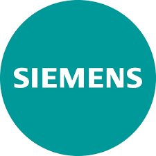

# Project-report

# Tabla de Contenidos

- [Student Outcome](#student-outcome)
- [Capítulo I: Introducción](#capítulo-i-introducción)
  - [1.1. Startup Profile](#11-startup-profile)
    - [1.1.1. Descripción de la Startup](#111-descripción-de-la-startup)
    - [1.1.2. Perfiles de integrantes del equipo](#112-perfiles-de-integrantes-del-equipo)
  - [1.2. Solution Profile](#12-solution-profile)
    - [1.2.1. Antecedentes y problemática](#121-antecedentes-y-problemática)
    - [1.2.2. Lean UX Process](#122-lean-ux-process)
      - [1.2.2.1. Lean UX Problem Statements](#1221-lean-ux-problem-statements)
      - [1.2.2.2. Lean UX Assumptions](#1222-lean-ux-assumptions)
      - [1.2.2.3. Lean UX Hypothesis Statements](#1223-lean-ux-hypothesis-statements)
      - [1.2.2.4. Lean UX Canvas](#1224-lean-ux-canvas)
  - [1.3. Segmentos objetivo](#13-segmentos-objetivo)
- [Capítulo II: Requirements Elicitation & Analysis](#capítulo-ii-requirements-elicitation--analysis)
  - [2.1. Competidores](#21-competidores)
    - [2.1.1. Análisis competitivo](#211-análisis-competitivo)
    - [2.1.2. Estrategias y tácticas frente a competidores](#212-estrategias-y-tácticas-frente-a-competidores)
  - [2.2. Entrevistas](#22-entrevistas)
    - [2.2.1. Diseño de entrevistas](#221-diseño-de-entrevistas)
    - [2.2.2. Registro de entrevistas](#222-registro-de-entrevistas)
    - [2.2.3. Análisis de entrevistas](#223-análisis-de-entrevistas)
  - [2.3. Needfinding](#23-needfinding)
    - [2.3.1. User Personas](#231-user-personas)
    - [2.3.2. User Task Matrix](#232-user-task-matrix)
    - [2.3.3. User Journey Mapping](#233-user-journey-mapping)
    - [2.3.4. Empathy Mapping](#234-empathy-mapping)
    - [2.3.5. As-is Scenario Mapping](#235-as-is-scenario-mapping)
  - [2.4. Ubiquitous Language](#24-ubiquitous-language)
- [Capítulo III: Requirements Specification](#capítulo-iii-requirements-specification)
  - [3.1. To-Be Scenario Mapping](#31-to-be-scenario-mapping)
  - [3.2. User Stories](#32-user-stories)
  - [3.3. Impact Mapping](#33-impact-mapping)
  - [3.4. Product Backlog](#34-product-backlog)
- [Capítulo IV: Solution Software Design](#capítulo-iv-solution-software-design)
  - [4.1. Strategic-Level Domain-Driven Design](#41-strategic-level-domain-driven-design)
    - [4.1.1. EventStorming](#411-eventstorming)
      - [4.1.1.1. Candidate Context Discovery](#4111-candidate-context-discovery)
      - [4.1.1.2. Domain Message Flows Modeling](#4112-domain-message-flows-modeling)
      - [4.1.1.3. Bounded Context Canvases](#4113-bounded-context-canvases)
    - [4.1.2. Context Mapping](#412-context-mapping)
    - [4.1.3. Software Architecture](#413-software-architecture)
      - [4.1.3.1. System Landscape Diagram](#4131-software-architecture-system-landscape-diagram)
      - [4.1.3.2. Context Level Diagrams](#4132-software-architecture-context-level-diagrams)
      - [4.1.3.3. Container Level Diagrams](#4133-software-architecture-container-level-diagrams)
      - [4.1.3.4. Deployment Diagrams](#4134-software-architecture-deployment-diagrams)
  - [4.2. Tactical-Level Domain-Driven Design](#42-tactical-level-domain-driven-design)
    - [4.2.X. Bounded Context](#42x-bounded-context-bounded-context-name)
      - [4.2.X.1. Domain Layer](#42x1-domain-layer)
      - [4.2.X.2. Interface Layer](#42x2-interface-layer)
      - [4.2.X.3. Application Layer](#42x3-application-layer)
      - [4.2.X.4. Infrastructure Layer](#42x4-infrastructure-layer)
      - [4.2.X.5. Component Level Diagrams](#42x5-component-level-diagrams)
      - [4.2.X.6. Code Level Diagrams](#42x6-code-level-diagrams)
        - [4.2.X.6.1. Domain Layer Class Diagrams](#42x61-domain-layer-class-diagrams)
        - [4.2.X.6.2. Database Design Diagram](#42x62-database-design-diagram)
- [Capítulo V: Solution UI/UX Design](#capítulo-v-solution-uiux-design)
  - [5.1. Style Guidelines](#51-style-guidelines)
    - [5.1.1. General Style Guidelines](#511-general-style-guidelines)
    - [5.1.2. Web, Mobile and IoT Style Guidelines](#512-web-mobile-and-iot-style-guidelines)
  - [5.2. Information Architecture](#52-information-architecture)
    - [5.2.1. Organization Systems](#521-organization-systems)
    - [5.2.2. Labeling Systems](#522-labeling-systems)
    - [5.2.3. SEO Tags and Meta Tags](#523-seo-tags-and-meta-tags)
    - [5.2.4. Searching Systems](#524-searching-systems)
    - [5.2.5. Navigation Systems](#525-navigation-systems)
  - [5.3. Landing Page UI Design](#53-landing-page-ui-design)
    - [5.3.1. Wireframe](#531-wireframe)
    - [5.3.2. Mock-up](#532-mock-up)
  - [5.4. Applications UX/UI Design](#54-applications-uxui-design)
    - [5.4.1. Wireframes](#541-wireframes)
    - [5.4.2. Wireflow Diagrams](#542-wireflow-diagrams)
    - [5.4.3. Mock-ups](#543-mock-ups)
    - [5.4.4. User Flow Diagrams](#544-user-flow-diagrams)
  - [5.5. Applications Prototyping](#55-applications-prototyping)
- [Capítulo VI: Product Implementation, Validation & Deployment](#capítulo-vi-product-implementation-validation--deployment)
  - [6.1. Software Configuration Management](#61-software-configuration-management)
    - [6.1.1. Development Environment Configuration](#611-development-environment-configuration)
    - [6.1.2. Source Code Management](#612-source-code-management)
    - [6.1.3. Style Guide & Conventions](#613-style-guide--conventions)
    - [6.1.4. Deployment Configuration](#614-deployment-configuration)
  - [6.2. Implementation](#62-implementation)
    - [6.2.X. Sprint n](#62x-sprint-n)
      - [6.2.X.1. Sprint Planning](#62x1-sprint-planning)
      - [6.2.X.2. Aspect Leaders and Collaborators](#62x2-aspect-leaders-and-collaborators)
      - [6.2.X.3. Sprint Backlog](#62x3-sprint-backlog)
      - [6.2.X.4-8. Sprint Review Evidences](#62x4-8-sprint-review-evidences)
      - [6.2.X.9. Team Collaboration Insights](#62x9-team-collaboration-insights)
  - [6.3. Validation Interviews](#63-validation-interviews)
    - [6.3.1. Diseño](#631-diseño)
    - [6.3.2. Registro](#632-registro)
    - [6.3.3. Evaluaciones](#633-evaluaciones)
  - [6.4. Video About-the-Product](#64-video-about-the-product)
- [Conclusiones y Recomendaciones](#conclusiones-y-recomendaciones)
- [Video About-the-Team](#video-about-the-team)
- [Bibliografía](#bibliografía)
- [Anexos](#anexos)

---

# Student Outcome

| Student Name | Contribution Summary |
|--------------|----------------------|
|              |                      |

---

# Capítulo I: Introducción
## 1.1. Startup Profile
### 1.1.1. Descripción de la Startup
GasGuard nace como respuesta a la falta de soluciones autónomas frente a las fugas de gas licuado en hogares, donde es necesaria la intervención humana para mitigar estas emergencias. 

Esta propuesta busca implementar tecnología del internet de las cosas (IoT) que, al detectar una fuga de gas, sea capaz de aplicar de manera innmediatas medidas de seguridad que reduzcan el riesgo de explosiones e incendios.

### Misión
Proteger a las personas y sus hogares con una solución simple, eficaz y segura ante situaciones de riesgo.

### Visión
Ser una empresa referente en el ámbito de la seguridad con tecnología IoT, centrados en innovar y transformar los hogares inteligentes.

### 1.1.2. Perfiles de integrantes del equipo
<table border="1" width="70%" style="text-align:center;">
    <tr align="center">
        <td rowspan="3">
            
        </td>
        <td align="left">
            <b>Nombre y Apellido:</b>
                         
        </td>
    </tr>
    <tr>
        <td align="left">
        <b>Carrera:</b>
         
        Ingeniería de Software
        </td>
    </tr>
    <tr>
        <td align="left">
        <b>Acerca de:</b>
         
        </td>
    </tr>
    <tr align="center">
        <td rowspan="3">
            
        </td>
        <td align="left">
            <b>Nombre y Apellido:</b>
                         
        </td>
    </tr>
    <tr>
        <td align="left">
        <b>Carrera:</b>
         
        Ingeniería de Software
        </td>
    </tr>
    <tr>
        <td align="left">
        <b>Acerca de:</b>
         
        </td>
    </tr>
    <tr align="center">
        <td rowspan="3">
            
        </td>
        <td align="left">
            <b>Nombre y Apellido:</b>
             
            Joseph Llacchua Peralta 
        </td>
    </tr>
    <tr>
        <td align="left">
        <b>Carrera:</b>
         
        Ingeniería de Software
        </td>
    </tr>
    <tr>
        <td align="left">
        <b>Acerca de:</b>
         
        </td>
    </tr>
    <tr align="center">
        <td rowspan="3">
            
        </td>
        <td align="left">
            <b>Nombre y Apellido:</b>
             
            Zaid Valentino Ramirez Contreras 
        </td>
    </tr>
    <tr>
        <td align="left">
        <b>Carrera:</b>
         
        Ingeniería de Software
        </td>
    </tr>
    <tr>
        <td align="left">
        <b>Acerca de:</b>
         
        Soy estudiante de la carrera de Ingeniería de Software, con conocimientos en Java, C++, python, javascript, entre otros. Soy alguien que le gusta aprender constantemente, además soy comunicativo y responsable. Espero seguir aprendiendo acerca de herramientas y habilidades que me puedan ser de utilidad en el futuro.
        </td>
    </tr>
    <tr align="center">
        <td rowspan="3">
        
        </td>
        <td align="left">
            <b>Nombre y Apellido:</b>
                         
            Samira Jetzabel Alvarez Araguache
        </td>
    </tr>
    <tr>
        <td align="left">
        <b>Carrera:</b>
         
        Ingeniería de Software
        </td>
    </tr>
    <tr>
        <td align="left">
        <b>Acerca de:</b>
         
        Soy una estudiante de ingeniería de software con experiencia en los lenguajes de programación C++, C# y JavaScript. Soy una persona comunicativa, capaz de trabajar eficazmente con mi equipo y con habilidades para liderar y gestionar proyectos.
        </td>
    </tr>
</table>

## 1.2. Solution Profile
Esta parte del contendo se encuentra dividida en dos partes:
- Antecedentes y Problemática: En este apartado se identifica la problemática que el proyecto busca a resolver. Se incluye el plantamento del problema, los aspectos más relevantes que la solución debe considerar y los objetivos y limitaciones que se esperan del proyecto. 
- Lean UX Process: En esta sección se implementa el enfoque Lean UX. Se describe de manera detallada la manera en la que se abordará la problemática según el modelo de negocio del proyecto. 
 
### 1.2.1. Antecedentes y problemática
### Antecedentes:

En la actualidad, el avance en la tecnología ha transformado nuestra interacción con nuestro entorno. Dichos avances han ganado fuerza en el ámbito doméstico, donde la integración con distintas tecnologías ha llevado a la creación del concepto de "hogares inteligentes". El internet de las cosas (IoT) ha formado una parte crucial de este proceso, aportando bienestar y comodidad facilitando tareas y optimizando el consumo de recursos. Sin embargo, la mayoría de estas soluciones se enfocan más en la comodidad, y no en la seguridad de los habitantes antes situaciones de riesgo.

En el caso de Perú, las fugas de gas licuado son la cuarta emergencia más recurrente. Solo en el año 2024 se registró un total de 5787 casos, mientras que en el primer trimestre del año 2025, ya se han contabilizado 1096, sin tomar en cuenta aquellos que escalaron a incendios (Cuerpo general de bomberos voluntario del Perú, 2025). Muchos de estos casos involucran el uso de gas domestico (Pereyra, 2020). 

Pese a existir sistemas de detección ante estas situaciones, la mayoría se limitan a emitir señales visuales o auditivas, por lo que todavía se requiere intervención humana para mitigar y comunicar este tipo de emergencias. Esta limitación deja expuestos tanto a los vecinos como a los residentes de la vivienda ante a estas amenazas.

Frente a este contexto, surge GasGuard como un sistema inteligente ante fugas de gas. Con el uso de tecnología IoT, se ejecutan medidas automáticas antes este tipo de emergencia, con protocolos de seguridad como la apertura de puertas, ventanas y corte de sistemas eléctricos, activación de señales visuales, así como notificaciones a los miembros del hogar y los servicios de emergencia. Mientras tanto, en condiciones normales, GasGuard se integra como un gestor inteligente de iluminación, controlando la intensidad de las luces del innmueble según la luz ambiental. 

### Problemática (5Ws y 2Hs)
### What/Qué
#### ¿Cuál es el problema?
Los hogares inteligentes muchas veces optan por la comodidad y conveniencia, descuidando situaciones de riesgo. La gran parte de sensores de detección requieren intervención humana inmediata para tomar acciones contra una fuga de gas. Estos se limitan a emitir señales visuales o sonoras, por lo que se tiene una respuesta más pasiva sobre estos incidentes.

### Where / Dónde
#### ¿Dónde está el usuario cuando usa el producto?
El usuario puede encontrarse en cualquier lugar, siempre y cuando tenga conexión a internet. Gracias a la naturaleza de los dispositivos IoT, es posible interactuar con GasGuard de manera remota, ya sea desde un teléfono inteligente o una computadora, siendo más accesible que los sistemas tradicionales de alarma.

#### ¿Dónde surge el problema?
El problema surge dentro del hogar, específicamente en zonas con instalaciones de gas o donde el uso de GLP es recurrente como en cocinas y lavanderías.

### Why / Por Qué
#### ¿Cuál es la causa del problema?
La causa del problema incluye factores como la necesidad de los sistemas tradicionales de alarma de requerir intervención humana, así como la falta de integración con otros sistemas del hogar para una reacción inmediata. Estas circunstancias aumentan la vunerabilidad de las familias en el hogar ante una fuga de gas.

### When / Cuándo
#### ¿Cuándo sucede el problema?
El problema puede suceder en cualquier momento, especialmente cuando no se han tomado medidas preventivas para reducir las posibilidades de una fuga de gas. Esto empeora cuando no hay personas en casa que puedan actuar rápida.   

### Who / Quién
#### ¿Quiénes están involucrados?
Los involucrados son principalmente las personas residentes de hogares que utilizan gas licuado. 

#### ¿A quién le sucede el problema?
El problema perjudica a cualquier persona que cuente con una instalación de gas licuado. Esto incluye a personas que viven solas, familias y condominios donde una fuga de gas puede tener consecuencias de mayor alcance.

#### ¿Quién lo utilizará?
Lo utilizaría cualquier persona que quiera mejorar la seguridad de su casa usando tecnología IoT. Esto incluye a familias que buscan hacer su hogar un espacio más seguro, así como adultos mayores o personas con problemas de movilidad que puedan tener dificultades a la hora de actuar en caso de una emergencia.

### How / Cómo
#### ¿En qué condiciones los usuarios usan nuestro producto?
Los usuarios utilizarían el sistema como parte de su hogar inteligente, siendo un complemento junto con otros dispositivos IoT en este tipo de viviendas. De manera predeterminada, GasGuard cumple con la función de regular la iluminación según el ambiente cuando la persona se encuentre en casa. Por otra parte, sus protocolos de seguridad se activan en caso de emergencia, ya sea que el usuario esté en su vivienda o fuera de ella.

#### ¿Cómo nos conocieron los usuarios?
Los usuarios pueden conocer el sistema a través de:
- Publicaciones o anuncios en plataformas de redes sociales como Instagram, Twitter, Facebook, TikTok, etc.
- Campañas de publicidad en línea mediante SEO en nuestra página web y artículos en periódicos o blogs.
- Eventos y exposiciones de tecnología IoT centrados en la domótica.
- Recomendaciones de usuarios actuales a amigos o familiares interesados en iniciar o complementar su hogar inteligente implementando un sistema de seguridad.

#### ¿Cómo prefieren los usuarios acceder a nuestro servicio?
Los usuarios prefieren acceder desde cualquier lugar de manera sencilla y conveniente. Por ello, pueden gestionar el sistema por medio de una aplicación web accesible desde computadoras de escritorio. Sin embargo, la mayoría de usuarios valoran la disponibilidad de una aplicación móvil, donde pueden recibir notificaciones a tiempo real sobre el estado de su hogar, así como controlar de manera remota los dispositivos del sistema.

### How much / Cuánto
El impacto del problema es considerable, especialmente teniendo en cuenta la cantidad de incidentes reportados anualmente relacionados a fugas de gas licuado. Las consecuencias de este tipo de emergencias implican un grave riesgo la integridad de las personas, así como perdidas materiales significativas. Por ello, es invaluable un sistema que pueda anticiparse ante este tipo de situaciones, que permita un accionar rápido que proteja no solo a una familia y sus bienes, sino también a los vecinos y a edificaciones de su entorno.

### 1.2.2. Lean UX Process

#### 1.2.2.1. Lean UX Problem Statements

#### 1.2.2.2. Lean UX Assumptions

#### 1.2.2.3. Lean UX Hypothesis Statements

#### 1.2.2.4. Lean UX Canvas

## 1.3. Segmentos objetivo

---

# Capítulo II: Requirements Elicitation & Analysis

## 2.1. Competidores

### 2.1.1. Análisis competitivo
| **Categoría**               | **Honeywell**                                                                   | **Siemens**                                                                  | **Johnson Controls**                                                            |
|----------------------------|-------------------------------------------------------------------------------|---------------------------------------------------------------------------|------------------------------------------------------------------------------|
| **Perfil**                 |                                                                               |                                                                           |                                                                              |
| Overview                | Empresa líder en soluciones de detección y control de gases, con amplio respaldo internacional. | Multinacional especializada en automatización e integración IoT para seguridad. | Líder global en la gestión integral de edificios y sistemas de seguridad.   |
| Ventaja competitiva     | Alta fiabilidad, robusta red técnica y variedad de soluciones.                | Alta integración con sistemas BMS existentes, escalabilidad.              | Fuerte presencia global y experiencia en múltiples sectores.                |
| **Perfil de marketing**    |                                                                               |                                                                           |                                                                              |
| Mercado objetivo        | Hogares, empresas e industrias.                                               | Edificios inteligentes y corporativos.                                    | Infraestructura, sector salud, retail.                                      |
| Estrategias de marketing| Campañas digitales, distribuidores y ferias tecnológicas.                    | Marketing B2B, eventos y alianzas corporativas.                           | Consultoría técnica, contenido técnico y enfoque en seguridad.             |
| **Perfil de producto**     |                                                                               |                                                                           |                                                                              |
| Productos y Servicios   | Detectores de gas, alarmas y plataformas conectadas.                          | Sensores de gas, monitoreo IoT y automatización.                          | Sistemas de gestión de edificios, IoT y detección ambiental.                |
| Precios y Costos        | Segmento medio-alto con énfasis en fiabilidad.                               | Soluciones premium a medida.                                              | Altamente variable según proyecto.                                          |
| Canales de distribución | Web, App móvil y red de distribuidores.                                       | Red de partners, app móvil y web.                                         | Venta directa y vía distribuidores.                                         |
| Fortalezas              | Innovación constante, soporte técnico robusto.                                | Soluciones modulares y amplia escalabilidad.                              | Integración completa, experiencia técnica.                                  |
| Debilidades             | Costos elevados para pequeños proyectos.                                      | Complejidad en integración.                                               | Alto costo inicial.                                                         |
| Oportunidades           | Expansión en LATAM y nuevos hogares smart.                                    | Integración con IA y cloud.                                               | Creciente demanda en automatización.                                        |
| Amenazas                | Nuevos competidores low-cost.                                                 | Competencia asiática y precios bajos.                                     | Nuevas startups con soluciones ágiles.                                      |

### 2.1.2. Estrategias y tácticas frente a competidores
| Competidores | ¿Que se puede hacer para ganarle a la competencia?|
|--------------|---------------------------------------------------|
| Honeywell    |Ofrecer una solución más accesible y especializada para hogares, con menor costo y mayor automatización inmediata (sin depender de instalaciones complejas).|
|Siemens|Presentar un producto más simple y enfocado en seguridad doméstica, evitando la complejidad y el enfoque corporativo de Siemens.|
|Johnson Controls|Aprovechar la agilidad de una startup para innovar más rápido y con una solución más adaptable y fácil de instalar en viviendas comunes, no solo en grandes infraestructuras.|

## 2.2. Entrevistas

### 2.2.1. Diseño de entrevistas

**Uso actual y percepcion de seguridad**
1. ¿Actualmente usas algún sistema para detectar fugas de gas en tu hogar?

2. ¿Cómo actuarías ante una fuga de gas? ¿Tienes un plan o herramienta que te ayude?

3. ¿Qué tan seguro/a te sientes en tu hogar respecto al uso de gas?

**Expectativas sobre una app de seguridad doméstica**

4. Si existiera una app que te avisara automáticamente sobre una fuga de gas y tomara acciones de seguridad por ti, ¿qué funcionalidades te parecerían imprescindibles?

5. ¿Te gustaría que la app se conecte con otros dispositivos del hogar (ventanas, luces, puertas, etc.)? ¿Con cuáles específicamente?

6. ¿Qué tipo de notificaciones preferirías recibir (sonido, vibración, mensaje, llamada, etc.)?

**Preferencias de diseño y experiencia de usuario**

7. ¿Cómo debería ser la interfaz de una app así para que te resulte fácil de usar?

8. ¿Qué tan cómodo/a te sientes usando apps relacionadas con seguridad del hogar?

9. ¿Te gustaría tener un panel con el estado en tiempo real de los sensores o solo alertas cuando haya problemas?

**Oportunidades de mejora / feedback**

10. Si ya usaste alguna app de seguridad o domótica, ¿qué aspectos te gustaron y cuáles no?

11. ¿Qué crees que podría mejorar una app de seguridad como esta para que realmente confíes en ella?

12. ¿Estarías dispuesto/a a pagar por una app que proteja tu hogar de forma automática? ¿Qué precio te parecería justo?

### 2.2.2. Registro de entrevistas

### 2.2.3. Análisis de entrevistas

## 2.3. Needfinding

### 2.3.1. User Personas

### 2.3.2. User Task Matrix

### 2.3.3. User Journey Mapping

### 2.3.4. Empathy Mapping

### 2.3.5. As-is Scenario Mapping

## 2.4. Ubiquitous Language

---

# Capítulo III: Requirements Specification

## 3.1. To-Be Scenario Mapping

## 3.2. User Stories

## 3.3. Impact Mapping

## 3.4. Product Backlog

---

# Capítulo IV: Solution Software Design

## 4.1. Strategic-Level Domain-Driven Design

### 4.1.1. EventStorming

#### 4.1.1.1. Candidate Context Discovery

#### 4.1.1.2. Domain Message Flows Modeling

#### 4.1.1.3. Bounded Context Canvases

### 4.1.2. Context Mapping

### 4.1.3. Software Architecture

#### 4.1.3.1. Software Architecture System Landscape Diagram

#### 4.1.3.2. Software Architecture Context Level Diagrams

#### 4.1.3.3. Software Architecture Container Level Diagrams

#### 4.1.3.4. Software Architecture Deployment Diagrams

## 4.2. Tactical-Level Domain-Driven Design

### 4.2.X. Bounded Context: <Bounded Context Name>

#### 4.2.X.1. Domain Layer

#### 4.2.X.2. Interface Layer

#### 4.2.X.3. Application Layer

#### 4.2.X.4. Infrastructure Layer

#### 4.2.X.5. Component Level Diagrams

#### 4.2.X.6. Code Level Diagrams

##### 4.2.X.6.1. Domain Layer Class Diagrams

##### 4.2.X.6.2. Database Design Diagram

---

# Capítulo V: Solution UI/UX Design

## 5.1. Style Guidelines

### 5.1.1. General Style Guidelines

### 5.1.2. Web, Mobile and IoT Style Guidelines

## 5.2. Information Architecture

### 5.2.1. Organization Systems

### 5.2.2. Labeling Systems

### 5.2.3. SEO Tags and Meta Tags

### 5.2.4. Searching Systems

### 5.2.5. Navigation Systems

## 5.3. Landing Page UI Design

### 5.3.1. Wireframe

### 5.3.2. Mock-up

## 5.4. Applications UX/UI Design

### 5.4.1. Wireframes

### 5.4.2. Wireflow Diagrams

### 5.4.3. Mock-ups

### 5.4.4. User Flow Diagrams

## 5.5. Applications Prototyping

---

# Capítulo VI: Product Implementation, Validation & Deployment

## 6.1. Software Configuration Management

### 6.1.1. Development Environment Configuration

### 6.1.2. Source Code Management

### 6.1.3. Style Guide & Conventions

### 6.1.4. Deployment Configuration

## 6.2. Implementation

### 6.2.X. Sprint n

#### 6.2.X.1. Sprint Planning

#### 6.2.X.2. Aspect Leaders and Collaborators

#### 6.2.X.3. Sprint Backlog

#### 6.2.X.4-8. Sprint Review Evidences

#### 6.2.X.9. Team Collaboration Insights

## 6.3. Validation Interviews

### 6.3.1. Diseño

### 6.3.2. Registro

### 6.3.3. Evaluaciones

## 6.4. Video About-the-Product

---

# Conclusiones y Recomendaciones

# Video About-the-Team

# Bibliografía

# Anexos
