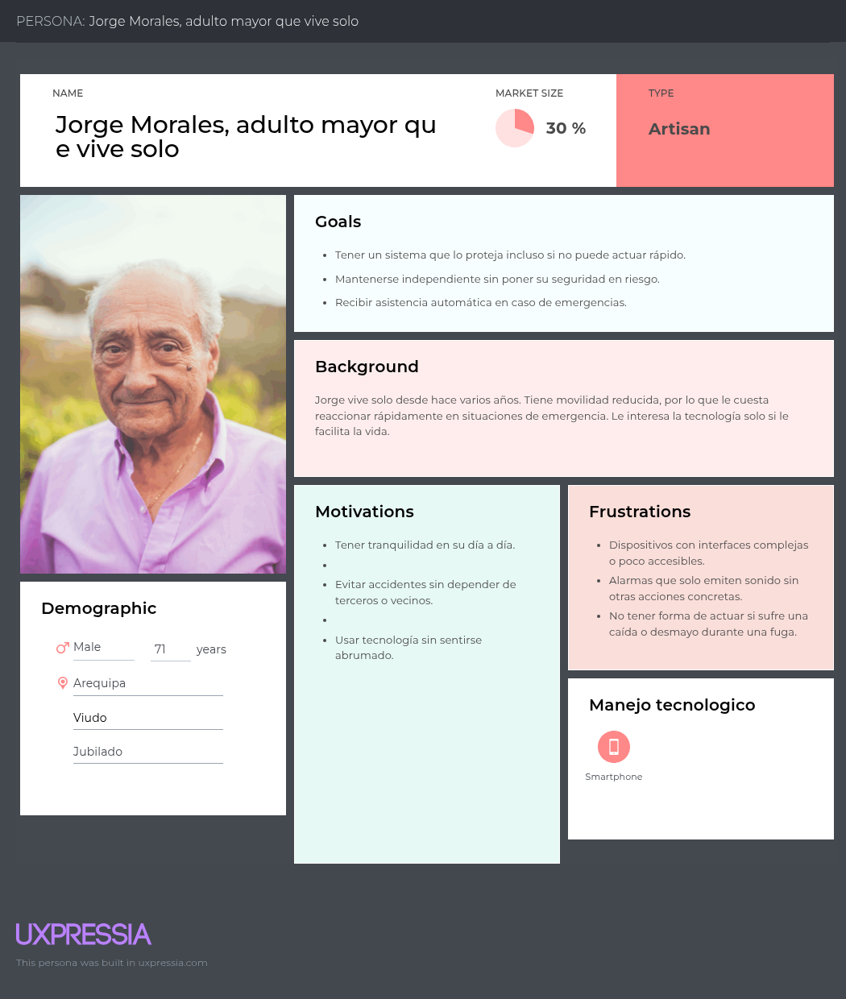

# Project-report

# Tabla de Contenidos

- [Student Outcome](#student-outcome)
- [Capítulo I: Introducción](#capítulo-i-introducción)
  - [1.1. Startup Profile](#11-startup-profile)
    - [1.1.1. Descripción de la Startup](#111-descripción-de-la-startup)
    - [1.1.2. Perfiles de integrantes del equipo](#112-perfiles-de-integrantes-del-equipo)
  - [1.2. Solution Profile](#12-solution-profile)
    - [1.2.1. Antecedentes y problemática](#121-antecedentes-y-problemática)
    - [1.2.2. Lean UX Process](#122-lean-ux-process)
      - [1.2.2.1. Lean UX Problem Statements](#1221-lean-ux-problem-statements)
      - [1.2.2.2. Lean UX Assumptions](#1222-lean-ux-assumptions)
      - [1.2.2.3. Lean UX Hypothesis Statements](#1223-lean-ux-hypothesis-statements)
      - [1.2.2.4. Lean UX Canvas](#1224-lean-ux-canvas)
  - [1.3. Segmentos objetivo](#13-segmentos-objetivo)
- [Capítulo II: Requirements Elicitation & Analysis](#capítulo-ii-requirements-elicitation--analysis)
  - [2.1. Competidores](#21-competidores)
    - [2.1.1. Análisis competitivo](#211-análisis-competitivo)
    - [2.1.2. Estrategias y tácticas frente a competidores](#212-estrategias-y-tácticas-frente-a-competidores)
  - [2.2. Entrevistas](#22-entrevistas)
    - [2.2.1. Diseño de entrevistas](#221-diseño-de-entrevistas)
    - [2.2.2. Registro de entrevistas](#222-registro-de-entrevistas)
    - [2.2.3. Análisis de entrevistas](#223-análisis-de-entrevistas)
  - [2.3. Needfinding](#23-needfinding)
    - [2.3.1. User Personas](#231-user-personas)
    - [2.3.2. User Task Matrix](#232-user-task-matrix)
    - [2.3.3. User Journey Mapping](#233-user-journey-mapping)
    - [2.3.4. Empathy Mapping](#234-empathy-mapping)
    - [2.3.5. As-is Scenario Mapping](#235-as-is-scenario-mapping)
  - [2.4. Ubiquitous Language](#24-ubiquitous-language)
- [Capítulo III: Requirements Specification](#capítulo-iii-requirements-specification)
  - [3.1. To-Be Scenario Mapping](#31-to-be-scenario-mapping)
  - [3.2. User Stories](#32-user-stories)
  - [3.3. Impact Mapping](#33-impact-mapping)
  - [3.4. Product Backlog](#34-product-backlog)
- [Capítulo IV: Solution Software Design](#capítulo-iv-solution-software-design)
  - [4.1. Strategic-Level Domain-Driven Design](#41-strategic-level-domain-driven-design)
    - [4.1.1. EventStorming](#411-eventstorming)
      - [4.1.1.1. Candidate Context Discovery](#4111-candidate-context-discovery)
      - [4.1.1.2. Domain Message Flows Modeling](#4112-domain-message-flows-modeling)
      - [4.1.1.3. Bounded Context Canvases](#4113-bounded-context-canvases)
    - [4.1.2. Context Mapping](#412-context-mapping)
    - [4.1.3. Software Architecture](#413-software-architecture)
      - [4.1.3.1. System Landscape Diagram](#4131-software-architecture-system-landscape-diagram)
      - [4.1.3.2. Context Level Diagrams](#4132-software-architecture-context-level-diagrams)
      - [4.1.3.3. Container Level Diagrams](#4133-software-architecture-container-level-diagrams)
      - [4.1.3.4. Deployment Diagrams](#4134-software-architecture-deployment-diagrams)
  - [4.2. Tactical-Level Domain-Driven Design](#42-tactical-level-domain-driven-design)
    - [4.2.X. Bounded Context](#42x-bounded-context-bounded-context-name)
      - [4.2.X.1. Domain Layer](#42x1-domain-layer)
      - [4.2.X.2. Interface Layer](#42x2-interface-layer)
      - [4.2.X.3. Application Layer](#42x3-application-layer)
      - [4.2.X.4. Infrastructure Layer](#42x4-infrastructure-layer)
      - [4.2.X.5. Component Level Diagrams](#42x5-component-level-diagrams)
      - [4.2.X.6. Code Level Diagrams](#42x6-code-level-diagrams)
        - [4.2.X.6.1. Domain Layer Class Diagrams](#42x61-domain-layer-class-diagrams)
        - [4.2.X.6.2. Database Design Diagram](#42x62-database-design-diagram)
- [Capítulo V: Solution UI/UX Design](#capítulo-v-solution-uiux-design)
  - [5.1. Style Guidelines](#51-style-guidelines)
    - [5.1.1. General Style Guidelines](#511-general-style-guidelines)
    - [5.1.2. Web, Mobile and IoT Style Guidelines](#512-web-mobile-and-iot-style-guidelines)
  - [5.2. Information Architecture](#52-information-architecture)
    - [5.2.1. Organization Systems](#521-organization-systems)
    - [5.2.2. Labeling Systems](#522-labeling-systems)
    - [5.2.3. SEO Tags and Meta Tags](#523-seo-tags-and-meta-tags)
    - [5.2.4. Searching Systems](#524-searching-systems)
    - [5.2.5. Navigation Systems](#525-navigation-systems)
  - [5.3. Landing Page UI Design](#53-landing-page-ui-design)
    - [5.3.1. Wireframe](#531-wireframe)
    - [5.3.2. Mock-up](#532-mock-up)
  - [5.4. Applications UX/UI Design](#54-applications-uxui-design)
    - [5.4.1. Wireframes](#541-wireframes)
    - [5.4.2. Wireflow Diagrams](#542-wireflow-diagrams)
    - [5.4.3. Mock-ups](#543-mock-ups)
    - [5.4.4. User Flow Diagrams](#544-user-flow-diagrams)
  - [5.5. Applications Prototyping](#55-applications-prototyping)
- [Capítulo VI: Product Implementation, Validation & Deployment](#capítulo-vi-product-implementation-validation--deployment)
  - [6.1. Software Configuration Management](#61-software-configuration-management)
    - [6.1.1. Development Environment Configuration](#611-development-environment-configuration)
    - [6.1.2. Source Code Management](#612-source-code-management)
    - [6.1.3. Style Guide & Conventions](#613-style-guide--conventions)
    - [6.1.4. Deployment Configuration](#614-deployment-configuration)
  - [6.2. Implementation](#62-implementation)
    - [6.2.X. Sprint n](#62x-sprint-n)
      - [6.2.X.1. Sprint Planning](#62x1-sprint-planning)
      - [6.2.X.2. Aspect Leaders and Collaborators](#62x2-aspect-leaders-and-collaborators)
      - [6.2.X.3. Sprint Backlog](#62x3-sprint-backlog)
      - [6.2.X.4-8. Sprint Review Evidences](#62x4-8-sprint-review-evidences)
      - [6.2.X.9. Team Collaboration Insights](#62x9-team-collaboration-insights)
  - [6.3. Validation Interviews](#63-validation-interviews)
    - [6.3.1. Diseño](#631-diseño)
    - [6.3.2. Registro](#632-registro)
    - [6.3.3. Evaluaciones](#633-evaluaciones)
  - [6.4. Video About-the-Product](#64-video-about-the-product)
- [Conclusiones y Recomendaciones](#conclusiones-y-recomendaciones)
- [Video About-the-Team](#video-about-the-team)
- [Bibliografía](#bibliografía)
- [Anexos](#anexos)

---

# Student Outcome

| Student Name | Contribution Summary |
|--------------|----------------------|
|              |                      |

---

# Capítulo I: Introducción
## 1.1. Startup Profile
### 1.1.1. Descripción de la Startup
GasGuard nace como respuesta a la falta de soluciones autónomas frente a las fugas de gas licuado en hogares, donde es necesaria la intervención humana para mitigar estas emergencias. 

Esta propuesta busca implementar tecnología del internet de las cosas (IoT) que, al detectar una fuga de gas, sea capaz de aplicar de manera innmediatas medidas de seguridad que reduzcan el riesgo de explosiones e incendios.

### Misión
Proteger a las personas y sus hogares con una solución simple, eficaz y segura ante situaciones de riesgo.

### Visión
Ser una empresa referente en el ámbito de la seguridad con tecnología IoT, centrados en innovar y transformar los hogares inteligentes.

### 1.1.2. Perfiles de integrantes del equipo
<table border="1" width="70%" style="text-align:center;">
    <tr align="center">
        <td rowspan="3">
            
        </td>
        <td align="left">
            <b>Nombre y Apellido:</b>
             
            Jorge Gerardo Quilla Luyo
        </td>
    </tr>
    <tr>
        <td align="left">
        <b>Carrera:</b>
         
        Ingeniería de Software
        </td>
    </tr>
    <tr>
        <td align="left">
        <b>Acerca de:</b>
         
        Estudiante de la carrera de ingeniería de software, tengo experiencia en los lenguajes de programación de java, python y c#, me considero una persona puntual y comprometida con los trabajos en grupo. Me esfuerzo en comunicar los resultados e investigar temas nuevos por cuenta propia.
        </td>
    </tr>
    <tr align="center">
        <td rowspan="3">
            
        </td>
        <td align="left">
            <b>Nombre y Apellido:</b>
                         
        </td>
    </tr>
    <tr>
        <td align="left">
        <b>Carrera:</b>
         
        Ingeniería de Software
        </td>
    </tr>
    <tr>
        <td align="left">
        <b>Acerca de:</b>
         
        </td>
    </tr>
    <tr align="center">
        <td rowspan="3">
            
        </td>
        <td align="left">
            <b>Nombre y Apellido:</b>
             
            Joseph Llacchua Peralta 
        </td>
    </tr>
    <tr>
        <td align="left">
        <b>Carrera:</b>
         
        Ingeniería de Software
        </td>
    </tr>
    <tr>
        <td align="left">
        <b>Acerca de:</b>
         
        </td>
    </tr>
    <tr align="center">
        <td rowspan="3">
            
        </td>
        <td align="left">
            <b>Nombre y Apellido:</b>
             
            Zaid Valentino Ramirez Contreras 
        </td>
    </tr>
    <tr>
        <td align="left">
        <b>Carrera:</b>
         
        Ingeniería de Software
        </td>
    </tr>
    <tr>
        <td align="left">
        <b>Acerca de:</b>
         
        Soy estudiante de la carrera de Ingeniería de Software, con conocimientos en Java, C++, python, javascript, entre otros. Soy alguien que le gusta aprender constantemente, además soy comunicativo y responsable. Espero seguir aprendiendo acerca de herramientas y habilidades que me puedan ser de utilidad en el futuro.
        </td>
    </tr>
    <tr align="center">
        <td rowspan="3">
        
        </td>
        <td align="left">
            <b>Nombre y Apellido:</b>
                         
            Samira Jetzabel Alvarez Araguache
        </td>
    </tr>
    <tr>
        <td align="left">
        <b>Carrera:</b>
         
        Ingeniería de Software
        </td>
    </tr>
    <tr>
        <td align="left">
        <b>Acerca de:</b>
         
        Soy una estudiante de ingeniería de software con experiencia en los lenguajes de programación C++, C# y JavaScript. Soy una persona comunicativa, capaz de trabajar eficazmente con mi equipo y con habilidades para liderar y gestionar proyectos.
        </td>
    </tr>
</table>

## 1.2. Solution Profile
Esta parte del contendo se encuentra dividida en dos partes:
- Antecedentes y Problemática: En este apartado se identifica la problemática que el proyecto busca a resolver. Se incluye el plantamento del problema, los aspectos más relevantes que la solución debe considerar y los objetivos y limitaciones que se esperan del proyecto. 
- Lean UX Process: En esta sección se implementa el enfoque Lean UX. Se describe de manera detallada la manera en la que se abordará la problemática según el modelo de negocio del proyecto. 
 
### 1.2.1. Antecedentes y problemática
### Antecedentes:

En la actualidad, el avance en la tecnología ha transformado nuestra interacción con nuestro entorno. Dichos avances han ganado fuerza en el ámbito doméstico, donde la integración con distintas tecnologías ha llevado a la creación del concepto de "hogares inteligentes". El internet de las cosas (IoT) ha formado una parte crucial de este proceso, aportando bienestar y comodidad facilitando tareas y optimizando el consumo de recursos. Sin embargo, la mayoría de estas soluciones se enfocan más en la comodidad, y no en la seguridad de los habitantes antes situaciones de riesgo.

En el caso de Perú, las fugas de gas licuado son la cuarta emergencia más recurrente. Solo en el año 2024 se registró un total de 5787 casos, mientras que en el primer trimestre del año 2025, ya se han contabilizado 1096, sin tomar en cuenta aquellos que escalaron a incendios (Cuerpo general de bomberos voluntario del Perú, 2025). Muchos de estos casos involucran el uso de gas domestico (Pereyra, 2020). 

Pese a existir sistemas de detección ante estas situaciones, la mayoría se limitan a emitir señales visuales o auditivas, por lo que todavía se requiere intervención humana para mitigar y comunicar este tipo de emergencias. Esta limitación deja expuestos tanto a los vecinos como a los residentes de la vivienda ante a estas amenazas.

Frente a este contexto, surge GasGuard como un sistema inteligente ante fugas de gas. Con el uso de tecnología IoT, se ejecutan medidas automáticas antes este tipo de emergencia, con protocolos de seguridad como la apertura de puertas, ventanas y corte de sistemas eléctricos, activación de señales visuales, así como notificaciones a los miembros del hogar y los servicios de emergencia. Mientras tanto, en condiciones normales, GasGuard se integra como un gestor inteligente de iluminación, controlando la intensidad de las luces del innmueble según la luz ambiental. 

### Problemática (5Ws y 2Hs)
### What/Qué
#### ¿Cuál es el problema?
Los hogares inteligentes muchas veces optan por la comodidad y conveniencia, descuidando situaciones de riesgo. La gran parte de sensores de detección requieren intervención humana inmediata para tomar acciones contra una fuga de gas. Estos se limitan a emitir señales visuales o sonoras, por lo que se tiene una respuesta más pasiva sobre estos incidentes.

### Where / Dónde
#### ¿Dónde está el usuario cuando usa el producto?
El usuario puede encontrarse en cualquier lugar, siempre y cuando tenga conexión a internet. Gracias a la naturaleza de los dispositivos IoT, es posible interactuar con GasGuard de manera remota, ya sea desde un teléfono inteligente o una computadora, siendo más accesible que los sistemas tradicionales de alarma.

#### ¿Dónde surge el problema?
El problema surge dentro del hogar, específicamente en zonas con instalaciones de gas o donde el uso de GLP es recurrente como en cocinas y lavanderías.

### Why / Por Qué
#### ¿Cuál es la causa del problema?
La causa del problema incluye factores como la necesidad de los sistemas tradicionales de alarma de requerir intervención humana, así como la falta de integración con otros sistemas del hogar para una reacción inmediata. Estas circunstancias aumentan la vunerabilidad de las familias en el hogar ante una fuga de gas.

### When / Cuándo
#### ¿Cuándo sucede el problema?
El problema puede suceder en cualquier momento, especialmente cuando no se han tomado medidas preventivas para reducir las posibilidades de una fuga de gas. Esto empeora cuando no hay personas en casa que puedan actuar rápida.   

### Who / Quién
#### ¿Quiénes están involucrados?
Los involucrados son principalmente las personas residentes de hogares que utilizan gas licuado. 

#### ¿A quién le sucede el problema?
El problema perjudica a cualquier persona que cuente con una instalación de gas licuado. Esto incluye a personas que viven solas, familias y condominios donde una fuga de gas puede tener consecuencias de mayor alcance.

#### ¿Quién lo utilizará?
Lo utilizaría cualquier persona que quiera mejorar la seguridad de su casa usando tecnología IoT. Esto incluye a familias que buscan hacer su hogar un espacio más seguro, así como adultos mayores o personas con problemas de movilidad que puedan tener dificultades a la hora de actuar en caso de una emergencia.

### How / Cómo
#### ¿En qué condiciones los usuarios usan nuestro producto?
Los usuarios utilizarían el sistema como parte de su hogar inteligente, siendo un complemento junto con otros dispositivos IoT en este tipo de viviendas. De manera predeterminada, GasGuard cumple con la función de regular la iluminación según el ambiente cuando la persona se encuentre en casa. Por otra parte, sus protocolos de seguridad se activan en caso de emergencia, ya sea que el usuario esté en su vivienda o fuera de ella.

#### ¿Cómo nos conocieron los usuarios?
Los usuarios pueden conocer el sistema a través de:
- Publicaciones o anuncios en plataformas de redes sociales como Instagram, Twitter, Facebook, TikTok, etc.
- Campañas de publicidad en línea mediante SEO en nuestra página web y artículos en periódicos o blogs.
- Eventos y exposiciones de tecnología IoT centrados en la domótica.
- Recomendaciones de usuarios actuales a amigos o familiares interesados en iniciar o complementar su hogar inteligente implementando un sistema de seguridad.

#### ¿Cómo prefieren los usuarios acceder a nuestro servicio?
Los usuarios prefieren acceder desde cualquier lugar de manera sencilla y conveniente. Por ello, pueden gestionar el sistema por medio de una aplicación web accesible desde computadoras de escritorio. Sin embargo, la mayoría de usuarios valoran la disponibilidad de una aplicación móvil, donde pueden recibir notificaciones a tiempo real sobre el estado de su hogar, así como controlar de manera remota los dispositivos del sistema.

### How much / Cuánto
El impacto del problema es considerable, especialmente teniendo en cuenta la cantidad de incidentes reportados anualmente relacionados a fugas de gas licuado. Las consecuencias de este tipo de emergencias implican un grave riesgo la integridad de las personas, así como perdidas materiales significativas. Por ello, es invaluable un sistema que pueda anticiparse ante este tipo de situaciones, que permita un accionar rápido que proteja no solo a una familia y sus bienes, sino también a los vecinos y a edificaciones de su entorno.

### 1.2.2. Lean UX Process

#### 1.2.2.1. Lean UX Problem statements

En Perú,el gas licuado es uno de los principales combustibles de energía domestica en cocinas, termas, calefacción, etc. Esto implica un mayor riesgo de sufrir alguna fuga de gas. Pese a esta amenaza, muchos hogares no cuentan con un sistema de seguridad que sea capaz de detectar y actuar frente a este tipo de emergencias. 

Hemos observado que, pese a que en el mercado existen detectores de gas, estos se limitan a mostrar alarmas visuales o sonoras, sin tomar medidas para mitigar la fuga. Así mismo, muchas personas no saben como reaccionar ante estas situaciones, ya sea por desconocimiento o temor. 

¿Cómo podríamos crear una solución accesible, confiable y automatizada que detecte de una fuga de gas, tome medidas de seguridad de manera innmediata para proteger a los habitantes de una vivienda y pueda integrarse en un hogar inteligente?

#### 1.2.2.2. Lean UX Assumptions
#### Features

- Detección a tiempo real de fuga de gas licuado: Sensores de gas para detectar altas concentraciones de GLP.
- Activación automática de protocolos de seguridad: Alerta visual, corte del suministro eléctrico y apertura de ventanas y puertas ante una fuga de gas.
- Notificaciones inteligentes: Envío de mensajes de texto a contactos seleccionados en la app y alertas a servicios de emergencia.
- Modo en reposo: Control inteligente de la iluminación en condiciones normales.
- Estado e historial: Aplicación para la consulta del estado actual del sistema y el historial de alertas.

#### Business Outcomes
- Aumento de usuarios: Mayor demanda de integración de sistemas automatizados de seguridad.
- Reducción de accidentes por fuga de gas: Reducir incidentes generadas como consecuencias de una fuga de gas doméstica.
- Reconocimiento de marca: Establecer GasGuard como lider en soluciones de seguridad para hogares inteligentes.
- Ingresos sostenibles: Ejecutar un modelo de ingreso en base a la venta e instalación de dispositivos, así como suscripciones en la aplicación para producir beneficios.

#### Users
Los usuarios serán principalmente aquellas personas que viven en hogares que emplean uso de GLP y busquen un sistema de seguridad ante fugas de gas que sea autónomo.

#### User Outcomes & Benefits
- Mayor seguridad en casos de fugas de gas: Disminuición del estrés por quedar en riesgo de sufrir accidentes debido a una fuga de GLP.
- Respuesta inmediata: Ejecución de sistemas de seguridad automáticas antes la detección de una fuga de gas.
- Integración como gestor de iluminación: Controlador inteligente de luces en el inmueble según la luz ambiental o intervención del usuario.
- Prevención de fugas: Informes, estadísticas y estadísticas acerca de los niveles de gas licuado en el inmueble.

#### User assumptions
#### ¿Quién es el usuario?
El usuario es cualquier persona que desee mejorar la seguridad en su hogar ante la amenzada de una fuga de gas.
#### ¿Dónde encaja nuestro producto en sus trabajos o vidas?
Nuestro producto se integra en la vida diaria de nuestros usuarios como un sistema de seguridad instalado en su hogar para actuar en situaciones de emergencia, donde podrá monitorearlo desde una aplicación web y móvil.
#### ¿Qué problema resuelve nuestro producto?
Nuestro producto reduce los incidentes producidos por fugas de gas licuado, ya sea por ausencia de personas en la vivienda, la presencia de personas que no puedan reaccionar de manera rápida o el desconocimiento de los protocolos a seguir en caso de este tipo de emergencias.
El sistema ofrece una respuesta automática ante la detección de una fuga de gas, alertando a las personas dentro o fuera de la vivienda, así como ejecutando protocolos de seguridad físicos sin necesitar intervención humana.
#### ¿Cuándo y cómo es usado nuestro producto?
- Funciona 24/7 desde que el sistema en instalado en el hogar del usuario.
- Cuando los niveles de gas son normales, controla de manera automática los niveles de luz en el inmueble. El usuario también puede gestionar la iluminación mediante la aplicación móvil.
- Cuando se detecta niveles altos de gas, se ejecutan medidas de seguridad para disminuir el riesgo ante fugas de gas. El usuario puede revisar el nivel de gas desde sus dispositivos.
#### ¿Qué características son importantes?
- Sistema de alerta: El sistema debe detectar y notificar de manera rápida los niveles anormales de gas licuado en el aire.
- Respuesta automática: Se ejecutan protocolos de seguridad de manera autónoma sin necesitar intervención humana.
- Control remoto: El usuario puede controlar el nivel de luminosidad en el hogar, así como abrir/cerrar ventanas o puertas de su vivienda desde cualquier dispositivo.
- Reportes: Reportes e historial acerca de los niveles de gas en el inmueble y el estado de los dispositivos asociados al sistema.

#### ¿Cómo debería verse y comportarse nuestro producto?
- Interacción simple: Un rápido flujo de interacción para cada acción que pueda realizar el usuario.
- Comportamiento predecible: Funcionamiento fluido, sin comportamientos inesperados o errores de conexión con los dispositivos asociados al sistema.
- Comunicación clara: Informar de manera simple el estado actual del sistema y las acciones disponibles.

#### Business Assumptions
1. **Creemos que nuestros clientes necesitan** una solución tecnológica confiable que actúe y detecte de manera innmediata una fuga de gas en sus hogares, así como ayude en la gestión inteligente en el hogar. 
2. **Estas necesidades se pueden resolver con un** un sistema IoT con sensores de gas que automatice la respuesta ante una fuga de gas (apertura de ventanas o puertas, corte de electricidad, notificaciones, etc) y pueda ser controlado de manera remota.
3. **El valor #1 que mi cliente quiere de mi servicio** es un sistema íntegro, que le permita sentirse seguro ante este tipo de emergencias, incluso estando fuera de casa.
4. **El cliente también puede obtener beneficios adicionales como** 
- Control de iluminación según la luz ambiental.
- Reportes acerca de los niveles de gas en el hogar e historial de alertas.
- Gestión remota del sistema mediante plataformas web y móvil.
5. **Voy a adquirir la mayoría de mis clientes** mediante marketing digital en redes sociales, asociaciones con inmobiliarias o empresas de gas y ferias o eventos de tecnología y seguridad.
6. **Haré dinero a través de** la venta directa e instalación del sistema, así como un modelo freemium de suscripción para brindar funcionalidades avanzadas.
7. **Mi competencia principal en el mercado** serán detectores de gas, otras soluciones IoT con acción limitada y alarmas tradicionales sin respuesta autónoma.
8. **Los venceremos debido a** nuestro elemento diferenciador: acción inmediata ante un accidente. De igual manera, ofreceremos un modo reposo, que se integrará junto a otros dispositivos smart-home para la gestión inteligente de iluminación.
9. **El mayor riesgo es que** no cumplamos con las expectativas de seguridad de nuestros usuarios y la desconfianza hacia los sistemas automatizados en el hogar.
10. **Resolveremos esto a través de** pruebas pilotos, demostraciones en vivo y testimonios de clientes, así como la mejora continua de nuestro sistema ante el feedback de nuestros usuarios.

#### 1.2.2.3. Lean UX Hypothesis Statements
### Hipótesis 1:
**Creemos que** cuando los protocolos de seguridad sean ejecutados de manera autónoma en caso de una fuga de gas, los usuarios se sentirán más protegidos por el sistema.
**Sabremos que** hemos tenido éxito **cuando** al menos el 70% de usuarios consultados en los primeros 6 meses de uso manifiesten sentirse más seguros gracias a la respuesta automática de la solución.

### Hipótesis 2:
**Creemos que** al integrar un sistema de control de iluminación inteligente aumentará el valor percibido por el cliente de la solución.
**Sabremos que** hemos tenido éxito **cuando** al menos el 60% de usuarios utilicen de manera diaria esta función después del primer mes de instalación.

### Hipótesis 3:
**Creemos que** al ejecutar cortes automáticos del suministro de seguridad, así como la apertura de ventanas/puertas al detectar niveles anormales de gas cuando se detecte una fuga de gas, se disminuirá el riesgo de incendios, explosiones e intoxicaciones en las viviendas.
**Sabremos que** hemos tenido éxito **cuando** no se reporten accidentes graves como consecuencias de una fuga de gas en los hogares con el sistema activado durante los primeros 12 meses.

### Hipótesis 4:
**Creemos que** implementar un modelo de suscripción freemium ofreciendo funciones adicionales avanzadas, incrementaremos la monetización del sistema.
**Sabremos que** hemos tenido éxito **cuando** observemos que al menos el 20% de nuestros clientes adquieran una suscripción premium durante el primer año.

#### 1.2.2.4. Lean UX Canvas
<TABLE BORDER>
	<TR>
		<TD ROWSPAN=2>

**Lean UX Canvas**
</TD>
	    	<TD ROWSPAN=2></TD> <TD>

**Fecha:** 10/04/2025

</TD> 
	</TR>
	<TR>
		<TD>

**Iteración 1**
</TD> 
	</TR>
    <TR>
		<TD ROWSPAN>
        
**1. Problema de negocios:**
        
En Perú,el gas licuado es uno de los principales combustibles de energía domestica en cocinas, termas, calefacción, etc. Esto implica un mayor riesgo de sufrir alguna fuga de gas. Pese a esta amenaza, muchos hogares no cuentan con un sistema de seguridad que sea capaz de detectar y actuar frente a este tipo de emergencias. 

Hemos observado que, pese a que en el mercado existen detectores de gas, estos se limitan a mostrar alarmas visuales o sonoras, sin tomar medidas para mitigar la fuga. Así mismo, muchas personas no saben como reaccionar ante estas situaciones, ya sea por desconocimiento o temor. 

¿Cómo podríamos crear una solución accesible, confiable y automatizada que detecte de una fuga de gas, tome medidas de seguridad de manera innmediata para proteger a los habitantes de una vivienda y pueda integrarse en un hogar inteligente?

</TD>
	    	<TD ROWSPAN=2>

**5. Ideas de solución:**
- Detección de fugas de gas inmediata mediante sensores IoT.
- Acciones automáticas de seguridad ante fugas de gas como: corte del servicio eléctrico, apertura de ventanas/puertas, alertas visuales y sonoras, etc.
- Notificaciones de alerta a contactos seleccionados y a servicios de emergencia mediante la app móvil o sms.
- Historial de eventos y monitereo remoto desde una aplicación web/móvil.
- Gestor de iluminación inteligente en condiciones normales.
</TD> <TD ROWSPAN=2>

**2. Resultados comerciales:**
- Tasa de conversión del 15% de usuarios gratuitos a suscriptores premium para acceder a funciones avanzadas.
- Retención del 80% de clientes durante el primer año del sistema.
- Integración en al menos el 5% de casas con servicios de gas licuado o con hogares inteligentes.
- Reducción en un 85% de accidentes graves generados por fugas de gas en viviendas.
</TD> 
	</TR>
	<TR>
		<TD >
        
**3. Usuarios y Clientes:**
Principalmente familias, adultos mayores, personas con movilidad reducida y cualquier usuario que utilice gas licuado en su hogar.
</TD> 
	</TR>
    <TR>
		<TD ROWSPAN=2>

**6. Hipótesis**
        
**Creemos que** cuando los protocolos de seguridad sean ejecutados de manera autónoma en caso de una fuga de gas, los usuarios se sentirán más protegidos por el sistema.
**Sabremos que** hemos tenido éxito **cuando** al menos el 70% de usuarios consultados en los primeros 6 meses de uso manifiesten sentirse más seguros gracias a la respuesta automática de la solución.

**Creemos que** al integrar un sistema de control de iluminación inteligente aumentará el valor percibido por el cliente de la solución.
**Sabremos que** hemos tenido éxito **cuando** al menos el 60% de usuarios utilicen de manera diaria esta función después del primer mes de instalación.

**Creemos que** al ejecutar cortes automáticos del suministro de seguridad, así como la apertura de ventanas/puertas al detectar niveles anormales de gas cuando se detecte una fuga de gas, se disminuirá el riesgo de incendios, explosiones e intoxicaciones en las viviendas.
**Sabremos que** hemos tenido éxito **cuando** no se reporten accidentes graves como consecuencias de una fuga de gas en los hogares con el sistema activado durante los primeros 12 meses.

**Creemos que** implementar un modelo de suscripción freemium ofreciendo funciones adicionales avanzadas, incrementaremos la monetización del sistema.
**Sabremos que** hemos tenido éxito **cuando** observemos que al menos el 20% de nuestros clientes adquieran una suscripción premium durante el primer año.</TD>

<TD ROWSPAN=2>

**7. ¿Qué es lo más importante que debemos aprender primero?**
- El tiempo mínimo de reacción del sistema ante una fuga de gas para que esta sea efectiva para el usuario y pueda tomar medidas.
- El nivel de confianza de los usuarios en las respuestas de sistemas automatizados de seguridad.
- Que tan intuitivo deben ser la interfaz de la página web/móvil para que sea accesible a usuarios mayores o sin experiencia tecnológica.
- Que tan dispuestos están los usuarios para adquirir una suscripcion premium.
</TD> 

<TD>

**4. Beneficios del usuario:**
- Mayor seguridad y protección ante una fuga de gas.
- Posibilidad de actuar de manera remota sin encontrarse en el inmueble en caso de una emergencia.
- Gestión automática de iluminación según la luz ambiental.
- Reducción de accidentes graves como consecuencia de una fuga de gas.

</TD> 
	</TR>
	<TR>
		<TD>
        
**8. ¿Cuál es la menor cantidad de trabajo que necesitamos para resolver las dudas y para hacer lo siguiente más importante?**
- Crear un prototipo funcional integrado a una aplicación web/móvil.
- Realizar simulacros y pruebas con usuarios reales.
- Validar la percepción el usuario con el sistema antes y después de su uso.
- Desarrollar un análisis de mercado para detectar puntos de mejora o nuevas necesidades del segmento objetivo. 
- Plantear estrategias de marketing para promocionar el sistema y su aplicación.
</TD> 
	</TR>
</TABLE>

## 1.3. Segmentos objetivo

---

# Capítulo II: Requirements Elicitation & Analysis

## 2.1. Competidores

### 2.1.1. Análisis competitivo
| **Categoría**               | **Honeywell**                                                                   | **Siemens**                                                                  | **Johnson Controls**                                                            |
|----------------------------|-------------------------------------------------------------------------------|---------------------------------------------------------------------------|------------------------------------------------------------------------------|
| **Perfil**                 |                                                                               |                                                                           |                                                                              |
| Overview                | Empresa líder en soluciones de detección y control de gases, con amplio respaldo internacional. | Multinacional especializada en automatización e integración IoT para seguridad. | Líder global en la gestión integral de edificios y sistemas de seguridad.   |
| Ventaja competitiva     | Alta fiabilidad, robusta red técnica y variedad de soluciones.                | Alta integración con sistemas BMS existentes, escalabilidad.              | Fuerte presencia global y experiencia en múltiples sectores.                |
| **Perfil de marketing**    |                                                                               |                                                                           |                                                                              |
| Mercado objetivo        | Hogares, empresas e industrias.                                               | Edificios inteligentes y corporativos.                                    | Infraestructura, sector salud, retail.                                      |
| Estrategias de marketing| Campañas digitales, distribuidores y ferias tecnológicas.                    | Marketing B2B, eventos y alianzas corporativas.                           | Consultoría técnica, contenido técnico y enfoque en seguridad.             |
| **Perfil de producto**     |                                                                               |                                                                           |                                                                              |
| Productos y Servicios   | Detectores de gas, alarmas y plataformas conectadas.                          | Sensores de gas, monitoreo IoT y automatización.                          | Sistemas de gestión de edificios, IoT y detección ambiental.                |
| Precios y Costos        | Segmento medio-alto con énfasis en fiabilidad.                               | Soluciones premium a medida.                                              | Altamente variable según proyecto.                                          |
| Canales de distribución | Web, App móvil y red de distribuidores.                                       | Red de partners, app móvil y web.                                         | Venta directa y vía distribuidores.                                         |
| Fortalezas              | Innovación constante, soporte técnico robusto.                                | Soluciones modulares y amplia escalabilidad.                              | Integración completa, experiencia técnica.                                  |
| Debilidades             | Costos elevados para pequeños proyectos.                                      | Complejidad en integración.                                               | Alto costo inicial.                                                         |
| Oportunidades           | Expansión en LATAM y nuevos hogares smart.                                    | Integración con IA y cloud.                                               | Creciente demanda en automatización.                                        |
| Amenazas                | Nuevos competidores low-cost.                                                 | Competencia asiática y precios bajos.                                     | Nuevas startups con soluciones ágiles.                                      |

### 2.1.2. Estrategias y tácticas frente a competidores
| Competidores | ¿Que se puede hacer para ganarle a la competencia?|
|--------------|---------------------------------------------------|
| Honeywell    |Ofrecer una solución más accesible y especializada para hogares, con menor costo y mayor automatización inmediata (sin depender de instalaciones complejas).|
|Siemens|Presentar un producto más simple y enfocado en seguridad doméstica, evitando la complejidad y el enfoque corporativo de Siemens.|
|Johnson Controls|Aprovechar la agilidad de una startup para innovar más rápido y con una solución más adaptable y fácil de instalar en viviendas comunes, no solo en grandes infraestructuras.|

## 2.2. Entrevistas

### 2.2.1. Diseño de entrevistas

**Uso actual y percepcion de seguridad**
1. ¿Actualmente usas algún sistema para detectar fugas de gas en tu hogar?

2. ¿Cómo actuarías ante una fuga de gas? ¿Tienes un plan o herramienta que te ayude?

3. ¿Qué tan seguro/a te sientes en tu hogar respecto al uso de gas?

**Expectativas sobre una app de seguridad doméstica**

4. Si existiera una app que te avisara automáticamente sobre una fuga de gas y tomara acciones de seguridad por ti, ¿qué funcionalidades te parecerían imprescindibles?

5. ¿Te gustaría que la app se conecte con otros dispositivos del hogar (ventanas, luces, puertas, etc.)? ¿Con cuáles específicamente?

6. ¿Qué tipo de notificaciones preferirías recibir (sonido, vibración, mensaje, llamada, etc.)?

**Preferencias de diseño y experiencia de usuario**

7. ¿Cómo debería ser la interfaz de una app así para que te resulte fácil de usar?

8. ¿Qué tan cómodo/a te sientes usando apps relacionadas con seguridad del hogar?

9. ¿Te gustaría tener un panel con el estado en tiempo real de los sensores o solo alertas cuando haya problemas?

**Oportunidades de mejora / feedback**

10. Si ya usaste alguna app de seguridad o domótica, ¿qué aspectos te gustaron y cuáles no?

11. ¿Qué crees que podría mejorar una app de seguridad como esta para que realmente confíes en ella?

12. ¿Estarías dispuesto/a a pagar por una app que proteja tu hogar de forma automática? ¿Qué precio te parecería justo?

### 2.2.2. Registro de entrevistas

### 2.2.3. Análisis de entrevistas

## 2.3. Needfinding

### 2.3.1. User Personas

    
 
   

### 2.3.2. User Task Matrix
| Tarea                            | Carolina (Madre de familia) | Jorge (Adulto mayor) | Claudia (Usuario tecnologico) |
|----------------------------------|-----------------------------|-------------------------|------------------------------|
| Instalar el dispositivo          | Medio                       | Bajo                    | Alto                         |
| Configurar desde la app         | Medio                       | Bajo                    | Alto                         |
| Recibir alertas de fuga         | Alto                        | Medio                   | Alto                         |
| Ver historial de eventos        | Medio                       | Bajo                    | Alto                         |
| Controlar iluminación           | Medio                       | Bajo                    | Alto                         |
| Usar botón físico de emergencia | Bajo                        | Alto                    | Alto                         |
| Contactar soporte técnico       | Medio                       | Medio                   | Alto                         |
| Recomendar a otros              | Alto                        | Bajo                    | Alto                         |

### 2.3.3. User Journey Mapping

### 2.3.4. Empathy Mapping

 
 
 

### 2.3.5. As-is Scenario Mapping

Link al Miro: <a href="https://miro.com/app/board/uXjVIDkps3Q=/?moveToWidget=3458764624540110425&cot=14">As-Is Scenario Mapping - GasGuard</a>

## 2.4. Ubiquitous Language

<strong>Dispositivo IoT:</strong> Integra el sensor de gas, el microcontrolador y los actuadores. Se encarga de detectar niveles de gas, procesar la información y ejecutar acciones automáticas en caso de emergencia.
  
<strong>Sensor de gas:</strong> Sensor de gas MQ-135, es un componente que mide la concentración de gases en el ambiente. Su lectura constante permite detectar posibles fugas de gas en zonas como la cocina, lavandería, etc.
  
<strong>Actuadores:</strong> Son dispositivos controlados electrónicamente que ejecutan respuestas físicas, como cortar la energía eléctrica, abrir ventanas o activar luces de emergencia cuando se detecta un nivel peligroso de gas.
  
<strong>Aplicación móvil:</strong> Interfaz desde la cual los usuarios monitorean el estado de su hogar, visualizan niveles de gas en tiempo real, reciben notificaciones y controlan funciones del sistema GasGuard, incluso de manera remota.
  
<strong>Gráfica en tiempo real:</strong> Representación visual dinámica que muestra la evolución del nivel de gas detectado por el sensor. Facilita al usuario la comprensión de la situación y la detección de patrones o irregularidades.
  
<strong>Notificación SMS:</strong> Alerta enviada automáticamente por mensaje de texto a los usuarios registrados o a los servicios de emergencia cuando se detecta una fuga crítica.
  
<strong>Protocolos de emergencia:</strong> Conjunto de acciones automáticas que se activan cuando se detecta una fuga peligrosa de gas. Incluyen la activación de alarmas, notificaciones, cortes eléctricos y apertura de ventilación.
  
<strong>Servicios de emergencia:</strong> Entidades externas como bomberos o compañías de gas que pueden ser notificadas automáticamente por el sistema ante una emergencia. Su inclusión busca acelerar la respuesta y mitigar el riesgo.
  
<strong>Iluminación inteligente:</strong> Función del sistema que regula la intensidad de las luces del hogar en base a la luz ambiental. También puede adaptarse a situaciones de emergencia, activando señales visuales para alertar a los ocupantes.

---

# Capítulo III: Requirements Specification

## 3.1. To-Be Scenario Mapping

Link al Miro: <a href="https://miro.com/app/board/uXjVIDkps3Q=/?moveToWidget=3458764624540224366&cot=14">To-Be Scenario Mapping - GasGuard</a>

## 3.2. User Stories

<table>
  <thead>
    <tr>
      <th>Epic ID</th>
      <th>Título</th>
      <th>Descripción</th>
    </tr>
  </thead>
  <tbody>
    <tr>
      <td>E1</td>
      <td>Monitoreo y respuesta del sensor</td>
      <td>
        Como usuario
         
        Quiero que el sensor detecte gases peligrosos
         
        Para tomar medidas necesarias
      </td>
    </tr>
    <tr>
      <td>E2</td>
      <td>Visualización de datos en la aplicación móvil</td>
      <td>
        Como usuario
         
        Quiero visualizar en mi celular la lecturas del sensor en tiempo real
         
        Para conocer el estado de la calidad del aire
      </td>
    </tr>
    <tr>
      <td>E3</td>
      <td>Gestión de usuarios</td>
      <td>
        Como usuario
         
        Quiero acceder a la aplicación móvil
         
        Para gestionar mi cuenta      
      </td>
    </tr>
    <tr>
      <td>E4</td>
      <td>Desarrollo del backend</td>
      <td>
        Como desarrollador
         
        Quiero construir una api rest, integrar servicios y distribuir los datos del sensor
         
        Para que la información sea recibida por la aplicación móvil, otros actuadores, y se ejecuten las acciones necesarias      
      </td>
    </tr>
    <tr>
      <td>E5</td>
      <td>Diseño de Landing Page</td>
      <td>
        Como visitante del sitio
         
        Quiero visualizar una página antarctica y clara
         
        Para conocer características y propósito de la aplicación      
      </td>
    </tr>
  </tbody>
</table>

 

<table>
  <thead>
    <tr>
      <th>Epic/ Story ID</th>
      <th>Título</th>
      <th>Descripción</th>
      <th>Criterio de aceptación</th>
      <th>Epic ID</th>
    </tr>
  </thead>
  <tbody>
    <tr>
      <td>US01</td>
      <td>Detectar fuga de gas</td>
      <td>
        <strong>Como </strong>usuario
         
        <strong>Quiero </strong>que el sensor detecte niveles de gas en el ambiente
         
        <strong>Para </strong>que pueda identificar si son peligrosos
      </td>
      <td>
        <strong>Escenario 1: Detección de gas por encima del límite</strong>
         
        <strong>Dado que </strong>el sensor está monitoreando el nivel de gas en el ambiente
         
        <strong>Cuando </strong>detecte una concentración de gas mayor al límite permitido
         
        <strong>Entonces </strong>se activa una alerta de fuga de gas
          
        <strong>Escenario 2: Detección de gas dentro del límite establecido</strong>
         
        <strong>Dado que </strong>el sensor está monitoreando el nivel de gas en el ambiente
         
        <strong>Cuando </strong>detecte una concentración de gas dentro del límite permitido
         
        <strong>Entonces </strong>el sensor continúa monitoreando el nivel de gas en el ambiente
      </td>
      <td>E1</td>
    </tr>
    <tr>
      <td>US02</td>
      <td>Ejecutar protocolos de seguridad</td>
      <td>
        <strong>Como </strong>usuario
         
        <strong>Quiero </strong>que el sensor ejecute protocolos de seguridad cuando detecte niveles de gas peligrosos
         
        <strong>Para </strong>reducir riesgos durante una fuga
      </td>
      <td>
        <strong>Escenario 1: Ejecución de protocolos</strong>
         
        <strong>Dado que </strong>el sensor se encuentra monitoreando el nivel de gas en el ambiente
         
        <strong>Cuando </strong>detecte que el nivel de gas sobrepasa el límite
         
        <strong>Entonces </strong>abrirá puertas y ventanas
         
        <strong>Y </strong>cortará sistemas eléctricos
         
        <strong>Y </strong>activará señales visuales
          
        <strong>Escenario 2: Protocolos en espera</strong>
         
        <strong>Dado que </strong>el sensor se encuentra monitoreando el nivel de gas en el ambiente
         
        <strong>Cuando </strong>detecte que el nivel de gas se encuentra dentro del límite
         
        <strong>Entonces </strong>los protocolos de seguridad permanecerán a la espera
      </td>
      <td>E1</td>
    </tr>
    <tr>
      <td>US03</td>
      <td>Ajustar automáticamente la iluminación</td>
      <td>
        <strong>Como </strong>usuario
         
        <strong>Quiero </strong>que las luces del ambiente se ajusten automáticamente a un nivel adecuado
         
        <strong>Para </strong>tener suficiente iluminación durante la fuga de gas
      </td>
      <td>
        <strong>Escenario 1: Ajustar intensidad de la luz</strong>
         
        <strong>Dado que </strong>el sensor se encuentra monitoreando el nivel de gas en el ambiente
         
        <strong>Cuando </strong>detecte que el nivel de gas sobrepasa el límite
         
        <strong>Entonces </strong>se ajustará automaticamente la intensidad de las luces en el ambiente
          
        <strong>Escenario 2: Luces en intensidad normal</strong>
         
        <strong>Dado que </strong>el sensor se encuentra monitoreando el nivel de gas en el ambiente
         
        <strong>Cuando </strong>el nivel de gas se encuentra dentro del límite
         
        <strong>Entonces </strong>la intensidad de las luces permanecen normales
      </td>
      <td>E1</td>
    </tr>
    <tr>
      <td>US04</td>
      <td>Visualizar lecturas del sensor</td>
      <td>
        <strong>Como </strong>usuario
         
        <strong>Quiero </strong>ver en tiempo real las lecturas del sensor
         
        <strong>Para </strong>estar informado de los niveles de gas en el ambiente
      </td>
      <td>
        <strong>Escenario 1: Visualización de datos en una gráfica</strong>
         
        <strong>Dado que </strong>el sensor se encuentra monitoreando el nivel de gas en el ambiente
         
        <strong>Cuando </strong>envíe datos en tiempo real a la aplicación móvil
         
        <strong>Entonces </strong>se mostrarán los datos en una gráfica intuitiva
          
        <strong>Escenario 2: Fallo en recepción de datos</strong>
         
        <strong>Dado que </strong>el sensor se encuentra monitoreando el nivel de gas en el ambiente
         
        <strong>Cuando </strong>la aplicación no reciba lecturas
         
        <strong>Entonces </strong>se mostrará un mensaje indicando error al capturar datos
      </td>
      <td>E2</td>
    </tr>
    <tr>
      <td>US05</td>
      <td>Notificar a miembros del hogar</td>
      <td>
        <strong>Como </strong>usuario
         
        <strong>Quiero </strong>que la aplicación notifique a los miembros registrados
         
        <strong>Para </strong>que tomen sus medidas necesarias
      </td>
      <td>
        <strong>Escenario 1: Notificar alerta a miembros registrados en la aplicación</strong>
         
        <strong>Dado que </strong>tengo a otros usuarios registrados en la aplicación
         
        <strong>Cuando </strong>se detecte niveles peligrosos de gas en el ambiente
         
        <strong>Entonces </strong>se notificará a esos usuarios
          
        <strong>Escenario 2: Notificaciones de calma a miembros registrados en la aplicación</strong>
         
        <strong>Dado que </strong>tengo a otros usuarios registrados en la aplicación
         
        <strong>Cuando </strong>se detecte niveles de gas dentro del límite
         
        <strong>Entonces </strong>se notificarán a otros usuarios con mensajes de calma
      </td>
      <td>E2</td>
    </tr>
    <tr>
      <td>US06</td>
      <td>Notificar a servicios de emergencia</td>
      <td>
        <strong>Como </strong>usuario
         
        <strong>Quiero </strong>que la aplicación notifique a servicios de emergencia cuando se detecte una fuga de gas
         
        <strong>Para </strong>que actúen rapidamente
      </td>
      <td>
        <strong>Escenario 1: Notificar a servicios de emergencia</strong>
        <strong>Dado que </strong>el sensor está monitoreando los niveles de gas del ambiente
         
        <strong>Y </strong>está enviando datos en tiempo real a la aplicación
         
        <strong>Cuando </strong>la gráfica muestre niveles de gas peligrosos
         
        <strong>Entonces </strong>se enviará una alerta a los servicios de emergencia
          
        <strong>Escenario 2: Sin alteraciones en la gráfica</strong>
         
        <strong>Dado que </strong>el sensor está monitoreando los niveles de gas del ambiente
         
        <strong>Y </strong>está enviando datos en tiempo real a la aplicación
         
        <strong>Cuando </strong>detecte niveles de gas por debajo del límite
         
        <strong>Entonces </strong>no se enviarán alertas a los servicios de emergencia
      </td>
      <td>E2</td>
    </tr>
    <tr>
      <td>US07</td>
      <td>Registrar usuario</td>
      <td>
        <strong>Como </strong>usuario
         
        <strong>Quiero </strong>crear una cuenta
         
        <strong>Para </strong>acceder a la aplicación y sus funciones
      </td>
      <td>
        <strong>Escenario 1: Registro exitoso</strong>
         
        <strong>Dado que</strong> el usuario ingresa por primera vez a la aplicación
         
        <strong>Cuando</strong> llene el formulario
         
        <strong>Y</strong> presione Registrar cuenta
         
        <strong>Entonces</strong> la aplicación muestra un mensajje que confirma la creación de su cuenta
          
        <strong>Escenario 2: Registro fallido</strong>
         
        <strong>Dado que</strong> el usuario ingresa por primera vez a la aplicación
         
        <strong>Cuando</strong> llene solo algunos campos del formulario
         
        <strong>Y</strong> presione Registrar cuenta
         
        <strong>Entonces</strong> la aplicación muestra un mensajje que indica que hubo un error al crear la cuenta
      </td>
      <td>E3</td>
    </tr>
    <tr>
      <td>US08</td>
      <td>Iniciar sesión</td>
      <td>
        <strong>Como </strong>usuario 
         
        <strong>Quiero </strong>iniciar sesión
         
        <strong>Para </strong>acceder a la aplicación y sus funciones
      </td>
      <td>
        <strong>Escenario 1: Inicio de sesión exitoso</strong>
         
        <strong>Dado que</strong> el usuario está en la aplicación
         
        <strong>Y</strong> selecciona iniciar sesión
         
        <strong>Cuando</strong> llene el formulario con sus credenciales
         
        <strong>Y</strong> la aplicación valida sus datos
         
        <strong>Entonces</strong> el usuario ingresa al contenido de la aplicación
          
        <strong>Escenario 2: Inicio de sesión fallido</strong>
         
        <strong>Dado que</strong> el usuario está en la aplicación
         
        <strong>Y</strong> selecciona iniciar sesión
         
        <strong>Cuando</strong> llene el formulario con sus credenciales
         
        <strong>Y</strong> la aplicación detecta que sus credenciales no son correctas
         
        <strong>Entonces</strong> la aplicación muestra un mensaje indicando que sus datos son incorrectos
      </td>
      <td>E3</td>
    </tr>
    <tr>
      <td>US09</td>
      <td>Recuperar contraseña</td>
      <td>
        <strong>Como </strong>usuario 
         
        <strong>Quiero </strong> recibir un correo
         
        <strong>Para </strong>reestablecer mi contraseña
      </td>
      <td>
        <strong>Escenario 1: Recuperación de contraseña exitosa</strong>
         
        <strong>Dado que</strong> el usuario ingresa a la aplicación
         
        <strong>Y</strong> selecciona Olvidé mi contraseña
         
        <strong>Cuando</strong> llene el formulario con su correo electrónico
         
        <strong>Y</strong> la aplicación valida que el correo existe
         
        <strong>Entonces</strong> se envía un enlace a su correo para que el usuario ingrese una nueva contraseña
          
        <strong>Escenario 2: Recuperación de contraseña fallido</strong>
         
        <strong>Dado que</strong> el usuario ingresa a la aplicación
         
        <strong>Y</strong> selecciona Olvidé mi contraseña
         
        <strong>Cuando</strong> llene el formulario con su correo electrónico
         
        <strong>Y</strong> la aplicación no logra encontrar el correo ingresado
         
        <strong>Entonces</strong> la aplicación muestra un mensaje de error
      </td>
      <td>E3</td>
    </tr>
    <tr>
      <td>US10</td>
      <td>Desarrollar API REST para comunicación de sistemas</td>
      <td>
        <strong>Como </strong>desarrollador
         
        <strong>Quiero </strong>construir una API REST que permita la comunicación entre dispositivos IoT y la aplicación móvil
         
        <strong>Para </strong>que los datos sean distribuidos entre los sistemas
      </td>
      <td>
        <strong>Escenario 1: Envío exitoso de datos del sensor a la aplicación</strong>
         
        <strong>Dado que </strong>soy desarrollador
         
        <strong>Y </strong>he construido una API REST para recibir datos del sensor
         
        <strong>Cuando </strong>el sensor de gas envíe valores mediante web sockets
         
        <strong>Entonces </strong>la aplicación recepciona y muestra los datos correctamente
          
        <strong>Escenario 2: Fallo al recepcionar datos del sensor</strong>
         
        <strong>Dado que </strong>soy desarrollador
         
        <strong>Y </strong>he construido una API REST para recibir datos del sensor
         
        <strong>Cuando </strong>los valores no sean recepcionados correctamente
         
        <strong>Entonces </strong>se mostrarán LOGS para realizar las respectivas correcciones
      </td>
      <td>E4</td>
    </tr>
    <tr>
      <td>US11</td>
      <td>Implementar servicio de notificación por SMS</td>
      <td>
        <strong>Como </strong>desarrollador
         
        <strong>Quiero </strong>integrar un servicio de notificaciones por SMS
         
        <strong>Para </strong>notificar a los respectivos usuarios sobre una fuga de gas
      </td>
      <td>
        <strong>Escenario 1: Notificación enviada exitosamente</strong>
         
        <strong>Dado que </strong>soy desarrollador
         
        <strong>Y </strong>he implementado el servicio de notificación SMS
         
        <strong>Cuando </strong>se haga una petición POST al endpoint correspondiente
         
        <strong>Entonces </strong>se enviará mensajes a los respectivos números de telefono de los usuarios
          
        <strong>Escenario 2: Fallo al enviar notificación SMS</strong>
         
        <strong>Dado que </strong>soy desarrollador
         
        <strong>Y </strong>he implementado el servicio de notificación SMS
         
        <strong>Cuando </strong>se haga una petición POST al endpoint correspondiente
         
        <strong>Y </strong>ocurra algun error
         
        <strong>Entonces </strong>se manejarán las excepciones
         
        <strong>Y </strong>se mostrarán LOGS para realizar las respectivas correcciones
      </td>
      <td>E4</td>
    </tr>
    <tr>
      <td>US12</td>
      <td>Visualizar características del sistema GasGuard</td>
      <td>
        <strong>Como </strong>visitante del sitio web
         
        <strong>Quiero </strong>ver las características principales de GasGuard en el landing page
         
        <strong>Para </strong>entender como funciona y cómo puede garantiza seguridad
      </td>
      <td>
        <strong>Escenario 1: Visualización detallada del contenido</strong>
         
        <strong>Dado que </strong>soy visitante del sitio web
         
        <strong>Y </strong>me encuentro en la landing page
         
        <strong>Cuando </strong>seleccione Acerca del producto de GasGuard
         
        <strong>Entonces </strong>se muestran puntos clave y detallados del funcionamiento del producto
          
        <strong>Escenario 2: Poco detalle acerca del producto</strong>
         
        <strong>Dado que </strong>soy visitante del sitio web
         
        <strong>Y </strong>me encuentro en la landing page
         
        <strong>Cuando </strong>seleccione Acerca del producto de GasGuard
         
        <strong>Entonces </strong>se muestra información escasa o irrelevante
      </td>
      <td>E5</td>
    </tr>
    <tr>
      <td>US13</td>
      <td>Visualizar sitio web desde dispositivo de preferencia</td>
      <td>
        <strong>Como </strong>visitante del sitio web
         
        <strong>Quiero </strong>que la landing page sea accesible desde mi computadora, tablet o móvil
         
        <strong>Para </strong>tener una buena experiencia desde cualquier dispositivo 
      </td>
      <td>
        <strong>Escenario 1: Navegación desde dispositivo de preferencia</strong>
         
        <strong>Dado que </strong>soy visitante del sitio web
         
        <strong>Cuando </strong>ingrese al landing page
         
        <strong>Entonces </strong>la página se adapta a la resolución de mi dispositivo
          
        <strong>Escenario 2: Elementos desordenados en pantalla</strong>
         
        <strong>Dado que </strong>soy visitante del sitio web
         
        <strong>Cuando </strong>cuando ingrese al landing page
         
        <strong>Y </strong>se muestre contenido desbordado y desordenado
         
        <strong>Entonces </strong>entiendo que la landing page no es adaptable a distintas resoluciones
      </td>
      <td>E5</td>
    </tr>
  </tbody>
</table>

## 3.3. Impact Mapping

## 3.4. Product Backlog

<table>
  <thead>
    <tr>
      <th># Orden</th>
      <th>User Story Id</th>
      <th>Título</th>
      <th>Descripción</th>
      <th>Story Points (1/2/3/5/8)</th>
    </tr>
  </thead>
  <tbody>
    <tr>
      <td>1</td>
      <td>E5-US12</td>
      <td>Visualizar características del sistema GasGuard</td>
      <td>
        Como visitante del sitio web
         
        Quiero ver las características principales de GasGuard en el landing page
         
        Para entender como funciona y cómo puede garantiza seguridad
      </td>
      <td>1</td>
    </tr>
    <tr>
      <td>2</td>
      <td>E5-US13</td>
      <td>Visualizar sitio web desde dispositivo de preferencia</td>
      <td>
        Como visitante del sitio web
         
        Quiero que la landing page sea accesible desde mi computadora, tablet o móvil
         
        Para tener una buena experiencia desde cualquier dispositivo
      </td>
      <td>2</td>
    </tr>
    <tr>
      <td>3</td>
      <td>E1-US01</td>
      <td>Detectar fuga de gas</td>
      <td>
        Como usuario
         
        Quiero que el sensor detecte niveles de gas en el ambiente
         
        Para que pueda identificar si son peligrosos      
      </td>
      <td>3</td>
    </tr>
    <tr>
      <td>4</td>
      <td>E1-US02</td>
      <td>Ejecutar protocolos de seguridad</td>
      <td>
        Como usuario
         
        Quiero que el sensor ejecute protocolos de seguridad cuando detecte niveles de gas peligrosos
         
        Para reducir riesgos durante una fuga      
      </td>
      <td>5</td>
    </tr>
    <tr>
      <td>5</td>
      <td>E1-US03</td>
      <td>Ajustar automáticamente la iluminación</td>
      <td>
        Como usuario
         
        Quiero que las luces del ambiente se ajusten automáticamente a un nivel adecuado
         
        Para tener suficiente iluminación durante la fuga de gas      
      </td>
      <td>5</td>
    </tr>
    <tr>
      <td>6</td>
      <td>E2-US04</td>
      <td>Visualizar lecturas del sensor</td>
      <td>
        Como usuario
         
        Quiero ver en tiempo real las lecturas del sensor
         
        Para estar informado de los niveles de gas en el ambiente      
      </td>
      <td>5</td>
    </tr>
    <tr>
      <td>7</td>
      <td>E2-US05</td>
      <td>Notificar a miembros del hogar</td>
      <td>
        Como usuario
         
        Quiero que la aplicación notifique a los miembros registrados
         
        Para que tomen sus medidas necesarias      
      </td>
      <td>3</td>
    </tr>
    <tr>
      <td>8</td>
      <td>E2-US06</td>
      <td>Notificar a servicios de emergencia</td>
      <td>
        Como usuario
         
        Quiero que la aplicación notifique a servicios de emergencia cuando se detecte una fuga de gas
         
        Para que actúen rapidamente      
      </td>
      <td>3</td>
    </tr>
    <tr>
      <td>9</td>
      <td>E4-US10</td>
      <td>Desarrollar API REST para comunicación de sistemas</td>
      <td>
        Como desarrollador
         
        Quiero construir una API REST que permita la comunicación entre dispositivos IoT y la aplicación móvil
         
        Para que los datos sean distribuidos entre los sistemas      
      </td>
      <td>5</td>
    </tr>
    <tr>
      <td>10</td>
      <td>E4-US11</td>
      <td>Implementar servicio de notificación por SMS</td>
      <td>
        Como desarrollador
         
        Quiero integrar un servicio de notificaciones por SMS
         
        Para notificar a los respectivos usuarios sobre una fuga de gas      
      </td>
      <td>3</td>
    </tr>
    <tr>
      <td>11</td>
      <td>E3-US07</td>
      <td>Registrar usuario</td>
      <td>
        Como usuario
         
        Quiero crear una cuenta
         
        Para acceder a la aplicación y sus funciones      
      </td>
      <td>3</td>
    </tr>
    <tr>
      <td>12</td>
      <td>E3-US08</td>
      <td>Iniciar sesión</td>
      <td>
        Como usuario
         
        Quiero iniciar sesión
         
        Para acceder a la aplicación y sus funciones      
      </td>
      <td>3</td>
    </tr>
    <tr>
      <td>13</td>
      <td>E3-US09</td>
      <td>Recuperar contraseña</td>
      <td>
        Como usuario
         
        Quiero recibir un correo
         
        Para reestablecer mi contraseña      
      </td>
      <td>3</td>
    </tr>
  </tbody>
</table>

---

# Capítulo IV: Solution Software Design

## 4.1. Strategic-Level Domain-Driven Design

### 4.1.1. EventStorming

#### 4.1.1.1. Candidate Context Discovery

#### 4.1.1.2. Domain Message Flows Modeling

#### 4.1.1.3. Bounded Context Canvases

### 4.1.2. Context Mapping

### 4.1.3. Software Architecture

#### 4.1.3.1. Software Architecture System Landscape Diagram

#### 4.1.3.2. Software Architecture Context Level Diagrams

#### 4.1.3.3. Software Architecture Container Level Diagrams

#### 4.1.3.4. Software Architecture Deployment Diagrams

## 4.2. Tactical-Level Domain-Driven Design

### 4.2.X. Bounded Context: <Bounded Context Name>

#### 4.2.X.1. Domain Layer

#### 4.2.X.2. Interface Layer

#### 4.2.X.3. Application Layer

#### 4.2.X.4. Infrastructure Layer

#### 4.2.X.5. Component Level Diagrams

#### 4.2.X.6. Code Level Diagrams

##### 4.2.X.6.1. Domain Layer Class Diagrams

##### 4.2.X.6.2. Database Design Diagram

---

# Capítulo V: Solution UI/UX Design

## 5.1. Style Guidelines

### 5.1.1. General Style Guidelines

### 5.1.2. Web, Mobile and IoT Style Guidelines

## 5.2. Information Architecture

### 5.2.1. Organization Systems

### 5.2.2. Labeling Systems

### 5.2.3. SEO Tags and Meta Tags

### 5.2.4. Searching Systems

### 5.2.5. Navigation Systems

## 5.3. Landing Page UI Design

### 5.3.1. Wireframe

### 5.3.2. Mock-up

## 5.4. Applications UX/UI Design

### 5.4.1. Wireframes

### 5.4.2. Wireflow Diagrams

### 5.4.3. Mock-ups

### 5.4.4. User Flow Diagrams

## 5.5. Applications Prototyping

---

# Capítulo VI: Product Implementation, Validation & Deployment

## 6.1. Software Configuration Management

### 6.1.1. Development Environment Configuration

### 6.1.2. Source Code Management

### 6.1.3. Style Guide & Conventions

### 6.1.4. Deployment Configuration

## 6.2. Implementation

### 6.2.X. Sprint n

#### 6.2.X.1. Sprint Planning

#### 6.2.X.2. Aspect Leaders and Collaborators

#### 6.2.X.3. Sprint Backlog

#### 6.2.X.4-8. Sprint Review Evidences

#### 6.2.X.9. Team Collaboration Insights

## 6.3. Validation Interviews

### 6.3.1. Diseño

### 6.3.2. Registro

### 6.3.3. Evaluaciones

## 6.4. Video About-the-Product

---

# Conclusiones y Recomendaciones

# Video About-the-Team

# Bibliografía

# Anexos
